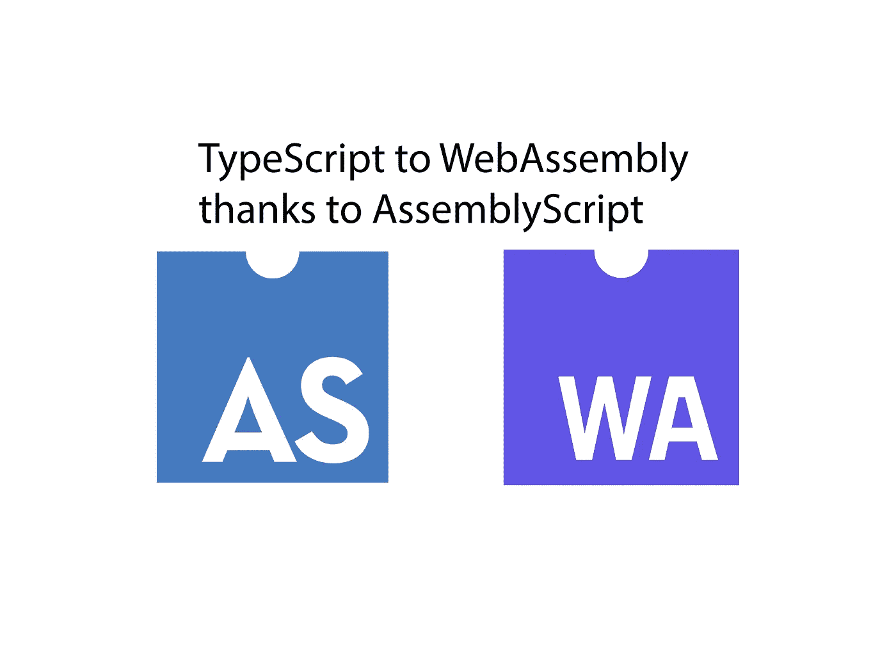
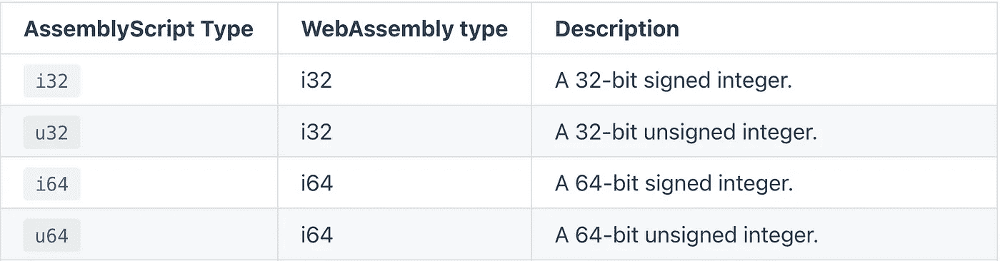

# Testosterones 上的 TypeScript 什么是 AssemblyScript？

> 原文：<https://javascript.plainenglish.io/assemblyscript-4c68a3c3ecf7?source=collection_archive---------6----------------------->

## 轻松开始使用 WebAssembly



Source: the author

**AssemblyScript** —一种用转换成 WebAssembly 的 TypeScript 编写代码的方式。名字说明了一切。

但是 AssemblyScript 不仅仅是一个工具或库——它建立在 TypeScript 语法之上，甚至还扩展了它。

WebAssembly 允许我们为浏览器和后端开发快速代码，多亏了 AssemblyScript，这相当容易。

在本文中，我们将了解如何在 Node.js 和浏览器中使用 AssemblyScript。

然后我们看看是什么使 AssemblyScript 不同于 TypeScript，以及它到底有多快。玩得开心！

# 安装

AssemblyScript 非常容易使用——比我测试过的同类 WebAssembly 解决方案都要容易。

创建一个新目录。在里面跑`npm init -y`。

然后，您可以安装依赖项。你可能需要安装带有`npm install -g npx`的 NPX。

```
npm install --save @assemblyscript/loader
npm install --save-dev assemblyscriptnpx asinit .
```

现在我们可以走了！

我们可以打开 assembly 文件夹中的 index.ts 并开始编辑该文件。编译后的 WebAssembly 文件将位于 build-folder 中。

默认情况下，index.ts 中有*add*-函数——让我们把它编译成 WebAssembly。我们可以通过运行`npm run asbuild`来做到这一点。

现在让我们创建一个 Node.js 应用程序，它使用这样一个 WebAssembly 模块——为此，已经有了一个 index.js，我们可以使用它来导入所有内容。

作为 Node-App，我在设置的根目录下创建了一个 app.js 文件。

```
const add = require('./index.js').addconsole.log(add(2, 2))
```

现在用`node app.js`运行这段代码时，您应该看到输出为 4——我们执行了 add-function，它是在 index.ts 中创建的。

```
*export* function add(a: i32, b: i32): i32 {
  *return* a + b;
}
```

但这并不是全部——我们还可以在 index.ts 中定义和导出其他函数

```
*export* function sub(a: i32, b: i32): i32 {
  *return* a — b;
}
```

现在我们也可以在 app.js 中导入并执行它——但是首先，我们必须再次执行`npm run asbuild`,将代码编译成 web 程序集。

然后我们也可以导入并执行子功能。

```
const sub = require('./index.js').sub
```

/assembly 目录中的 index.ts 是我们的入口点。在同一个文件夹中，我们还可以创建其他类型脚本文件，例如，我们可以从中导出函数。然后，我们可以在我们的 index.ts 中导入和导出它们，并使它们易于使用。

# 浏览器支持

但是我们不仅可以在 Node.js 中使用它，还可以在浏览器中使用它，为此，我在项目的根目录中创建了一个 index.html，它导入并执行我们用 WebAssembly 编译的代码。

为此，我推荐工具 *serve* 。可以用 NPM: `npm install -g serve`安装。您应该立即使用 Serve 或替代产品。如果在没有实际服务器的浏览器中打开 HTML 文件，导入 WebAssembly 时可能会出现问题。

现在我们可以运行`serve -s .`,当在端口 5000 上打开本地主机时，应该会在浏览器中看到我们的 index.html——在控制台中，der 应该是 5 printed，因为我们调用了 add-function。

# 与 TypeScript 的主要区别是什么？

TypeScript 扩展了 JavaScript —这是显而易见的。顾名思义，它提供了我们在声明变量、参数等时可以使用的类型。
重点是 ***我们可以***——因为我们不必在 TypeScript 中使用类型。

重点是 TypeScript 编译成 JavaScript。但是 AssemblyScript 编译成 WebAssembly。对于许多与系统关系更密切的编程语言，如 C、C++或 Rust，很明显它们是严格类型化的。AssemblyScript 也是如此。我们必须使用特定的类型。
TS 的 *any* 型不可用。

类型本身也不一样。与许多其他编程语言不同，TypeScript 只有几种类型。AssemblyScript 提供了许多类型，这导致了您可能已经注意到的这些神秘的名称。



Source: [The official documentation](https://www.assemblyscript.org/types.html#type-rules)

*i* 表示它是一个整数。这个数字表示这个变量有多少内存可用。无符号意味着数值不能为负。有符号意味着它可以是负数。

# 表演

像无符号整数这样的东西不是你自愿处理的——这样做有什么好处呢？表演。这通常是 WebAssembly 的商标。

使用 AssemblyScript，我们还可以根据应用程序显著加快代码的执行。这里有一个例子。

我用 AssemblyScript 和 JavaScript 实现了下面的函数。它获取一个数字作为参数，并测试这个数字是否是一个质数。

这是 JavaScript 中的函数:

AssemblyScript 中的相同函数:

我们在函数上释放一个 For 循环。多亏了 *Date.now()* 我们可以测量函数检查 for 循环中的所有数字需要多长时间。

这是 JavaScript 函数的外观。要测试 WebAssembly 函数，我们只需从 index.ts 导入该函数，如上所示。然后我们可以调整 For 循环中的函数调用。

Date.now()输出的毫秒数越低，代码运行得越快。这两个功能我都测试过几次——web assembly 更快。

**平均而言，JavaScript 函数几乎花费了 10.3 秒。
assembly script 函数只用了 8.2 秒。**

这是一个明显的区别——当然，区别取决于应用程序。