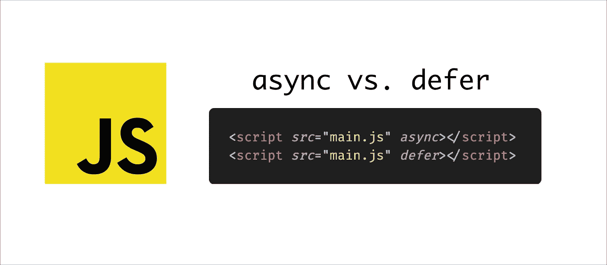
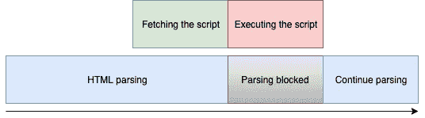
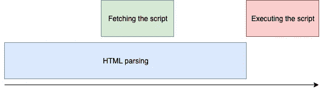
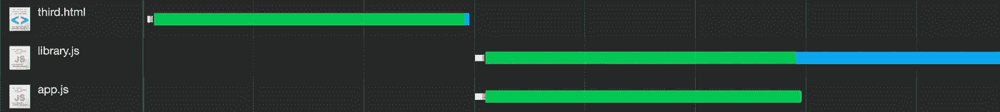
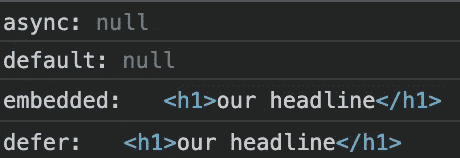
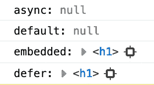

# 异步和延迟——如何正确加载 JavaScript

> 原文：<https://javascript.plainenglish.io/async-and-defer-the-complete-guide-to-loading-javascript-properly-ce6edce1e6b5?source=collection_archive---------1----------------------->

## 解决错误并提高性能



Async and defer in a HTML script tag

使用 script 标签将外部脚本加载到 HTML 中可能是必不可少的。虽然它实际上是如此重要，但还是会出现问题。

**async** 和 **defer** 都是 HTML 中经典脚本标签的属性，它允许我们指定外部 JavaScript 应该如何加载。

因此，在本文中，我们将讨论如何同时优化我们的脚本标签。

# 为什么应该使用异步和延迟？

因为加载和执行外部脚本可能会导致错误，这可能是每个开发人员都经历过的。通常只是顺序不对，因为浏览器从上到下读取和执行 HTML 文档——至少这是我们的脚本标签的标准，它可以包含 JavaScript 代码本身，或者引用外部文件。让我们看一个经常出现的问题的例子:

```
<head>
  <script>
    console.log(document.querySelector('h1'))
  </script>
</head><body>
  <h1>our headline</h1>
</body>
```

我们的 console.log 现在将输出***【null】***，因为我们在 H1 在 DOM 中可用之前执行了 JavaScript。因此 **querySelector** 不能访问该元素，因为它实际上还不存在。

不管我们是在脚本标记中包含代码，还是在相同的位置用包含相同代码的脚本标记加载外部脚本，我们的 console.log 都会返回“null”，因为我们的 h1 标记还不存在。

理解这一点很重要，因为 JavaScript 也**阻止了我们的 DOM 构造**——只要浏览器遇到一个脚本，它就会立即被加载和执行，即使它实际上应该访问 DOM，而那时 DOM 还不存在——而且它还阻止了 DOM 的构造，因为浏览器在那个时刻优先考虑脚本。

## 这不是唯一的问题

实际上，关于刚才描述的问题，你可以简单地说，我们需要访问 DOM 的脚本应该总是包含在页面的末尾——换句话说，以这样的方式，当 DOM 准备好时，它们只被**加载**和**执行**，即页面已经对用户可见。

但是如果浏览器现在遇到一个脚本，哪怕只是在页面的最后，也要先完整加载执行。

在当今世界，JavaScript 在现代网站的动态中扮演着关键角色，这意味着页面在这个时间点已经可见，但用户不一定能与之交互，因为处理事件或输入所需的脚本尚未加载和执行。

因此，用户坐在一个表面上已经完成的网站前面，但是如果它实际上需要在后台运行 JavaScript，它就不能对任何事情做出反应。这是一种非常令人沮丧的体验，尤其是在网速很慢、网络连接很差的移动设备上。

# 解决方案 1:异步

就像 defer 一样，当我们使用 async 来包含外部脚本时，它是经典脚本标签的一个属性。正确使用它很容易，如下所示:

```
<script src="jquery.js" async></script>
```

因此，我们只需包含 async as 属性，就像它与 defer 一起工作一样，但稍后会详细介绍。

**async** 意味着我们的脚本与所有其他资源并行加载，浏览器可以构建 DOM 并同时加载脚本。Async 保证加载脚本不再阻塞 DOM。



How async works

## **重要的**

只有**加载**不再阻塞——一旦脚本完成加载，它将立即执行**，从而阻塞浏览器正在做的任何事情。**

**而这正是我们用 **async** :
**要注意的，不清楚脚本什么时候加载完，什么时候执行。****

## **何时不使用异步属性加载脚本**

*   **因此，要小心使用加载脚本来访问带有异步**的 DOM。****
*   **同样危险的是用 **async** 加载几个脚本，但是它们实际上是相互依赖的——所以它们的执行顺序很重要，因为例如**两个脚本中的一个是第二个脚本想要访问的库。****

```
<script *src*="library.js"></script><script *src*="app.js"></script>
```

**如果我们包含如上所示的两个没有任何异步或延迟的脚本，库将总是**首先执行或可用**。因为浏览器是从上到下的，并且为它们中的每一个提供了一个加载和执行的暂停。**

**如果我们现在用 **async** 包含两者，关键的一点是这个库当然比我们的 app.js 大得多，因此加载时间也相应地长。然而，使用 async，两个脚本将并行加载，但是由于大小不同，它们将在不同的时间完成。**

****

**Chrome network tag showing the async loading-behavior**

**正如您在这个网络选项卡中看到的， **app.js** 准备得更早，因此运行得更早。这也可以用两个文件中的 **console.log** 相对容易地证明:**

****

**Console logs of both files**

**对于这两个测试，我在开发者工具中设置了“快速 3G”以使其更加真实。**

****关于这一点的结论:**用 async 加载依赖脚本也是有风险的，因为我们想要的顺序不一定被保持。**

## **何时使用异步属性加载脚本**

**特别是当我们从另一个服务器加载外部 JavaScripts 时，当然总是会出现短暂的延迟甚至失败。如果没有 **async** 属性，这个脚本会在很长一段时间内阻止我们整个网站的加载。
特别是如果脚本只是一个像谷歌分析这样的分析工具，因此对用户没有附加值，出于性能和安全原因，我们应该将其与 **async** 集成。**

**否则，这也适用于所有其他不能直接访问 DOM 的脚本。例外证实了这一规则，因为在有些情况下，如果在第一次访问 DOM 时因为元素尚不存在而返回“null ”,这一点也不可悲——例如，如果整个事情出于某种原因在某个时间间隔内发生。**

# **解决方案 2:推迟**

**除了 **async** 之外，还有 **defer** ，用它我们可以影响脚本的加载行为。**

**就像 **async** 一样， **defer** 在加载脚本时不会阻塞浏览器。
对于**异步**，决定性的一点是**异步**可能会在执行过程中阻塞浏览器——而**延迟**则不会。**

**包含在 **defer** 中的脚本只在 DOM 准备好的时候执行——因此 defer 对于保证访问 DOM 的脚本来说是理想的。**

****async** 和 **defer** 的共同点是脚本是与 DOM 的构造并行加载的——只是两者的脚本执行时间不同。使用 **defer** 可以保证它们只有在 DOM 准备好的时候才会被执行。**

****

**How defer works**

## **让我们再看一下我们的库和 app.js 的例子**

**我们只需用 defer 替换 async 属性，就完成了:**

```
<script *src*="library.js" *defer*></script><script *src*="app.js" *defer*></script>
```

**在控制台中，首先输出来自 library.js 的 console.log，然后输出来自 app.js 的 console.log 尽管库当然更大，因此加载时间更长。**

**这是因为 defer 完全遵循我们用脚本标签的顺序指定的执行顺序。因此，如果我们现在交换两个脚本标签的位置，使 app.js 在上面，那么它将首先执行——但是像往常一样，只有当 DOM 准备好了，才会执行 **defer** 。**

**如果我们现在查看 network 选项卡的部分，我们会看到几乎与我们使用 async 实现整个项目时相同的内容。这是因为 async 和 defer 加载脚本与 DOM 构造并行。
但是你当然不能从网络记录中看出两人在不同的时间执行脚本。**

****

**Almost identical as if we had used async**

## **何时使用 defer 属性加载脚本**

**基本上，这个属性对于所有保证访问 DOM 的脚本都是理想的，并且必须不惜一切代价成功访问。**

**如果我们有几个相互访问的脚本也是理想的，这意味着它们必须按照我们希望的顺序执行。**

****Defer** 非常适合这种情况，因为执行顺序总是与我们在 DOM 中从上到下包含脚本的顺序相同——不管脚本的大小如何。**

# **最后一个例子**

**最后，我想把我们学到的所有知识放到一个更大的例子中，在这个例子中，你可以清楚地看到包含我们脚本的所有可能性的属性。**

**我用下面的文件结构创建了一个小例子。每个脚本都包含一个 console.log 来明确它是哪个脚本&一个 querySelector 来访问 DOM 中的 h1 标签，正如它在我们的 index.html 中一样，如下所示。**

```
├── async.js
├── default.js
├── defer.js
└── index.html
```

****index.html:****

```
<html *lang*=”en”>
<head>
  <script *src*=”async.js” *async*></script>
  <script *src*=”defer.js” *defer*></script>
  <script *src*=”default.js”></script>
</head><body>
  <h1>our headline</h1>
</body><script>
  console.log(‘embedded:’, document.querySelector(‘h1’))
</script>
</html>
```

****再次强调:**所有的脚本实际上都是一样的，只有它们的 console.log 不同，但这没问题。我这样命名 default.js，因为它是“正常”包含的，没有**延迟**或**异步**。**

**下面是 Chrome 和 Firefox 中浏览器控制台的输出。
(就加载和执行行为而言，由于浏览器、任何扩展或互联网连接，总是会有偏差。)**

******

On the left: Chrome, on the right side: Firefox** 

*   **到目前为止，结果应该是清楚的。 **async.js** 是如此之小，以至于它的加载速度极快，当然，和 **async** 一样，它是直接执行的。此时，它还不能访问我们的 h1，因为它还不存在。**
*   ****default.js** 正常加载，即加载时阻塞，执行时阻塞。因为它包含在我们的 h1 标记之前，并且浏览器从上到下读取所有内容，所以 default.js 不能访问该元素**
*   **脚本**直接嵌入**在 index.html 中，定义在 h1 标签下，仅在 h1 标签已经进入 DOM 时执行。因此它可以成功地访问标签。**
*   ****defer.js** 和我们的 **async.js** 几乎同时被下载，但是和 **defer** 一样，它会一直等到 DOM 准备好。因此，它当然可以成功地访问 h1 标签。**

# **临终遗言**

**如果加载脚本时有延迟，并且浏览器已经在 DOM 中显示了 h1 标签，那么 **async.js** 最终还是可以访问元素，因此当 async 在延迟加载后执行时，脚本可以成功访问 DOM。**

**与我们预期的偏差总是会发生，尤其是在加载脚本时，即使没有使用**异步**或**延迟**。**

**我认为提到这一点特别重要:当一个真实世界的应用程序用**延迟**和**异步**实现时，它就是测试、测试、测试。并且当然在具有不同连接的不同设备上，以避免可能的错误。**

**但是通常总是有一种理想的方法来包含任何脚本，在这种情况下，您可以使用 async 或 defer，我们已经讨论过了。但是你不一定要和他们中的一个合作。**

# ****用简单英语写的便条****

**你知道我们有四份出版物和一个 YouTube 频道吗？你可以在我们的主页[**plain English . io**](https://plainenglish.io/)找到所有这些内容——关注我们的出版物并 [**订阅我们的 YouTube 频道**](https://www.youtube.com/channel/UCtipWUghju290NWcn8jhyAw) **来表达你的爱吧！****