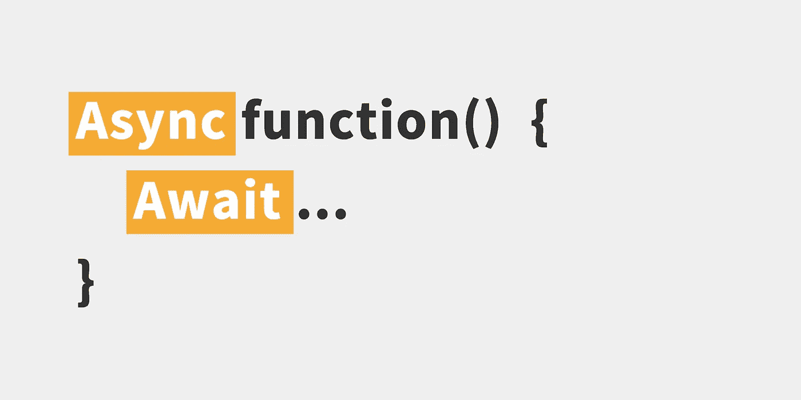
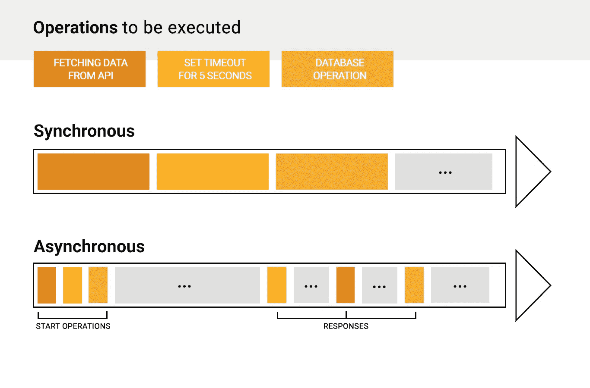

# Async/Await 适合初学者——理解 Javascript 中的异步代码

> 原文：<https://javascript.plainenglish.io/async-await-for-beginners-understanding-asynchronous-code-in-javascript-748b57ae94e2?source=collection_archive---------4----------------------->

Async / Await 语法是在 ES7 中引入的，最终成为了 JavaScript 的标准。但是它有什么特别之处，为什么我们需要它呢？因为我自己也是初学者，所以过去我在理解和处理 JavaScript 中的异步代码时非常困难。因此，本文应该介绍 JavaScript 在异步代码方面的问题，以及 Async / Await 如何帮助我们解决这些问题。

# 什么是异步编程？

为了真正理解我们为什么需要 Async / Await 这样的东西，我们必须看一看 JavaScript 的核心概念。从根本上说，JavaScript 是一种同步编程语言。这意味着它是单线程的。一次只能执行一个操作。我在下图中想象了为什么这会导致问题。

Synchronous and asynchronous execution in Javascript

默认情况下，JavaScript 中的代码执行是同步的。这意味着每个操作在完成之前都会阻塞下面的操作。因此，通常需要较长时间的操作(例如网络请求)将阻止任何进一步的执行。这很糟糕，自然会导致性能问题，从图中可以看出这一点。

然而，通过像事件循环这样的特性，今天的 JavaScript 找到了异步执行代码的方法。因此，它可以同时执行操作，而不仅仅是顺序执行。

如图所示，异步处理操作的方式是启动它们，然后等待它们的响应。因此，中间的时间可以用于其他操作。有了这种机制，长时间执行的操作不再阻碍代码的进一步执行。

## 异步执行的问题

但是……这种异步执行也会导致问题。例如，如果我们在第 1 行中发出一个网络请求，然后继续处理第 2 行中请求的数据，会怎么样呢？因为我们只在第 1 行开始了网络请求，所以我们不能确定它是否已经在第 2 行得到了解决——可能，我们稍后会得到响应。因此，第 2 行的执行。

因此，我们需要一种方法来声明一段代码是否依赖于之前异步执行的代码。在我们的例子中，我们必须确保只有在收到第 1 行的网络请求的响应时才执行第 2 行。

# 了解异步/等待

正如你可能猜到的，Async / Await 正好为我们解决了这个问题。但是公平地说，这并不是帮助我们处理 JavaScript 中异步代码的第一种方法。其实之前也有过两种比较体面的方式:回调和承诺。然而，由于两者在可读性和代码维护方面都有一些缺点，使用 Async / Await，我们现在有了第三个选项来处理异步代码，这更容易阅读和理解，特别是对于初学者。

因此，Async / Await 方法得以发展的主要原因是它使异步和同步代码或多或少无法区分。这反过来为处理异步代码带来了前所未有的清晰和简单。

## 一个简单的异步/等待示例

但是现在让我们来看看 Async / Await 是如何工作的！在下面的例子中，我们想从一个 API 中获取一些文章。因为这可能是一个长时间执行的操作，所以默认情况下它是异步处理的。因此，在我们继续处理第 4 行中提取的数据之前，我们需要确保第 3 行中的 *fetch* 调用已经成功解决。否则， *json* 方法将会失败，因为我们还没有收到来自 *fetch* 调用的响应。

有了 Async / Await，我们可以轻松确保这一点。首先，我们通过使用 *async* 关键字将 *fetchData* 函数声明为异步函数。通过使用这个声明，JavaScript 允许我们在函数中使用 *await* 关键字。这个关键字真的很有用！每当它发生时，JavaScript 暂停我们函数的执行，直到异步调用(例如我们的 *fetch* 调用)被解决。一旦出现这种情况，它将继续执行。因此，在我们的示例中，第 3 行的过程很简单:

1.  我们用给定的 URL 开始*获取*调用
2.  我们一直等到收到它的响应，并将其存储在变量中
3.  我们继续下一行代码

然后，我们对第 4 行的 *json* 调用做同样的事情，最后，我们在第 5 行返回接收到的数据。就这么简单！

## 用 Try & Catch 处理错误

也许，你想知道为什么我们的例子中有 *Try* 和 *Catch* 块。它们负责我们可能想要实现的任何错误处理。可以想象，不是每个 fetch 调用都能成功解析。可能会出现我们想要请求的 URL 不存在的情况。在我们不能成功解决异步调用的情况下，进一步的执行将会失败。因此，我们可以在一个单独的 *catch* 块中指定我们想要如何处理这样的错误(比如向用户显示一条错误消息)。因此，如果 *try* 块中的任何 *await* 语句失败，执行将直接跳转到 *catch* 块。

# 主控异步/等待

现在，我们已经有了 Async / Await 的基本概念，要完全掌握这种新语法还需要一点东西。我们需要理解承诺。正如我前面提到的，承诺是 JavaScript 中处理异步代码的另一种方式。它们构建了 Async / Await 的基础——最终只是承诺之上的语法糖衣。**因此，理解承诺的概念是真正掌握 Async / Await 的关键。**

基本上，承诺是一个可以在未来产生价值的对象——这取决于异步调用是会成功解析还是会被拒绝。从图中可以再次看到这意味着什么:我们在开始时启动一个操作，这个操作承诺，也就是说，它将在稍后返回一个响应。

重要的是要知道每个 Async / Await 函数都返回这样的承诺。因为这是一个异步操作，所以将来它会返回一个响应，我们必须解决这个响应。

## Async / Await 总是返回一个承诺

在我们的例子中，第 11 行的 *fetchData* 函数返回一个承诺，而不是我们想要的实际数据。为了检索数据，我们必须等到承诺得到解决(意味着我们的异步 *fetchData* 函数的响应已经返回)。我们可以通过使用*然后*的方法来实现。这个函数将另一个函数作为参数，我们在那里传递响应。在函数体中，我们可以使用我们的 *fetchData* 调用的实际接收数据。

如您所见，Async / Await 是处理 JavaScript 中异步代码的一种非常简单明了的语法。然而，如果你想用这种新方法顺利工作，没有办法绕过承诺，因为他们建立了它的基础。因此，强烈建议也学习它们。

我希望这篇文章能帮助你理解 Async / Await 到底是什么！一如既往，我很想听听你对这个话题的想法——在下面分享吧！