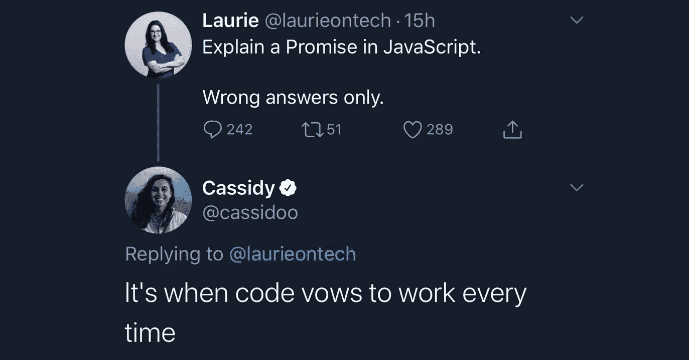
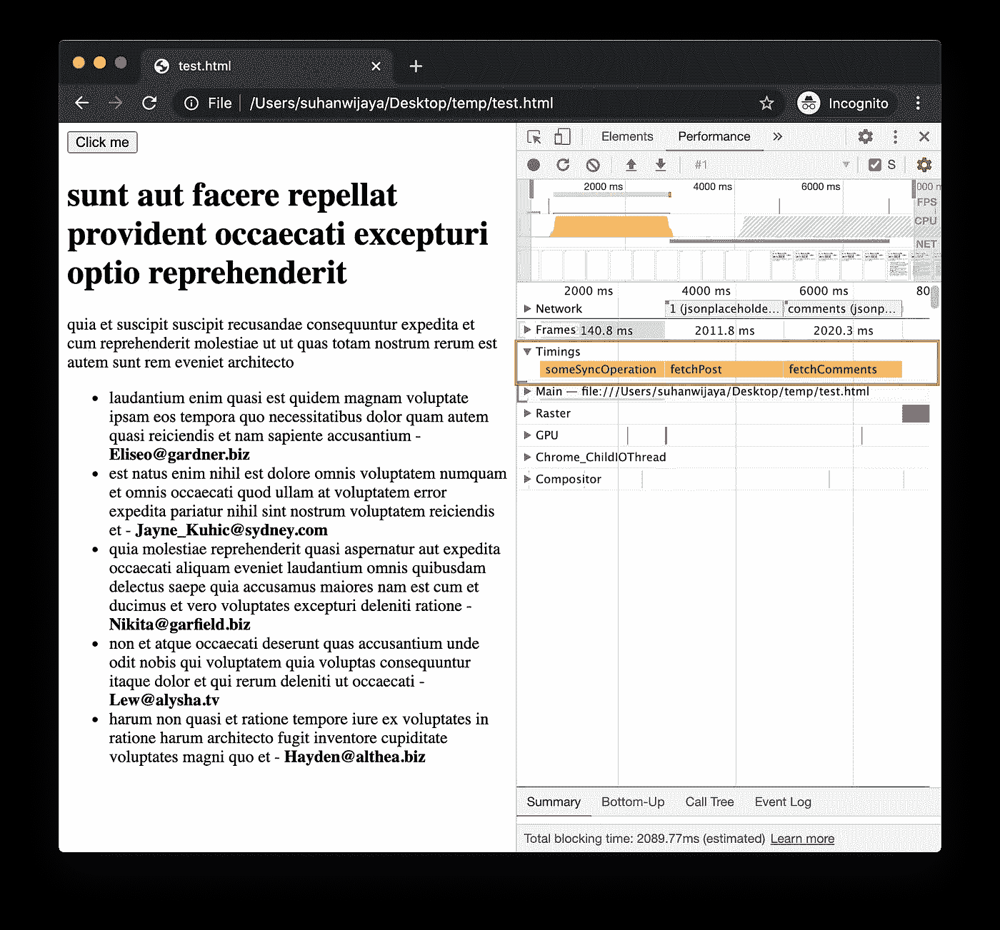
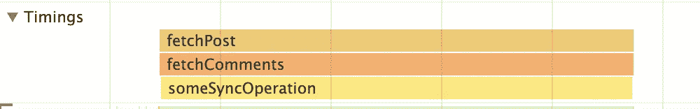
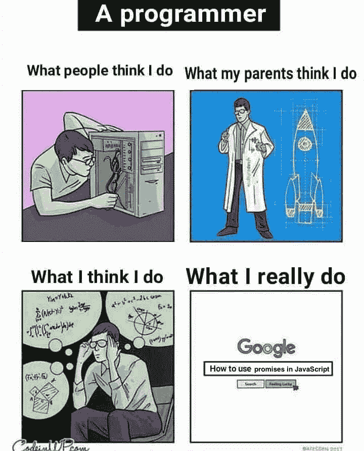

# Async/await 很棒，但是不要放弃承诺

> 原文：<https://javascript.plainenglish.io/async-await-is-awesome-but-dont-abandon-promises-f815b3df51dc?source=collection_archive---------6----------------------->

## 什么是 JavaScript 承诺？每次都是代码发誓要工作的时候。



Shoutout to [Cassidy Williams](https://medium.com/u/4c5633187eea?source=post_page-----f815b3df51dc--------------------------------) 😀

让我们创建一个按钮，它将:

*   执行昂贵的同步操作，
*   启动 2 个 AJAX 请求，然后
*   根据 AJAX 响应更新 DOM。

这是标记。

下面是函数。让我们也用 [Performance API](https://developer.mozilla.org/en-US/docs/Web/API/Performance/measure) 来测量每个操作的持续时间，它可视化了 Chrome DevTools 性能时间线上每个函数执行的时间和持续时间。(感谢 [JSONPlaceholder](https://jsonplaceholder.typicode.com) 的虚拟端点。)

你还在这里？好，有趣的部分来了:为`button`编写`onclick`处理程序。既然所有酷小孩都这么做，那就用`async` / `await`吧。

```
async function handleClick() {
   someSyncOperation(); // Expensive sync operation    const postJson = await fetchPost(); // AJAX request #1 const commentsJson = await fetchComments(); // AJAX request #2 appendPostDOM(postJson);
   appendCommentsDOM(commentsJson);
}
```

这里是点击`button`后的表演时间线。



让我们仔细看看。


有道理，关于`async` / `await`如何将异步代码变成阻塞代码的文章很多。仅供参考，当将网络节流到“慢 3G”时，每个条形约为 2 秒。

**所以总共执行时间为 6 秒。**

好的。`fetchPost`和`fetchComments`可以并行执行，所以让我们使用`await Promise.all`组合。

```
async function handleClick() {
  someSyncOperation(); const [ postJson, commentsJson ] = await Promise.all([
    fetchPost(), 
    fetchComments()
  ]); appendPostDOM(postJson);
  appendCommentsDOM(commentsJson);
}
```


**由于** `**fetchPost**` **和** `**fetchComments**` **并行执行，现在总执行时间为 4 秒。**

好的。由于`someSyncOperation`不依赖于 AJAX 请求，让我们看看将它移到函数的最后一行是否会加快速度。

```
async function handleClick() {
  const [ postJson, commentsJson ] = await Promise.all([
    fetchPost(), 
    fetchComments()
  ]); appendPostDOM(postJson);
  appendCommentsDOM(commentsJson); someSyncOperation();
}
```


没有，总执行时间仍然是 4 秒。

好的。是时候去“全面承诺”了。

```
function handleClick() {
  Promise.all([
    fetchPost(),
    fetchComments()
  ]).then(([ postJson, commentsJson ]) => {
    appendPostDOM(postJson);
    appendCommentsDOM(commentsJson)
  }); someSyncOperation();
}
```



**执行“完全承诺”会将总执行时间减少到 2 秒。**

为什么这个作品值得自己的文章，但[在这里是一个可怕的解释者](http://latentflip.com/loupe/?code=JC5vbignYnV0dG9uJywgJ2NsaWNrJywgZnVuY3Rpb24gb25DbGljaygpIHsKICAgIHNldFRpbWVvdXQoZnVuY3Rpb24gdGltZXIoKSB7CiAgICAgICAgY29uc29sZS5sb2coJ1lvdSBjbGlja2VkIHRoZSBidXR0b24hJyk7ICAgIAogICAgfSwgMjAwMCk7Cn0pOwoKY29uc29sZS5sb2coIkhpISIpOwoKc2V0VGltZW91dChmdW5jdGlvbiB0aW1lb3V0KCkgewogICAgY29uc29sZS5sb2coIkNsaWNrIHRoZSBidXR0b24hIik7Cn0sIDUwMDApOwoKY29uc29sZS5sb2coIldlbGNvbWUgdG8gbG91cGUuIik7!!!PGJ1dHRvbj5DbGljayBtZSE8L2J1dHRvbj4%3D)。

今天我学会了。



Source: [Programmer Humor](https://programmerhumour.tumblr.com/post/633961754778533888/google-my-saviour)

## 奖金

对于那些铁杆粉丝来说，我了解到(实际上是在写这个故事的那天)下面的片段实际上做了同样的事情。此文由[月亮](https://medium.com/u/994dcd5bc2e8?source=post_page-----f815b3df51dc--------------------------------)归功于[。](https://medium.com/better-programming/an-extremely-easy-tip-to-improve-web-performance-with-async-await-b609e7e65744)

```
async function handleClick() {
  const postPromise = fetchPost();
  const commentsPromise = fetchComments();

  someSyncOperation();
  const postJson = await postPromise;
  const commentsJson = await commentsPromise; appendPostDOM(postJson);
  appendCommentsDOM(commentsJson);
}
```

喜欢这篇文章吗？如果有，通过 [**订阅获取更多类似内容解码，我们的 YouTube 频道**](https://www.youtube.com/channel/UCtipWUghju290NWcn8jhyAw?sub_confirmation=true) **！**

📫*在*[*LinkedIn*](https://www.linkedin.com/in/suhanwijaya/)*或* [*邮箱*](mailto:suhanw@gmail.com) *！*