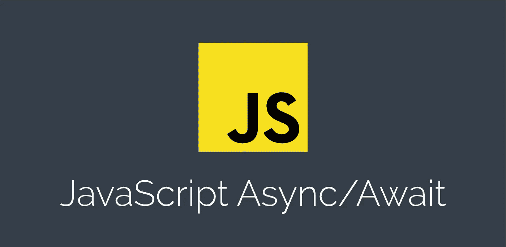
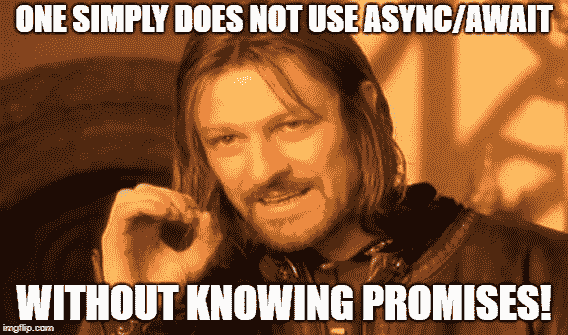

# 如何在 JavaScript 中使用异步 Await

> 原文：<https://javascript.plainenglish.io/async-await-javascript-5038668ec6eb?source=collection_archive---------0----------------------->



## JavaScript 有点像编程世界的无面人。

它可以是异步的。它可以是功能性的。可以是面向对象的。它可以是客户端的。可以是服务器端的。这样的例子不胜枚举。


本文将关注异步 JavaScript。

## **但是等等，JavaScript 是同步语言！**

这意味着一次只能执行一个操作。但这并不是全部情况。JavaScript 为我们提供了许多方法，让我们能够像异步语言一样工作。其中之一是 Async-Await 子句。

## 什么是**异步等待**？

Async 和 Await 是承诺的扩展。如果你不清楚承诺的概念，你可以参考我以前的帖子[如何用 JavaScript 写承诺](https://medium.com/javascript-in-plain-english/truly-understanding-promises-in-javascript-cb31ee487860)。



# 异步ˌ非同步(asynchronous)

异步函数使我们能够编写基于承诺的代码，就像它是同步的一样，但不会阻塞执行线程。它通过事件循环异步运行。异步函数总是会返回值。使用`async`仅仅意味着一个承诺将被返回，如果一个`promise` 没有被返回，JavaScript 自动将它和它的值包装在一个已解析的`promise`中。

```
async function firstAsync() {
  return 27;
}

firstAsync().then(alert); // 27
```

运行上面的代码给出的警告输出为 27，这意味着返回了一个`promise`，否则`.then()`方法根本不可能。

# 等待

await 操作符用于等待承诺。它只能在异步块中使用。关键字 Await 让 JavaScript 一直等到 promise 返回结果。必须注意的是，它仅使`async`功能块等待，而不是整个程序执行。

下面的代码块展示了异步 Await 的用法。

```
async function firstAsync() {
    let promise = new Promise((res, rej) => {
        setTimeout(() => res("Now it's done!"), 1000)
    });

    // wait until the promise returns us a value
    let result = await promise; 

    // "Now it's done!"
    alert(result); 
    }
};firstAsync();
```

# 使用异步 Await 时要记住的事情

## 我们不能在常规函数中使用`await` 关键字。

```
function firstAsync() {
  let promise = Promise.resolve(10);
  let result = await promise; // Syntax error
} 
```

为了让上面的函数正常工作，我们需要在函数`firstAsync();`之前添加`async`

## 异步等待使执行顺序化

这不一定是件坏事，但是并行执行要快得多。

例如:

```
async function sequence() {
  await promise1(50); // Wait 50ms…
  await promise2(50); // …then wait another 50ms.
  return "done!";
}
```

以上需要 100 毫秒才能完成，时间不多，但仍然很慢。

这是因为它是按顺序发生的。返回两个承诺，都需要 50 毫秒完成。第二个承诺仅在第一个承诺解决后执行。这不是一个好的做法，因为大型请求可能非常耗时。我们必须平行执行。

这可以通过使用`Promise.all()` 来实现。

根据 MDN:

> 当作为 iterable 传递的所有承诺都已解析或 iterable 不包含承诺时，`**Promise.all()**`方法返回一个解析的`Promise`。它用拒绝的第一个承诺的理由拒绝。

## Promise.all()

```
async function sequence() {
    await Promise.all([promise1(), promise2()]);  
    return "done!";
}
```

当 iterable 中的所有承诺都被解析时,`promise.all()`函数进行解析，然后返回结果。

另一种方法:

```
async function parallel() { *// Start a 500ms timer asynchronously…*
    const wait1 = promise1(50); *// …meaning this timer happens in parallel.*
    const wait2 = promise2(50); 

 *// Wait 50ms for the first timer…*
    await wait1; 

 *// …by which time this timer has already finished.*
    await wait2; 

    return "done!";}
```

Async Await 非常强大，但是它们带有警告。但是如果我们正确地使用它们，它们有助于使我们的代码非常可读和高效。

希望你学到了新的东西！如果你觉得这篇文章有用，一定要分享，关注和支持！

如果你正在寻找 [Java 作业帮助](https://cwassignments.com/java-assignment-help.html)，你来对地方了！我们经验丰富的程序员团队可以在异步编码任务、编程项目等方面提供帮助。

*更多内容看* [***说白了就是 io***](https://plainenglish.io/) *。报名参加我们的* [***免费周报***](http://newsletter.plainenglish.io/) *。关注我们关于* [***推特***](https://twitter.com/inPlainEngHQ) ， [***领英***](https://www.linkedin.com/company/inplainenglish/)**和* [***不和***](https://discord.gg/GtDtUAvyhW) ***。****

> *[在 LinkedIn 上分享这篇文章！](https://www.linkedin.com/sharing/share-offsite/?url=https%3A%2F%2Fwww.linkedin.com%2Fpulse%2Fasync-await-javascript-ashay-mandwarya%2F%3Fpublished%3Dt)*