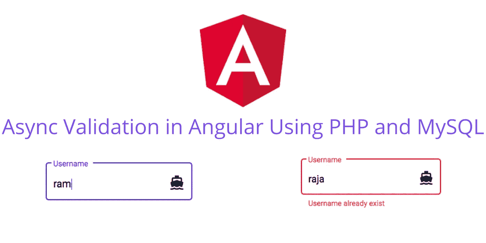
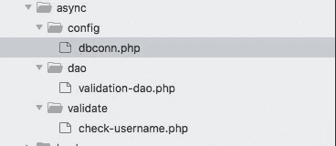
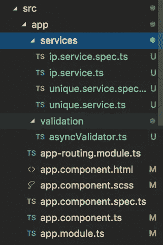
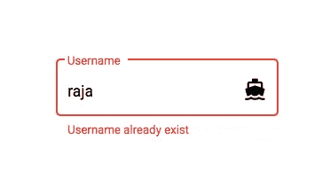

# Angular 中的异步验证 PHP 和 MySQL 分步指南

> 原文：<https://javascript.plainenglish.io/async-validation-in-angular-step-by-step-guide-with-php-and-mysql-ebb551ef4b8f?source=collection_archive---------4----------------------->



验证在应用程序开发中扮演着非常重要的角色。验证帮助用户以更好的方式访问/使用应用程序。大多数 **UI 框架**都提供**内置验证**。我们也可以使用一些第三方插件进行验证。

例如，如果用户想要使用 OTP 验证他/她的手机号码，那么他/她必须在给定的输入字段中输入手机号码。有时，用户可能会输入十(10)个以上的数字(印度手机号码的长度为十(10)个数字)。输入错误的手机号码(多位数)后，用户期望 OTP。然而，短信服务器会告诉我们这个号码是无效的。这消耗了**很多时间**，用户会不高兴。然而，如果我们在输入数字本身时显示这个**错误**，而不是将其发送到服务器，这将**减少时间**。这将是最佳实践，给用户带来更好的用户体验。

因此，对所需的输入字段进行适当的验证将有助于最终用户使用应用程序。并且降低了应用程序的复杂性。

**验证的类型。**

1.  客户端验证
2.  服务器端验证
3.  异步验证

在本教程中，你将学习如何使用 **Angular** 框架进行**异步验证**。

**什么是异步验证和示例？**

不用解释什么是**异步验证**的理论，我们可以在需要异步验证的地方采用实时用例。

**案例 1:**

我们举个简单的例子。假设你正在创建一个类似 Gmail 的应用程序。在该应用程序中，用户名总是唯一的。当我们尝试注册时，它会要求我们输入用户名。当我们在输入字段中输入用户名时，它会将用户名发送到服务器，并检查用户名是否存在。如果用户名存在，那么它会向我们显示错误消息。这被称为异步验证。

**案例二:**

假设您正在创建电子商务/ERP 应用程序。和产品有关。现在，您希望将每种产品归入一个类别。然后我们将创建一个类别列表。类别是唯一的值。因此，我们必须检查该类别是否存在。这也称为异步验证。

比如有很多可用的用例。**简单来说，如果你想在你的数据库上创建唯一值，那么你必须需要异步验证。**

我们将在教程中看到的内容列表如下。

1.  使用 PHP 和 MySQL 创建 REST API
2.  在 Angular 中创建服务来调用 REST API
3.  使用 Angular 创建自定义异步验证器
4.  创建 FormGroup 并将异步验证绑定到 FormControl
5.  显示验证消息

# **1。使用 PHP 和 MySQL 创建 REST API**

您可以使用任何 REST API。这里我使用了 **PHP** 和 **MySQL** 来创建 REST API。如果你已经有了 REST API 或者你知道如何创建 API，请随意**跳过这个**部分。

**场景:**

对于本例，我们将创建用户列表。在用户列表中，**用户名**是唯一的。所以我们将使用 PHP 和 MySQL 的 **Angular 来验证用户名是否存在。**

我假设你的机器上已经安装了 PHP 和 MySQL。我用的是 **macOS** 。所以 mac 总是要求本地 **IP** 地址( **127.0.0.1** )而不是本地主机。如果您使用的是 Windows，则可以在下面的示例中使用本地主机而不是 IP 地址。

**第一步:**

使用下面的查询在 MySQL 中创建一个用户表。

在您的 **MySQL** 数据库上执行上述代码。

**第二步:**

为了在 **PHP** 中创建一个 **REST API** ，我使用了一些不同的文件夹结构作为最佳实践。



在你的 XAMPP **htdocs** 文件夹下创建一个名为 **async** 的文件夹。在这个例子中，async 是根文件夹。

在异步文件夹下创建一个**配置**文件夹。在**配置**文件夹下创建一个**dbconn.php**文件，并将下面的代码粘贴到文件中。

在上面的代码中更改用户名、密码和数据库名称。

在异步文件夹下创建一个 **dao** 文件夹。然后在 dao 文件夹下创建一个**validation-dao.php**文件，并粘贴下面的代码。

这里我们有一个 check username 函数，它将用户名作为输入，检查用户名是否存在于数据库中。如果用户名存在，它将返回 true 或 false。

在异步文件夹下创建一个**验证**文件夹。然后在 validate 文件夹下创建一个**check-username.php**文件，并粘贴下面的代码。

上面的代码从 **Angular** 应用程序中捕获用户名，并将用户名传递给 dao 文件，以对照数据库进行检查。

这里我使用了一些标准的文件夹结构。如果你觉得这个结构太复杂，你可以把这三个文件放在一个文件夹下。

**这里是最终的 REST API URL**

```
[http://localhost/async/validate/check-username.php?username=raja](http://localhost/async/validate/check-username.php?username=raja)
```

在您的机器上执行上述 URL。它将返回 **false** 作为输出。为什么因为没有用户名。您可以在上面的 URL 中更改用户名，如果用户名存在，那么它将返回 **true** 作为输出。

我有 GET 方法来捕捉数据。您也可以在 REST API 中使用 POST 方法。

# **2。在 Angular 中创建服务来调用 REST API**

REST API 准备好了。如果还没有创建，现在使用下面的命令创建一个新的 **Angular** 项目。

```
ng new async-example
```

现在使用 VS 代码编辑器打开项目。现在我们需要**有棱角的材料**。角材是一个 UI 框架。它只是可选的。但是，它会给我们一个好的外观和感觉。所以用有棱角的材料。

在您的角度项目中使用下面的命令安装角度材料。

```
ng add [@angular/material](http://twitter.com/angular/material)
```

我使用了一些标准的文件夹结构。如果需要，您可以跳过此文件夹结构。然而，当你开发**复杂的应用**时，它会非常有用。



使用以下命令在 Angular 中创建 IP 服务文件

```
ng g s services/ip
```

并将下面的代码粘贴到 **ip.services.ts** 文件中。

这是您可以轻松更改指向服务器的唯一位置。如果您想切换到不同的服务器，这种方法非常有用。

使用创建唯一的服务文件

```
ng g s services/unique
```

在 **unique.services.ts** 文件中，粘贴以下代码。

它会将用户输入的值传递给 REST API URL 并返回输出。

# **3。使用 Angular** 创建自定义异步验证器

现在我们需要创建一个**自定义异步验证器**。验证器将调用唯一的服务来传递输入值。这个验证器将向输入字段提供验证状态。

在 **src/app 下创建一个**验证**文件夹。**

在 **src/app/validation** 文件夹下创建一个 **asyncValidator.ts** 文件，并粘贴以下代码。

该代码使用延迟概念。这意味着它不会将每个输入值都发送到服务器。相反，它将每 1 秒钟向用户发送一次键入的值。您可以根据需要更改计时器值。

**应该是唯一的**是错误属性。您需要在 HTML 上捕捉这个属性，并根据条件显示消息。您可以更改此名称。但是要遵循变量命名规则来创建这样的属性名。

# **4。创建 FormGroup 并将异步验证绑定到 FormControl**

一切准备就绪。现在我们需要创建一个 FormGroup，用户名为 FormControl。

创建一个以 UniqueService 为变量的构造函数。

打开 **app.component.ts** 文件，将异步验证器绑定到用户名，如下所示。

# **5。显示验证信息**

现在我们需要在组件页面上绑定它。创建一个窗体并将用户名与 formControlName 属性绑定。

默认情况下，如果用户名存在，formControl 将显示一个错误样式的输入字段。然而，如果你想显示正确的错误信息，那么你必须使用 **mat-error** 标签。并检查 **shouldBeUnique** 属性是否有效。

仅此而已。当用户名存在时，它会显示如下错误信息。



希望你喜欢这篇文章！。

感谢阅读这篇文章！。

**源代码链接。**

[](https://github.com/bharathirajatut/angular-examples/tree/master/async-validation) [## bharathirajatu/angular-示例

### 角度示例源代码。为 bharathirajatu/angular-examples 的发展作出贡献

github.com](https://github.com/bharathirajatut/angular-examples/tree/master/async-validation)