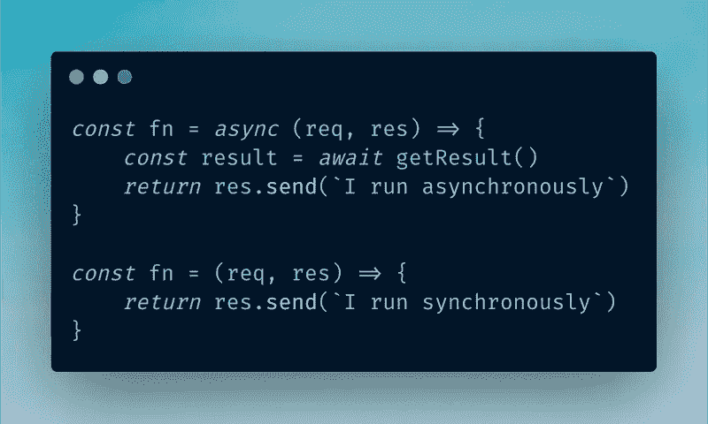

# Node.js 中的异步与同步:一个简单的基准

> 原文：<https://javascript.plainenglish.io/async-vs-sync-nodejs-a-simple-benchmark-f99be70cab03?source=collection_archive---------8----------------------->

## Node.js 中异步和同步模式的基准测试



Async 和 sync 可能是 JavaScript 开发人员听到最多的两个词，它们分别指异步和同步编程。JavaScript 中的异步编程可以使用`callbacks`、`Promise`、`async`和`await`来完成。

JavaScript 借助[事件循环](https://developer.mozilla.org/en-US/docs/Web/JavaScript/EventLoop)处理异步任务。我们知道它提高了性能，并且不会阻塞其余的代码。但是一切都是理论上的，我们怎么知道它真的能提高性能呢？

通过做一些基准测试！

在本文中，我们不会讨论如何异步或同步编程，相反，我们将针对`sync`和`async`方法运行一些基准测试。

对于测试用例，我们将使用具有 sync 和 async 方法的`bcrypt`包来散列一个给定的字符串。我们还需要`express`。

让我们从安装依赖项开始。

```
yarn add express bcrypt
```

以下脚本可用于基准测试。

```
import express from 'express'
import bcrypt from 'bcrypt'

const app = express()

app.get('/sync', (req, res) => {
    let hashed = bcrypt.hashSync('secret', 10)
    return res.send(hashed)
})

app.get('/async', async (req, res) => {
    let hashed = await bcrypt.hash('secret', 10)
    return res.send(hashed)
})

app.listen(3000, () => console.log('Server started on port 3000'))
```

这是一个简单的 express 应用程序，有两条路径，都将返回字符串“secret”的散列值。`/sync` route 将使用`bcrypt.hashSync()`方法同步散列值，而`/async` route 使用`bcrypt.hash()`方法异步散列值。

我们现在可以使用 [apache bench](https://httpd.apache.org/docs/2.4/programs/ab.html) 运行基准测试。

*Apache bench 是一个 HTTP 服务器基准测试工具。*

# 同步模式基准

以下命令用于运行同步模式的基准测试。

```
ab -k -c 20 -n 250 "http://localhost:3000/sync"
```

如果您不知道上面的命令是做什么的，它只是简单地调用 apache bench ( `ab`)，使用要进行基准测试的 URL([http://localhost:3000/sync](http://localhost:3000/sync))作为输入，并使用一些选项(`-k`、`-c`、`-n`)。

*   `-k` -启用 HTTP KeepAlive 功能
*   `-c` -一次执行多个请求的次数。
*   `-n` -为基准测试会话执行的请求数量

结果如下所示。

```
Concurrency Level:      20
Time taken for tests:   23.247 seconds
Complete requests:      250
Failed requests:        0
Keep-Alive requests:    250
Total transferred:      66250 bytes
HTML transferred:       15000 bytes
Requests per second:    10.75 [#/sec] (mean)
Time per request:       1859.754 [ms] (mean)
Time per request:       92.988 [ms] (mean, across all concurrent requests)
Transfer rate:          2.78 [Kbytes/sec] received

Connection Times (ms)
              min  mean[+/-sd] median   max
Connect:        0    0   1.6      0      10
Processing:    90 1783 414.3   1804    3655
Waiting:       90 1783 414.4   1804    3655
Total:         90 1783 414.5   1804    3655
```

# 异步模式基准

现在让我们对异步模式进行基准测试。

```
ab -k -c 20 -n 250 "http://localhost:3000/async"
```

结果如下。

```
Concurrency Level:      20
Time taken for tests:   10.141 seconds
Complete requests:      250
Failed requests:        0
Keep-Alive requests:    250
Total transferred:      66250 bytes
HTML transferred:       15000 bytes
Requests per second:    24.65 [#/sec] (mean)
Time per request:       811.281 [ms] (mean)
Time per request:       40.564 [ms] (mean, across all concurrent requests)
Transfer rate:          6.38 [Kbytes/sec] received

Connection Times (ms)
              min  mean[+/-sd] median   max
Connect:        0    0   0.5      0       3
Processing:    97  776 120.5    802     874
Waiting:       95  776 120.6    802     874
Total:         97  776 120.3    802     874
```

# 比较

如你所见，`async`模式比`sync`模式表现更好。`async`模式处理的请求/秒比`sync`模式多，其时间/请求比`sync`模式少。

# 结论

根据基准测试结果，`async`模式在执行 I/O 时比`sync`模式性能更好(即使测试用例不执行任何 I/O 操作)。使用`bcrypt`散列是 CPU 密集型操作，当在异步模式下使用 bcrypt 散列字符串时，它使用线程池，不会阻塞事件循环。

当您的代码需要执行一些阻塞 I/O 操作时，请始终使用`async`模式，因为它不会阻塞事件循环。

*最初发表于*[*https://jinoantony.com*](https://jinoantony.com/blog/async-vs-sync-nodejs-a-simple-benchmark)*。*