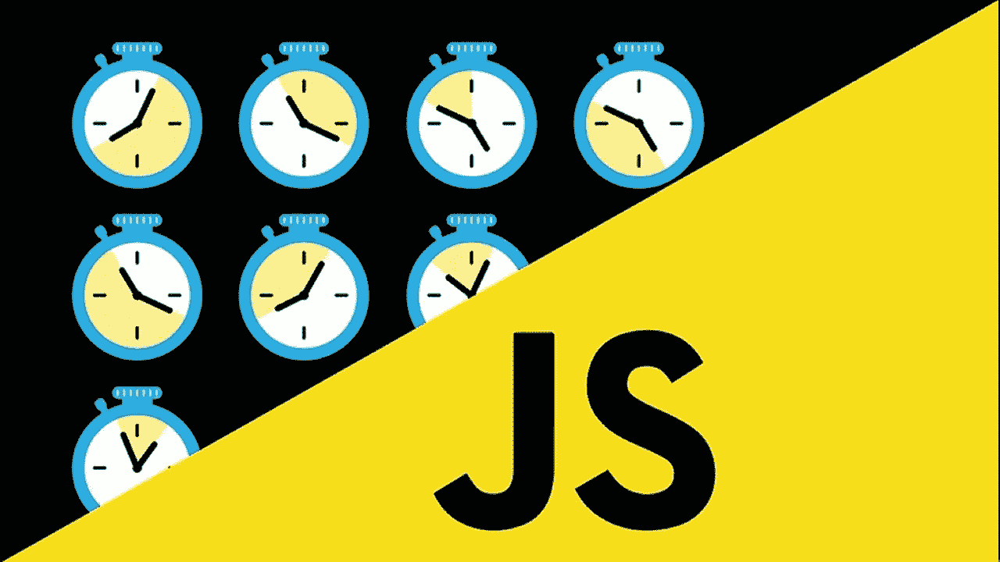

# 异步 JavaScript 解释

> 原文：<https://javascript.plainenglish.io/asynchronous-javascript-explained-a4c1133f5544?source=collection_archive---------7----------------------->



这是对 javascript，一种同步语言，是的，你没看错，是如何执行/允许软件工程师开发异步执行代码的权威性解释。

让我们从下面的例子开始，追踪 javascript 是如何执行这段代码的:

```
const num = 3;
function multiplyBy2 (inputNumber){
    const result = inputNumber*2
    return result
}
const output = multiplyBy2(num);
const newOutput = multiplyBy2(10);
```

*   第 1 行:我们定义一个`const num`，在其中存储值`3`，数据保存在**全局内存**
*   第 2 行:我们定义一个函数`multiplyBy2`，我们获取它的标签和里面的所有代码，然后一次性保存。
*   第 7 行:我们在**全局内存**中定义了`cons output`，它将存储调用`multiplyBy2`的`result`(返回值)
*   当我们运行`multiplyBy2`时会发生什么？
*   我们新建一个*****执行上下文*****
*   **在这个新的**执行上下文**中，在**本地存储器**中，我们:**
*   **将值`3`存储在`inputNumber`中**
*   **我们定义了`const result`，我们在其中存储了`inputNumber*2`的值。**
*   **我们返回分配给标签`result`的**值**，并将其存储在`output`中。**
*   **再次为`newOutput`**

## **Javascript 是一种同步语言，这意味着它逐行执行代码。**

## **但是，如果`multiplyBy2`是一个与 Twitter 对话的功能，并且它真的很慢，会怎么样呢？这意味着，我们的代码必须暂停，等待函数与 Twitter 完成对话，然后继续运行我们的程序。**

## **那太糟糕了。**

# **异步 JS 来拯救。**

**我们的核心 Javascript 引擎有三个主要部分，**执行线程**，**变量环境和调用栈**。**

**因此它不支持异步行为。我们必须添加新的组件:**

*   **网络浏览器功能**
*   **承诺——本博客中没有提到**
*   **事件循环**
*   **回拨/任务队列**
*   **微任务队列——本博客中没有提到**

**我们需要添加这些成分来解释到底发生了什么。**

## **Javascript 在浏览器中运行**

**浏览器有很多特性，Javascript 引擎是其中的一部分。该浏览器的一些功能包括:**

*   **Javascript 引擎**
*   **Web 套接字**
*   **开发工具+控制台**
*   **网络请求**
*   **HTML DOM**
*   **计时器**

**并且 **Javascript** 允许我们使用/接口浏览器的这些功能！**

**有些 **facade** 函数看起来像是 javascript，但实际上是用 C++(针对谷歌 Chrome)或其他语言编写的网络浏览器功能的 facade。**

**这些外观功能包括:**

**`console` - >控制台**

**`xhr` / `fetch` - >网络请求**

**`document` - > HTML DOM**

**`setTimeout` - >计时器**

**让我们通过下面的例子来理解 JavaScript 是如何使用浏览器特性的，并学习它是如何将浏览器特性转换成可工作的代码的。**

```
function printHello(){ console.log("Hello") }
​
setTimeout(printHello, 1000)
​
console.log("Me first!")
```

*   **第 1 行->我们定义一个`function printHello`**
*   **第 2 行->调用一个`setTimeout`**
*   **我们在**网络浏览器**中设置了一个计时器**
*   **我们向它传递一个在完成时执行的回调和以毫秒为单位的持续时间。**
*   **浏览器计时器有一个完整的？`boolean`，其中 if `true`，运行回调。**
*   **所以在 0 毫秒，完成？是`false`，所以什么也没发生**
*   **此时， **Javascript 引擎**已经完成了在浏览器中设置计时器的工作，并且可以继续执行下一行代码。**
*   **第 3 行-> `console.log("Me first!")`被执行。**
*   **至此， **Javascript 引擎**完成，但在后台，浏览器中有一个定时器。**
*   **滴答声**
*   **托科鸟**
*   **1000 ms 过去了->完成？**是否为真**，该函数将直接返回到 **Javascript 引擎**，将其添加到调用堆栈中，并执行它。**

## **话虽如此，许多问题还是出现了，比如:**

*   **既然`setTimeout`已经完成，那么**网络浏览器**将在稍后阶段影响堆栈？**
*   **比如，如果栈里有东西呢？在这段时间内是否正在执行某项功能？浏览器推送的功能是否会覆盖已经运行的功能？**

**很明显，我们需要一些规则来决定浏览器何时允许这个功能，在我们的例子中`printHello`回到 Javascript。**

## **我们需要一些非常严格的规则，使我们的代码超级可预测，如果我们知道这些核心规则，我们将从根本上知道它会如何表现。**

**让我们试着理解什么时候允许回调。**

**为了做到/模拟这一点，我们将让调用堆栈在浏览器试图向 **Javascript 引擎**发送回调时处于忙碌状态。**

```
function printHello(){ console.log("Hello") } 
function blockFor1Sec(){     
    // Blocks the Javascript thread for 1 second        
    for(i=0; i < 50000; i++){         
        console.log("i is: ", i)     
    } 
}  
setTimeout(printHello, 10); 
blockFor1Sec(); 
console.log("Me First")
```

## **在我们继续之前，我们必须引入回调队列，它是传递给浏览器的回调队列。不要与传递给传统高阶函数的回调混淆。这些只是传递给浏览器并返回给 Javascript 引擎的回调。**

*   **0 毫秒:`setTimeout`被放入调用堆栈。**
*   **浏览器中启动一个定时器，当定时器结束时，传递`printHello`到回调队列。**
*   **1 ms:进入`blockFor1Sec`的**执行上下文****
*   **这需要 1000 毫秒才能完成**
*   **10 ms: `printHello`被推送到回调队列。**
*   **1001 ms: `console.log("Me First")`被执行死刑**
*   **1002 ms: `printHello`从回调队列中弹出，放入调用栈，执行。**

**我们知道传递给`setTimeout`的回调是在线程执行完成后的 1002ms 执行的。**

## **所以规则是:**

## **所有同步代码必须在回调队列弹出其内容之前完成。**

## **所有常规代码将首先运行，直到 Javascript 触及队列中的任何内容。**

# **javascript 是如何做到的？**

**它有一个检查调用栈是否为空的特性，如果是，那么从队列中获取一些东西。**

**这个特性被称为**事件循环。****

**这就是全部了。**

**感谢您的阅读。**

**如果您看到错误、不完整的解释或遗漏的部分，请指出来。**

**博客灵感来源于[前端大师](https://frontendmasters.com/) / [前端大师](https://medium.com/u/1b199ed2dfd?source=post_page-----a4c1133f5544--------------------------------)，[教授的 JavaScript:难的部分 v2 将会提交一份清单](https://medium.com/u/c211a09475?source=post_page-----a4c1133f5544--------------------------------)，这篇文章就是由此而来。对于那些想大幅增加他们的前端编程知识的人来说，这是一个惊人的资源。**

## ****用简单英语写的 JavaScript 笔记****

**我们已经推出了三种新的出版物！请关注我们的新出版物:[**AI in Plain English**](https://medium.com/ai-in-plain-english)[**UX in Plain English**](https://medium.com/ux-in-plain-english)[**Python in Plain English**](https://medium.com/python-in-plain-english)**——谢谢，继续学习！****

****我们也一直对帮助推广高质量内容感兴趣。如果您有一篇文章想提交给我们的任何出版物，请用您的中用户名在[**submissions @ plain English . io**](mailto:submissions@plainenglish.io)**发邮件给我们，我们会将您添加为作家。另外，请告诉我们您想添加到哪个出版物中。******