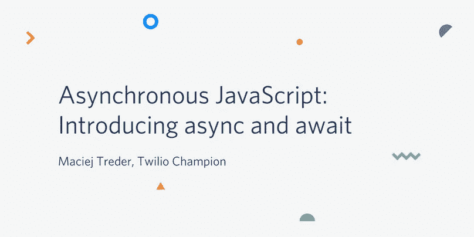
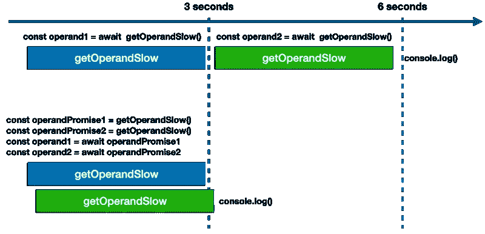

# 异步 JavaScript:引入异步和等待

> 原文：<https://javascript.plainenglish.io/asynchronous-javascript-introducing-async-and-await-5b15e971b43a?source=collection_archive---------7----------------------->



异步处理是 JavaScript 语言最重要的方面之一。JavaScript 是一种单线程语言，因此它需要一种机制来处理一些动作，比如执行耗时且可能不可靠的活动，比如调用 REST API、从磁盘读取文件或与用户输入交互。

在 JavaScript 中，使用的机制是一个[事件循环](https://developer.mozilla.org/en-US/docs/Web/JavaScript/EventLoop#Event_loop)，它按照从最旧到最新的顺序处理回调队列。队列中的每一项都是一条消息，在进入下一条消息之前会被完全处理。每条消息都是一个函数，它返回对应用程序中其他地方的代码的响应。这样使用的函数叫做*回调*函数。

因为有了回调，JavaScript 可以使用多种技术绕过它的单线程特性来实现异步处理。不幸的是，其中一些技术，JavaScript Promises 和 RxJS Observables，迫使您在代码中至少引入一个嵌套层次。这会降低代码的可读性和可维护性。

幸运的是，最近的 JavaScript 版本增加了一项处理异步代码的技术:*异步*和*等待*。当您希望程序在执行某些异步操作时同步阻塞，然后在该操作完成后继续工作时，这是一个完美的选择。

这篇文章将向你介绍*异步*和*等待*的基本原理，并向你展示具体的例子。然后，您将有机会创建一个使用*异步*和*等待*来执行异步处理的真实应用程序。

# 在 async 和 await 之前了解异步 JavaScript

在开始使用 *async* 和 *await* 之前，理解回调是很有帮助的，它是所有 JavaScript 异步处理基础的一部分。理解承诺也很重要，它为事件循环和回调过程增加了功能。承诺与*异步*和*等待*功能紧密配合使用。

# 复试

回调是异步运行 JavaScript 代码的最古老、最基本的技术。[回调](https://developer.mozilla.org/en-US/docs/Glossary/Callback_function)是“一个函数作为参数传递给另一个函数，然后在外部函数中被调用以完成某种例程或动作。”( [MDN](https://developer.mozilla.org/en-US/) )

当它们同步运行时，回调有一个相当大的缺点:它们阻塞事件循环，直到它们结束，从而可能导致程序变得没有响应，看起来“冻结”。在使用[同步请求](https://www.npmjs.com/package/sync-request)库的函数中可以看到这样一个例子，它是同步执行的。

您可以按以下方式编写使用回调的函数:

`getStatusCodeCB`函数有一个`url`参数，它是一个包含 URL 的字符串，您希望对该 URL 执行 HTTP 请求并从响应中获取状态代码。第二个参数是`callback`，这是一个一旦检索到状态代码就应该执行的函数。

该函数使用 [setTimeout](https://nodejs.org/api/timers.html#timers_scheduling_timers) API 在`setTimeout`的第二个参数指定的时间后将`request()`调用和`callback`函数调用放入回调队列。因为`setTimeout`是[异步](https://nodejs.org/en/docs/guides/timers-in-node/)，所以`getStatusCodeCB`函数体异步执行，不阻塞 JavaScript 栈，同步执行。

# 承诺

JavaScript 中异步执行代码的另一种方式是使用承诺。 [Promise](https://developer.mozilla.org/en-US/docs/Web/JavaScript/Reference/Global_Objects/Promise) 是一个对象，它提供了一个值的代理，该值将基于稍后发生的异步操作的结果(如果有的话)来确定。承诺也有一个状态，表示操作的状态。

上面的代码定义了一个返回 Promise 对象的`getStatusCodePromise`函数。当`getStatusCodePromise`函数*返回的承诺解析*时，它将请求的响应代码返回到`url`参数*中指定的地址。*Promise 对象的`.then()`方法指定了解析 Promise 时要做什么。

这两种解决方案都很好，当您想要使用外部 API(如`setTimeout`、`setInterval`或`fetch`)异步运行一个动作时，这两种解决方案是等效的。不幸的是，这些解决方案不能很好地处理依赖于其他动作的异步动作，比如在根据输入的数据执行一些条件逻辑之前等待用户输入。

*注意:*如果您想了解更多关于回调、承诺、事件循环或其他异步 JavaScript 特性的信息，请查看下面的*附加资源*部分中列出的帖子。它们是异步 JavaScript 教程综合库的一部分。

# 了解 async 和 await 关键字

[async](https://developer.mozilla.org/en-US/docs/Web/JavaScript/Reference/Statements/async_function) 和 [await](https://developer.mozilla.org/en-US/docs/Web/JavaScript/Reference/Operators/await) 关键字被添加到了第八版规范 [ECMAScript 2017](https://www.ecma-international.org/ecma-262/8.0/index.html) 版本的 JavaScript 规范中。这是 JavaScript 异步编程能力的重大改进，受到了各地开发人员的欢迎。

在第 9 个版本中， [ECMAScript 2018](https://www.ecma-international.org/ecma-262/9.0/index.html) ，引入了异步迭代器。这个新特性使得在`for…of`循环中使用`await`关键字成为可能。

## 异步ˌ非同步(asynchronous)

`async`关键字只能用于函数声明。它告诉 JavaScript 运行时环境( [V8](https://v8.dev/) 、 [Node.js](https://nodejs.org/en/docs/) 或 [Deno](https://deno.land/) )它应该将函数体包装在一个承诺中。承诺将由函数返回，而不是返回语句值；返回值将用于异步解析承诺。

以下两个函数返回等效的输出:一个 Promise 对象，该对象通过对`url`参数中提供的地址的 GET 请求的状态代码进行解析:

如果您希望由`async`函数返回的`Promise`被拒绝，请使用`throw`语句:

一个`async`函数不需要返回值；它可以返回 *void* 。当它这样做时，它相当于没有值的`Promise`解析:

`postDataAsync`功能在其承诺解决时*不会发出*任何数据，但承诺*状态*会变为*履行*或*拒绝*。通过检查承诺状态，程序可以确定异步操作是否成功。

## 等待

`await`关键字只能用于 Promise 对象。它通知 JavaScript 运行时环境应该暂停程序执行，直到相关的承诺解决。另一个约束是`await`只能在`async`函数内部使用。

要强制 JavaScript 运行时暂停程序执行，直到 Promise 解析并提供一个值，请在 Promise 调用之前插入关键字`await`:

要处理承诺拒绝，请将`await`语句放在`try…catch`块中:

声明逻辑所在的异步函数的另一种方法是在初始化之后调用它。例如，您可以将代码包装在一个匿名异步函数中，并立即调用它:

现在，您已经快速复习了 JavaScript 中异步处理的工作原理，并了解了`async`和`await`关键字，您可以获得一些在实际场景中使用这些工具的经验。

# 了解教程项目

在本教程中，您将创建一个带有交互式命令行菜单的控制台应用程序。它是您可以在控制台项目中重用的代码，比如命令行界面(CLI)工具。

当你构建菜单应用程序时，本教程将向你展示`async`和`await`关键字的方方面面。您将使用它们来创建返回承诺的函数，并调用同步等待承诺解决。

本文中的代码使用了 [readline-promise](https://www.npmjs.com/package/readline-promise) 库来读取命令行输入，因此您也将获得一些使用经验。这个库通过添加异步迭代器和其他特性来扩展 Node.js [readline](https://nodejs.org/api/readline.html#readline_readline) 模块。

# 先决条件

要完成本教程中的任务，您需要以下工具:

*   [Node.js 和 npm](https://nodejs.org/)(node . js 安装也将安装 NPM。)
*   [吉特](https://git-scm.com/downloads)
*   [Visual Studio 代码](https://code.visualstudio.com/download)(或其他 IDE 或代码编辑器)

为了充分利用这篇文章，你还应该具备 JavaScript 的基本工作知识。

有一个[配套库](https://github.com/maciejtreder/asynchronous-javascript)包含 GitHub 上提供的项目的完整源代码。

[Twilio 账户](http://www.twilio.com/referral/78mKcI)——虽然本教程并不要求这样做，但如果您使用此链接注册 Twilio 账户，您账户还可获得 10 美元的信用额度。

# 设置项目

在本教程中，您有两个选项来设置 Node.js 项目。您可以:

1.  使用配套存储库中的代码，其中还包括本系列前面关于异步 JavaScript 文章的代码
2.  从头开始，这样您的项目只包含本教程中的代码

要克隆伴随存储库，请在要创建项目根目录的目录中执行以下命令行说明:

```
git clone [https://github.com/maciejtreder/asynchronous-javascript.git](https://github.com/maciejtreder/asynchronous-javascript.git)
cd asynchronous-javascript
git checkout step16
npm install
mkdir async-await
cd async-await
```

这段代码包括许多分支，这些分支提供了说明如何使用 JavaScript 回调、Promises、RxJS Observables 和其他 JavaScript 特性的代码。

要从头开始命令行菜单项目，请在要放置项目根目录的目录中执行以下命令行指令:

```
mkdir async-await
cd async-await
git init
npx license mit > LICENSE
npx gitignore node
npm init -y
git add -A
git commit -m "Initial commit"
npm install esm
```

您可以在 Twilio 的 Phil Nash 的[帖子](https://philna.sh/blog/2019/01/10/how-to-start-a-node-js-project/)中了解更多关于初始化 Node.js 项目的信息。

使用以下命令在项目根目录或以下安装`readline-promise`库:

```
npm install readline-promise
```

# 构建应用程序

在您选择的 IDE 或代码编辑器中打开项目。

## 等待用户输入

为了构建应用程序的入口点，在*异步等待*文件夹中创建一个 *start.js* 文件，并将以下 JavaScript 代码放入其中:

上面的代码导入了`readline-promise`库，该库将用于收集用户的输入，并将其作为 Promise 对象传递给程序。常量`rl`的声明使用一个配置设置了一个`readlinePromise`对象的实例，该配置将输出分配给系统的标准输出，并通过标准输入监听用户输入，两者都是控制台。

在初始化了`readline`对象之后，代码声明了`MenuOptions`常量。这是一张[地图](https://developer.mozilla.org/en-US/docs/Web/JavaScript/Reference/Global_Objects/Map)，代表菜单中显示的可用程序选项。迄今为止，只有一个:“退出”。在编写应用程序的过程中，您将添加更多选项。

异步函数`displayMenu`，是程序的入口点。它从清除控制台开始。然后，它遍历`MenuOptions`地图的元素，并在控制台中显示可用的选项。一旦完成，就该等待用户输入了。

在`chosenOption`常量的声明中，代码要求用户使用`rl.questionAsync`方法进行交互。这个方法返回一个承诺，当用户输入时，这个承诺被解析。

您可以将`await`关键字与该方法调用一起使用，这将导致同步等待用户输入，并将用户输入放入`chosenOption`常量中。这在这里很有用，因为直到你从用户那里得到信息，你才知道下一步该做什么。

通过使用`await`关键字，您可以避免在嵌套层次中使用 Promise 对象的`then()`方法。您能够避免额外的调用，因为您已经使用`async`关键字声明了`displayMenu`函数。

用户输入是一个`string`值，因此`parseInt`方法在将它赋给`chosenOption`常量之前将其转换为一个整数。在函数结束时，在`switch`语句中使用`chosenOption`的值来确定要执行的动作。到目前为止，有两个:

`case 4`通过调用`rl`对象的 close 方法结束程序，该方法清除回调队列并释放节点。`js`退出。

`default`处理非法输入。如果用户输入一个超出范围的数字或任何其他无效输入，该函数会在控制台中显示一个通知。然后程序等待用户的确认，并递归调用 displayMenu 函数。

## 测试基本功能

这是查看一切是否正常工作的好时机。

通过在 *async-await* 目录中输入以下 Node.js CLI 命令来运行程序:

```
node -r esm start.js
```

您应该会在控制台窗口中看到以下输出:

```
Choose an option and press Enter(4) ExitYour choice:
```

输入“4”选择选项 4 并按下**确认选择后，输入**程序将退出。

如果您没有按照编码进行，并且希望使用 GitHub 存储库中的代码赶上这一步，请在您想要创建项目目录的目录中执行以下命令:

```
git clone [https://github.com/maciejtreder/asynchronous-javascript.git](https://github.com/maciejtreder/asynchronous-javascript.git)
cd asynchronous-javascript
git checkout step17
npm install
cd async-await
```

# 增强计划

当然，你不希望你的程序只有一个选项:“退出”。

在项目根目录下创建一个 *sum.js* 文件，并插入以下 JavaScript 代码:

上面的代码介绍了异步函数`getOperand`。该函数返回一个`Promise<number>`对象，它用一个从 0 到 10 的随机生成的数字进行解析。

问题是，为什么这个函数返回一个`Promise`而`return`语句调用返回整数的方法？这就是`async`关键字的神奇之处:它告诉 JavaScript 运行时将函数体包装在一个`Promise`中，后者用来自`return`语句的值进行解析。

第二个函数`addTwoNumbers`是从文件中导出的，因此您将能够在 *start.js* 文件中使用它，程序入口点就驻留在这个文件中。该函数清除控制台，等待随机数的生成，并添加它们。在函数返回之前，它显示操作数和它们的总和。

请注意，`addTwoNumbers`函数声明的前面是`async`关键字，因此您可以在其中使用`await`,来“解开”由`getOperand`函数返回的 Promise 对象。如果你不使用`await`，你会得到一个 Promise 对象，在这个对象上你仍然需要调用`then`方法来获取值。

注意，`addTwoNumbers`函数没有`return`语句。这与声明中的`async`一起表明函数的返回类型是`Promise<void>`，这是一个承诺，通知调用者一些异步操作已经完成，而没有提供该操作的任何输出。

在 *start.js* 文件的开头添加以下`import`语句:

通过用以下内容替换当前的`MenuOptions`声明，向菜单添加一个新选项:

将新的`case`添加到`displayMenu`函数内的`switch`语句中:

现在，每当用户从菜单中选择“1”时，程序就会调用`addTwoNumbers`函数，等待它用`await`结束，并要求用户按回车键返回菜单。一旦用户执行该操作，`displayMenu`功能将被递归调用。

在这些修改之后，你的 *start.js* 文件应该看起来像同伴库中的 [this file](https://github.com/maciejtreder/asynchronous-javascript/blob/step18/async-await/start.js) 。

## 测试增强型应用程序

现在您已经为应用程序添加了一些功能，您可以进行一些有价值的测试了。

使用以下 Node.js 命令运行程序:

```
node -r esm start.js
```

从菜单中选择选项 1，并验证它是否按预期工作。您的输出应该类似于以下内容，操作数和 sum 的值随着大多数迭代而变化:

```
First operand: 3
Second operand: 1
Sum: 4
Press Enter to get back to the menu
```

要关闭程序，请按回车键返回菜单并选择选项“4”。

到目前为止的代码在伙伴库的分支[步骤 18](https://github.com/maciejtreder/asynchronous-javascript/tree/step18/async-await) 中。

# 了解等待性能陷阱

您已经掌握了 async-await，但是还有一点需要注意。正如你已经知道的，`await` *同步*等待一个`Promise`来解决。它真的做到了，毫不留情。有时候可能会疼。

创建一个名为 *sumSlow.js* 的新文件，并将以下 JavaScript 代码放入其中:

这个函数返回一个承诺，它在 3 秒钟后用一个随机生成的数字解决。为了延迟输出，代码使用了`setTimeout`函数，这是异步的。

将以下函数添加到 *sumSlow.js* 文件的底部:

这个函数与您之前实现的非常相似。唯一附加的逻辑是使用`console.time`和`console.timeEnd`来测量这个函数运行的速度。

通过在文件顶部添加以下语句，将`addTwoNumbersSlow`函数导入到 *start.js* 文件中:

向`MenuOptions`地图添加一个新条目:

在`displayMenu`函数内的`switch`语句中添加了一个新的`case`，用于控制程序流程:

运行程序并从菜单中选择选项“2”。检查该函数需要返回多少时间:

```
First operand: 2
Second operand: 0
Sum: 2
Time elapsed: 6006.825ms
Press Enter to get back to the menu
```

正如你所看到的，这个功能需要 6 秒钟才能完成。为什么？原因是您在`addTwoNumbersSlow`功能中使用`await`的方式:

在检索第一个操作数的过程中，你已经用关键字`await`同步阻塞了程序。因此，第二个呼叫在 3 秒后被初始化，又花了 3 秒才解决。

这很容易解决。将以下函数添加到 *sumSlow.js* 文件的底部:

`addTwoNumbersSlow`和`addTwoNumbersFaster`的区别在于你如何称呼承诺:

你同时开始了两个承诺的生命周期，之后你通过使用`await`关键字来阻止程序等待结果。正因为如此，这些承诺并行不悖。

这两种实现的比较如下图所示:



从调整导入语句。/ *sumSlow* 在 *start.js* 文件中添加`addTwoNumbersFaster`使其看起来如下:

向`MenuOptions`地图添加新条目:

在`displayMenu`函数内的`switch`语句中添加一个新的`case`:

在这些修改之后，你的 *start.js* 文件应该看起来像 [this](https://github.com/maciejtreder/asynchronous-javascript/blob/step19/async-await/start.js) 。

运行程序，并通过从菜单中选择选项“3”来调用您刚刚实现的功能。在控制台中，您应该看到所用的时间大约是第一次实现的一半:

```
First operand: 2
Second operand: 4
Sum: 6
Time elapsed: 3003.828ms
Press Enter to return to the menu
```

根据您的系统进行计算实际需要的时间，您的实际值应该与上面显示的数字略有不同。

到目前为止的代码是伙伴库中的分支[步骤 19](https://github.com/maciejtreder/asynchronous-javascript/tree/step19/async-await) 。

# 摘要

这篇文章介绍了 JavaScript 中异步处理的工作原理，以及回调和承诺如何提供异步功能。它向您展示了这些语言特性是如何工作的，然后描述了`async`和`await`关键字如何与这些特性一起工作，以提供对异步处理的更方便、更可读的访问。

在一个案例研究项目中，您看到了如何使用 async、await 和 Promises 实现交互式命令行菜单系统。您还看到了如何使用 [readline-promise](https://www.npmjs.com/package/readline-promise) 库。

# 额外资源

要钻研与异步处理相关的 JavaScript 基础知识，请参阅:

[异步 JavaScript:理解回调](https://medium.com/swlh/asynchronous-javascript-understanding-callbacks-8c288c555b23)

如果你想了解更多关于 JavaScript 的承诺，看看下面的帖子:

[异步 JavaScript:JavaScript Promises 简介](https://medium.com/better-programming/asynchronous-javascript-introduction-to-javascript-promises-3142eeea9b38)
[异步 JavaScript:高级 Promises with node . js](https://medium.com/swlh/asynchronous-javascript-advanced-promises-with-node-js-1d4c4b82e8ce)
[异步 JavaScript:使用 RxJS Observables with REST API in node . js](https://medium.com/weekly-webtips/asynchronous-javascript-using-rxjs-observables-with-rest-apis-in-node-js-f31755c880b3)

您可能还想了解 RxJS(react vex JavaScript)，对于某些编程情况，它是一个更好的异步工具:

[异步 JavaScript:引入 ReactiveX 和 RxJS 观察器](https://medium.com/swlh/asynchronous-javascript-introducing-reactivex-and-rxjs-observables-2e3ef3bf3a01)
[异步 JavaScript:在 Node.js 中使用带有 REST APIs 的 RxJS 观察器](https://medium.com/weekly-webtips/asynchronous-javascript-using-rxjs-observables-with-rest-apis-in-node-js-f31755c880b3)

还有一些第三方资源是 JavaScript 开发人员必不可少的参考。以下是一些例子:

[MDN web docs:Javascript](https://developer.mozilla.org/en-US/docs/Web/JavaScript)—Mozilla 开发者网络提供了一个全面的 Javascript 参考网站，包含教程和参考信息。

[Node.js 文档](https://nodejs.org/en/docs/) —如果您正在编写服务器端 JavaScript，Node.js 参考文档是一个必不可少的资源。

RxJS 的学习资源和参考信息的网站，RxJS 是 observer、迭代器模式以及函数式集合编程的 JavaScript 实现。

[我应该使用哪个运算符？](https://xgrommx.github.io/rx-book/content/which_operator_do_i_use/index.html) —为所需操作选择最佳可观察操作员的有用工具。

想在提高编程技能的同时找点乐子吗？试试 Twilio 的视频游戏:

[TwilioQuest](https://www.twilio.com/quest) —通过这一 16 位风格的冒险，击败传统系统的力量。

*我是 Maciej Treder，通过*[*contact@maciejtreder.com*](mailto:contact@maciejtreder.com)*、*[*https://www.maciejtreder.com*](https://www.maciejtreder.com/)*或@ maciejtreder on*[*GitHub*](http://github.com/maciejtreder)*、*[*Twitter*](https://twitter.com/maciejtreder)*和* [*LinkedIn*](https://www.linkedin.com/in/maciej-treder/)

*本帖原载于* [*Twilio 博客*](https://www.twilio.com/blog/asynchronous-javascript-introducing-async-and-await) *。*