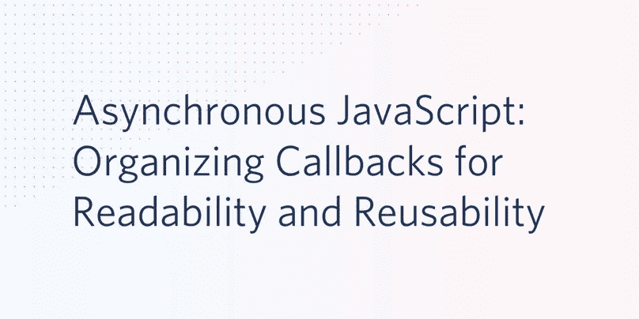

# 异步 JavaScript:为可读性和可重用性组织回调

> 原文：<https://javascript.plainenglish.io/asynchronous-javascript-organizing-callbacks-for-readability-and-reusability-32ad912f2faf?source=collection_archive---------5----------------------->



异步编程是成为一名完整的 JavaScript 程序员的重要组成部分。理解 JavaScript 中的代码执行流是理解它如何处理异步任务的基础。能够编程异步任务使您能够利用 JavaScript 运行时引擎和外部 API 提供的大量功能。有了这些工具，您可以通过互联网将您的 JavaScript 程序与 web APIs 连接起来，并有效地管理这些(有时是脆弱的)连接。

随着权力而来的是复杂性。使用 JavaScript 回调实现异步功能可以快速创建一系列深度嵌套的函数调用。这篇文章将向您展示如何编写和组织 JavaScript 回调函数，以最大化异步函数的可读性、可维护性和可重用性。

正如一句古老的编程谚语所说:

> 任何傻瓜都能写出计算机能理解的代码。优秀的程序员编写人类能够理解的代码。

本系列的第一部分，[异步 JavaScript:理解回调](https://medium.com/swlh/asynchronous-javascript-understanding-callbacks-8c288c555b23)，提供了 JavaScript 事件循环、回调队列和执行堆栈的完整概述。在一个简短的案例研究项目中，它向您展示了 JavaScripts 非阻塞事件模型中的函数执行顺序，以及如何使用回调从外部 API 检索和操作数据。

这篇文章继续第一部分的内容，向您展示如何将一系列三个链接的回调函数和五个层次的函数转换成更易维护和调试的代码。设置案例研究项目只需要几分钟时间。

# 先决条件

为了完成这篇文章中的任务，你需要:

*   [Node.js 和 npm](https://nodejs.org/)(node . js 安装也会安装 NPM。)
*   [吉特](https://git-scm.com/downloads)

您还应该对 JavaScript 和 JavaScript 事件循环有很好的理解。如果您需要复习后一点，请查看本系列关于异步 JavaScript 的第一部分。

GitHub 上有这篇文章的[配套资源库](https://github.com/maciejtreder/asynchronous-javascript)。

# 正在初始化项目

如果你从[开始](https://medium.com/swlh/asynchronous-javascript-understanding-callbacks-8c288c555b23)开始这个系列，很好！您已经有了项目和代码设置。可以继续使用*异步 javascript* Node.js 应用程序。

如果您已经知道事件循环是如何工作的，并且在这里关注代码组织，有两种方法可以开始:

**选项 1**

通过在您想要创建项目目录的目录中执行以下指令，克隆第 1 部分中的项目:

```
git clone [https://github.com/maciejtreder/asynchronous-javascript.git](https://github.com/maciejtreder/asynchronous-javascript.git)
cd asynchronous-javascript
git checkout step2
npm install
```

**选项 2**

在您想要创建项目目录的目录中执行以下命令行指令:

```
mkdir asynchronous-javascript
cd asynchronous-javascript
git init
npx license mit > LICENSE
npx gitignore node
npm init -y
npm install request
git add -A
git commit -m "Initial commit"
```

在成功完成选项 1 或 2 之后，您应该在项目根目录中拥有一个 Node.js 项目和一个 *nestedCallbacks.js* 文件。还有一个带有适当的*的 Git repo。Node.js 项目的 gitignore* 文件。

如果您遵循了**选项 1** ，打开根项目目录中的 *nestedCallbacks.js* 文件。

如果您遵循了**选项 2** ，在根项目目录中创建一个 *nestedCallbacks.js* 文件，并插入以下 JavaScript 代码:

通过在根项目目录中执行以下命令行指令，验证 Node.js 项目是否设置正确:

```
node nestedCallbacks.js
```

控制台窗口中显示的输出应该是:

```
The best movie by Quentin Tarantino is... Inglourious Basterds !!!
```

您可能不同意这个结果，但是它证明了您的代码工作正常，并且您的 API 调用与远程 API 模型相连接。

# 理解嵌套 JavaScript 回调的问题

在开始重新组织你的回调函数之前，看看一系列嵌套的回调函数对理解问题是有帮助的。

在 IDE 或代码编辑器中查看 *nestedCallbacks.js* 代码。如果您使用的是 Visual Studio 代码(为什么不呢？)你会看到第三个 API 调用的回调函数中的`forEach`循环在嵌套的第六层。

虽然前两个回调函数中的代码很简单，第三个回调函数也很简单，但是不难看出在回调队列中找到自己的位置会变得很复杂。想象一下，如果在 API 调用、回调函数和依赖于 API 调用返回值的条件逻辑的参数之间有选择。这可能是意大利面条的配方！

# 组织异步 JavaScript 回调

随着程序复杂性的增加，除了潜在地难以阅读、维护和调试之外， *nestedCallbacks.js* 中的 API 调用和回调函数不能以当前形式重用。这意味着您可能有重复的代码，导致更多的 bug。

幸运的是，很容易将 *nestedCallbacks.js* 重构为更加模块化和可重用的代码。一个技巧是从最里面的回调开始，一步步向上。

因此，您可以在工作时并排比较这两个版本，在项目根目录中创建一个 *organizedCallbacks.js* 文件。

插入以下 JavaScript 代码:

封装嵌套最多的代码块，也就是最后一个`request`调用的回调函数。在刚刚添加的行下面插入以下代码:

您可能已经注意到，这个函数中有更多的参数。他们是这样做的:

`movie`是一个对象，包含您要计算平均分的电影的信息。

`reviews`是指定`movie`的评论数组。每个数组元素都有一个评审分数。

`director`是一个包含指定`movie`导演信息的对象。

`toBeChecked`是一个计数器，显示还有多少电影需要该函数处理。

注意`toBeChecked`是一个对象而不是一个原始(整数)类型，所以它的状态，检查的电影数量，可以在函数调用之间维护。这在原始代码中是不必要的，因为 JavaScript 的变量作用域方法:父函数外层循环中的变量`checkedMoviesCount`可供它下面的函数调用使用。(阅读更多关于 JavaScript [闭包](https://developer.mozilla.org/en-US/docs/Web/JavaScript/Closures)的内容。)这是一种可以在许多需要跟踪函数调用之间的值的地方使用的技术。

`movies`是一个电影数组，函数通过它进行迭代以找到最高分。

该函数遍历指定导演的电影。它从递增`count`计数器开始。然后，它遍历电影的每个评论，将每个评论的分数添加到累积分数中，并增加评论的计数。当检查完评论后，它会计算电影的平均评分，并将分数添加到电影列表中的电影条目中。

当检查的电影数等于电影数组的长度时，代码按平均分降序排列该数组。然后，数组中第一个元素的标题，也就是评分最高的电影，被写入控制台输出。

现在，将调用堆栈上移至第二个 API 调用，该调用检索电影评论。

将以下 JavaScript 代码插入到 *organizedCallbacks.js* 中您在上一步中添加的代码下方:

这个函数有两个参数:

`movies`是一组您要检索评论的电影。

`director`是一个对象，包含关于`movies`数组中电影导演的信息。

该代码初始化`toBeChecked`计数器，该计数器跟踪剩余待评估的电影数量。

然后代码遍历`movies`数组。它为每个`movie`调用一个 REST 来检索评论列表，该列表存储在`reviews`对象中并传递给`calculateAverageScore`函数。

您要封装的最后一个代码块是对第一个 REST 请求的回调，该代码查找给定导演的电影:

有两个参数:

`directors`是要搜索的控制器数组。

`name`是一个字符串，标识您正在为其检索评论的导演。它用于显示最终结果。(有关这方面的更多信息，请参见下面的*进一步改进*部分。)

在函数体中，代码保存指定的`director`的`id`值，并使用它来执行 REST 调用以检索他的电影列表。

`findDirector`函数的回调函数是`getReviews`函数。当对*/asynchronous-JavaScript/directors/{ id }/movies*端点的 REST 调用返回一个电影列表时，该列表被用作`movies`参数中的`getReviews`函数的回调函数调用的参数。导演的名字在`name`参数中传递。

启动整个过程的 web API 调用是对 */directors* 端点的调用，以获取 directors 列表。在前面的函数下添加以下代码:

web API 调用获取一个控制器列表，并将 JSON 对象解析成一个数组。这个控制器列表被传递给`directors`参数中的回调函数。对`findDirector`的回调函数调用获得了昆汀·塔伦蒂诺的`id`值。

# 测试重组后的 JavaScript 回调

通过在项目根目录中执行以下命令行指令，验证新的程序结构是否正常工作:

```
node organizedCallbacks.js
```

输出应该是:

```
The best movie by Quentin Tarantino is... Inglourious Basterds !!!
```

批评家可能会有不同意见，但是结果反映了测试 API 的平均分数。如果你得到不同的结果，确保你使用正确的`id`值为导演得到电影列表。

# 探索封装回调函数的优势

封装的回调有什么好处？您已经将代码中嵌套层次的数量从六个减少到三个，使得阅读、维护和调试更加容易。您可以改变或增加每个函数的行为，而对其他函数的影响较小。

您还使得扩展应用程序的功能变得更加容易。使用新的程序结构，很容易为测试集中的每个导演找到评分最高的电影。

将以下几行添加到 *organizedCallbacks.js* 文件的底部:

再次执行程序。您应该会看到四位导演的顶级电影列表:

```
Best movie by Quentin Tarantino is... Inglourious Basterds !!!
Best movie by Stanley Kubrick is... 2001: A Space Odyssey !!!
Best movie by James Cameron is... Titanic !!!
Best movie by Wes Anderson is... The Grand Budapest Hotel !!!
```

如果您还没有进行编码，并且想要使用 GitHub 上的配套库来完成这一步，那么在您想要创建项目目录的目录中执行以下命令:

```
git clone [https://github.com/maciejtreder/asynchronous-javascript.git](https://github.com/maciejtreder/asynchronous-javascript.git)
cd asynchronous-javascript
git checkout step3
npm install
```

# 进一步增强

上面的代码比 *nestedCallbacks.js* 有所改进，但仍有改进的空间。以下是一些可以改进的方法:

*   它是颠倒的。如果代码按照从上到下的顺序执行，你的程序将更具可读性。
*   这些功能是高度耦合的。程序只能在当前的结构中运行，函数间的数据流只允许程序以一种方式构建。随着需求的变化，这抑制了功能的可重用性和可维护性。
*   这些功能不是原子的。你可以在几个地方很容易地看到这一点:
*   在第一个 API 调用被调用之前，代码知道您要为其显示得分最高的电影的导演的名字，但是它通过两个函数调用来传递。
*   最后一个函数调用`calculateAverageScore`，显示评分最高的电影——但那“不是它的工作描述的一部分”。

如果你是 JavaScript 新手，做更多的重构对你来说是一个很好的练习。重要的是要认识到，既然回调嵌套的级别已经降低，那么发现需要改进的地方就容易多了。当你自己编程时，发现你已经创建了一系列深度嵌套的回调函数，这是你应该考虑重构的信号。

# 组织 JavaScript 回调概述

在这篇文章中，您了解了如何获取一组深度嵌套的 JavaScript 回调并将它们重构为独立的函数，从而使代码更具可读性、可维护性和可调试性。您还看到了如何减少 JavaScript 回调的嵌套，从而更容易发现代码中可以改进的其他方面。

进一步:[异步 JavaScript:JavaScript 简介承诺](https://medium.com/@maciejtreder/asynchronous-javascript-introduction-to-javascript-promises-3142eeea9b38)

# 额外资源

*JavaScript:精彩部分*，道格拉斯·克洛克福特(O'Reilly，2008)如果你只打算读一本关于编写 JavaScript 的书，这应该就是了。

【json.org】一页上的 JSON 语言规范。也可从 ECMA 获得更长的 [PDF](http://www.ecma-international.org/publications/files/ECMA-ST/ECMA-404.pdf) 格式。

GitHub Pages 用于托管本文中使用的测试 web API。这是一件值得了解的好事。

*我是 Maciej Treder，请通过*[*contact@maciejtreder.com*](mailto:contact@maciejtreder.com)*，*[https://www.maciejtreder.com](https://www.maciejtreder.com/)*或@ maciejtreder on*[*GitHub*](http://github.com/maciejtreder)*，*[*Twitter*](https://twitter.com/maciejtreder)*和* [*LinkedIn*](https://www.linkedin.com/in/maciej-treder/)

*本帖最初发表在* [*Twilio 博客*](https://www.twilio.com/blog/asynchronous-javascript-organize-callbacks-readability-reusability) *上。*