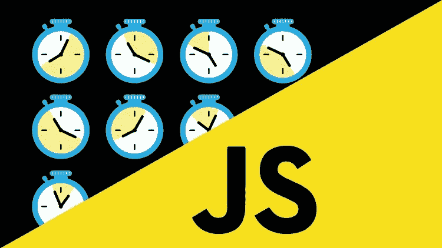
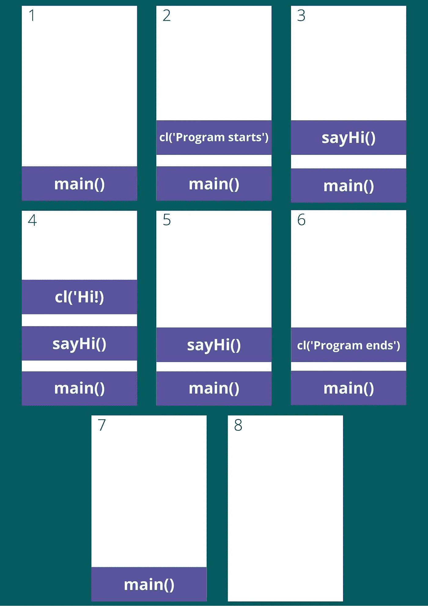
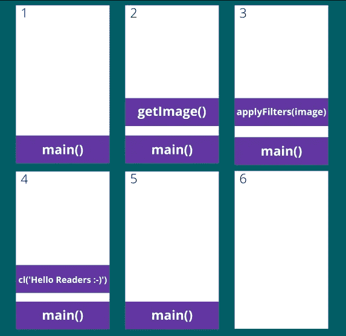
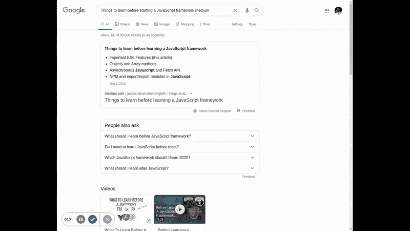
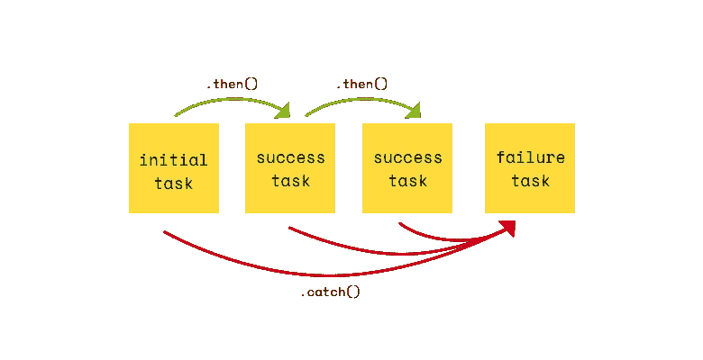
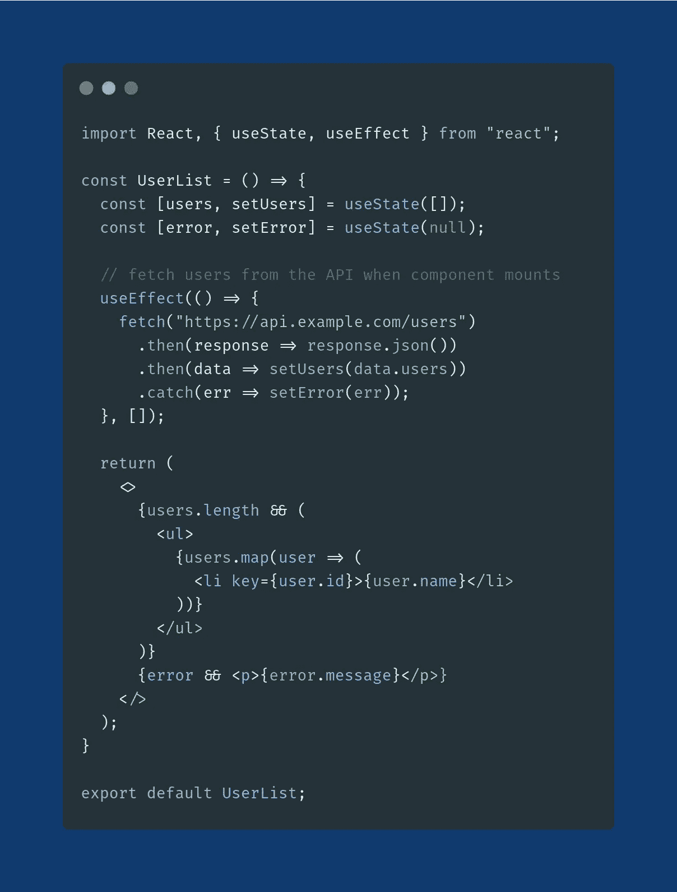

# 在 JavaScript 框架之前学习异步 JavaScript

> 原文：<https://javascript.plainenglish.io/asynchronous-javascript-to-learn-before-javascript-frameworks-9b63972290c2?source=collection_archive---------1----------------------->

Source: [https://myfreecourses.com/wp-content/uploads/2018/09/1705248_a6d3-1280x720.jpg](https://myfreecourses.com/wp-content/uploads/2018/09/1705248_a6d3-1280x720.jpg)

在这一系列文章中，我们旨在涵盖以下主题:

1.  [ES6 的重要特性](https://medium.com/javascript-in-plain-english/things-to-learn-before-learning-a-javascript-framework-b7baec310247)
2.  [对象和数组方法](https://medium.com/javascript-in-plain-english/object-and-array-methods-to-learn-before-javascript-frameworks-59728dcea306)
3.  异步 JavaScript 和获取 API(本文)
4.  [JavaScript 中的 NPM 和导入/导出模块](https://medium.com/javascript-in-plain-english/how-to-use-npm-and-import-export-modules-in-javascript-31a7f66a2064)

在前两篇文章中，我们已经讨论了前两个主题，所以在本文中，我们将讨论**异步 JavaScript 和 Fetch API。**

所以，不浪费任何时间，让我们从这个话题开始:

Source: [https://giphy.com](https://giphy.com/g)

在跳到异步 JavaScript 的细节之前，我们先来说说 JavaScript 中**同步代码**的执行。我们将考虑一个简单的例子来理解这一点:

正如您所注意到的，它遵循一个连续的顺序，也就是说，所有的任务都是按照它们被编码的顺序执行的。在内部，JavaScript 引擎在 [*调用栈*](https://developer.mozilla.org/en-US/docs/Glossary/Call_stack) 的帮助下执行这些任务。

让我们看看调用堆栈如何帮助执行我们的代码:

正如您所注意到的，当前正在执行的任务被添加到`Call Stack`中，并在完成执行后从其中弹出。

现在，您对同步代码的执行和调用堆栈有了一个概念，让我们从异步 javascript 开始吧。

## 什么是异步 JavaScript，为什么我需要它？

JavaScript 是一种单线程的 T21 语言，也就是说它只有一个 T1，这意味着它一次只能执行一个任务。因此，如果我们试图以同步的方式执行缓慢(或耗时)的操作，那么它们会导致阻塞主线程。

让我们借助一个例子来理解我们所说的`Blocking`是什么意思:

上述示例中调用堆栈的不同状态如下:

现在，正如你所注意到的，它遵循我们已经学习过的相同的顺序，但是，这一次`getImages`和`applyFilters`是需要大量时间执行的缓慢操作，由于它们，主线程被阻塞，这意味着，**页面冻结，我们不能在输入中输入任何内容，也不能触发任何事件。**

**注:**

1.  当程序处于阻塞状态时，链接、事件监听器或函数都不起作用。
2.  您可以通过在浏览器的开发人员控制台窗口中运行任何无限或繁重的操作来轻松复制阻塞行为。这种操作的一个例子是:

以下是运行此代码的结果:

正如你所注意到的，页面被冻结了，没有一个事件在起作用，所以，我们可以清楚地说这不是一个理想的情况，所以为了克服它，为了避免我们所有人编写阻塞代码，JavaScript 提出了**异步的概念。**

根据维基百科:

> **异步**，在计算机编程中，是指独立于主程序流程的事件的发生以及处理这类事件的方式。

在 JavaScript 的例子中，由于它是单线程语言，**异步**意味着一次只执行一个任务，但是告诉环境在稍后的某个时间点执行特定的任务。

好的，但是我们如何用 JavaScript 写一个函数，在某个时间点之后被调用，或者如何写一个异步代码？

对此最简单的回答是使用**异步回调**。

## **异步**回调

顾名思义，异步回调是在另一个函数完成执行时调用的函数。它使我们的代码非阻塞，并为我们的代码提供异步行为。

浏览器为我们提供了一个名为`setTimeout()`的函数，它接受两个参数，第一个是回调函数，第二个是回调函数应该执行的最小持续时间。让我们借助一个简单的例子来看看它是如何工作的:

在上面的例子中，回调函数在程序执行一秒钟后被调用。

所以，上面的例子本质上是异步的，但是它是如何在调用栈或 JavaScript 引擎中工作的呢？

让我们借助一段视频来了解一下:

正如您所注意到的，除了**调用堆栈，**现在我们还有一列用于**Web API**和一行用于**回调队列**。

好了，为了理解执行，让我们来分解一下这些东西是如何工作的:

1.  任何异步任务(就像本例中的回调函数)都会和它的定时器(如果有的话)一起被添加到 Web APIs 列中。
2.  一旦计时器结束，回调函数将被添加到回调队列中。
3.  现在，[事件循环的](https://developer.mozilla.org/en-US/docs/Web/JavaScript/EventLoop)任务是遍历堆栈和队列，如果堆栈为空，它将队列中的第一个任务推送到堆栈上，从而有效地运行该任务。

为了更好地理解它，我们来看另一个例子，这次我们将持续时间设置为 0:

这一次没有立即调用回调，因为事件循环等待堆栈为空，以将任务推送到队列中。让我们借助一个小视频来了解一下执行情况:

**注意:**从上面的例子我们可以得知，setTimeout()函数中提到的持续时间是回调函数被调用或执行的最小 **持续时间****。**

如果你想了解更多关于事件循环、web APIs 和其他相关术语的信息，那么 [**这段**](https://www.youtube.com/watch?v=8aGhZQkoFbQ) 视频非常值得一看。另外， [**这里的**](http://latentflip.com/loupe/) 是我用来展示 JavaScript 引擎工作的网站链接。

## 顺序执行多个异步操作

假设我们现在必须顺序执行多个异步操作，因为这些操作都是异步的，所以我们必须使用异步回调来避免阻塞线程。那么，让我们看看如何实现这一目标:

你可以清楚地看到，现在我们的代码很难理解和维护，而且不可伸缩。这种情况被称为`Callback hell`或`Pyramid of Doom`。

由于回调的可读性更差，复杂性更高，因此引入了承诺的概念。让我们看看 Promises 是如何解决这个问题的。

## 承诺

承诺是包装异步代码并在完成时发出通知的对象。它代表了一个可能还不可用但将来会有的值。它帮助我们以同步的方式编写异步代码。

允诺对象由允诺人和被允诺人组成。承诺状态可能有 3 个不同的值:

*   待定(初始状态，既未解决也未拒绝)
*   已解决(表示操作成功)
*   拒绝(意味着操作失败)

PromiseValue 由操作的结果组成，如果成功可能是数据，如果失败可能是错误。

承诺有三种执行方法，具体取决于承诺的状态:

*   。然后(如果承诺已解决，则执行)
*   。catch(承诺被拒绝时执行)
*   。最终(在承诺已解决或已拒绝时执行)

所有这些方法都接受一个函数并返回另一个承诺。

让我们看看返回承诺的异步代码的基本语法:

让我们一行一行地理解上面的例子:

1.  一些异步代码被执行，它返回一个承诺。
2.  如果承诺的状态为`resolved`，那么将执行`.then()`函数中的代码。
3.  如果返回的承诺的状态为`rejected`，那么`.catch()`中的代码将被执行。

**注意:**有时你有多个异步任务，你想按顺序执行，你也需要把上一步的结果传递给下一步，在这种情况下，你可以把`.then()`方法链接起来，这样每个方法执行一个特定的任务，它的结果将在下一个任务的执行中有用。

让我们来理解它在我们的图像示例中是如何工作的:

因此，我们可以注意到，这次我们的代码更具可读性和可伸缩性，因此与回调相比，承诺更易于使用，因为它们使我们的代码更具可读性，更易于维护。

**注意:**可以链接多个`.then()`方法，但只允许使用一个`.catch()`方法。因此，如果在执行任何一个`.then()`方法时出现错误，那么`.catch()`方法会捕获该错误并执行传递给它的函数。

这里有一张图片，可以帮助您直观地看到这一点:

Credits: [Kevin Kim](https://medium.com/u/78e5e4ccd675?source=post_page-----9b63972290c2--------------------------------)

记住这些知识，让我们写一些实际的代码来更好地理解它。我们将使用`**fetch API**`向[https://jsonplaceholder.typicode.com/todos/1](https://jsonplaceholder.typicode.com/todos/1)发出一个`GET`请求。

## 获取 API

Fetch API 提供了在`window`对象上定义的`fetch()`方法，用于执行请求。该方法返回一个承诺，您可以用它来检索请求的响应。

让我们在实践中看看:

让我们一步一步解码:

*   Fetch 方法接收一个`url`，从中读取/发送数据。
*   作为`GET`请求的结果，它返回一个承诺。
*   如果承诺的状态为`resolved`，那么执行第一个`.then()`方法，将响应解析为 JSON。
*   第一个`.then()`方法执行后，返回的结果被传递到第二个`.then()`方法，该方法将数据打印到控制台。
*   如果承诺的状态为`rejected`，那么将执行`.catch()`方法，将`error`打印到控制台。

这就是如何使用`Fetch`方法生成一个简单的`GET`请求。现在，我们将看到另一个发出`POST`请求的例子。我们将向[https://jsonplaceholder.typicode.com/posts](https://jsonplaceholder.typicode.com/posts')发出帖子请求，以创建一个帖子:

这里，除了 URL，我们还传递了一个对象，该对象由发出`POST`请求所需的方法、主体和头组成。该方法指定了 API 请求的类型，`body`由我们正在创建的新 post 数据组成，`headers`由`Content-type`组成。

本文到此为止，我们将在下一篇文章中讨论本系列的最后一个主题。

和往常一样，为了结束这篇文章，我将留给你们一个简单的`React Component`，它使用了上述概念:

此外，检查之前的部分(如果你没有):

 [## 学习 JavaScript 框架之前需要了解的事情(第 1 部分)

### 因此，在这一系列的文章中，我将尝试解释一些我认为真正…

medium.com](https://medium.com/javascript-in-plain-english/things-to-learn-before-learning-a-javascript-framework-b7baec310247)  [## JavaScript 框架之前要学习的对象和数组方法(第 2 部分)

### JavaScript 中可以应用于对象和数组的不同类型的方法

medium.com](https://medium.com/javascript-in-plain-english/object-and-array-methods-to-learn-before-javascript-frameworks-59728dcea306)  [## 如何在 JavaScript 中使用 NPM(和导入/导出模块)(第 4 部分)

### 学习 JavaScript 框架之前要学习的 NPM 命令和导入/导出模块

medium.com](https://medium.com/javascript-in-plain-english/how-to-use-npm-and-import-export-modules-in-javascript-31a7f66a2064) 

如果你想和我联系，请点击下面的链接:

[LinkedIn](https://www.linkedin.com/in/rajat-verma-39458317b/)|[GitHub](https://github.com/rajat2502)|[Twitter](https://twitter.com/rajatverma2502)