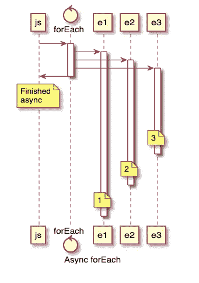
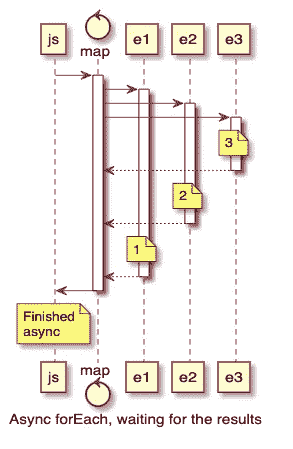

# JavaScript 循环中的异步处理

> 原文：<https://javascript.plainenglish.io/asynchronous-processing-in-javascript-loops-2acdbe674303?source=collection_archive---------2----------------------->


Photo by [Ferenc Almasi](https://unsplash.com/@flowforfrank?utm_source=medium&utm_medium=referral) on [Unsplash](https://unsplash.com?utm_source=medium&utm_medium=referral)

在过去的三年里，我一直在学习 JavaScript 及其不同的风格、框架和库。这种语言功能强大、有趣，并且有一个大型开源社区作为后盾。作为一名全栈 JavaScript 开发人员，您真正受到限制的只是您的想象力。

Node.js 是 JavaScript 的一个**异步**事件驱动运行时。它允许您构建具有高性能的高可伸缩性应用程序。Node.js 高性能背后的秘密是，它违背了其他运行时、框架和语言中使用的常见并发模型。

Node.js 进程中的所有代码从头到尾都是按顺序执行的，但是，该进程只有一个线程，这意味着它只有一个调用堆栈和内存堆。简而言之，如果线程不是空闲的，代码执行会延迟到它空闲时。这是开发人员在构建应用程序时需要格外小心以避免性能瓶颈的地方。你应该始终遵循一条规则:**永远不要阻塞主线程！**

阻塞方法同步执行，而非阻塞方法异步执行。当阻塞方法消耗主线程并冻结整个进程时，它们就变得很危险。作为一个例子，考虑这样一个场景，一个 API 请求发送到一个 web 服务器，需要 100 毫秒才能完成。假设通过 IO 查询后端数据库需要 90 毫秒，处理数据并将数据返回给客户端需要 10 毫秒。通过选择对数据库的非阻塞异步查询操作，我们可以从主线程中释放 90 毫秒，让我们在后台做其他事情(比如处理第二个或第三个请求)，直到第一个请求的数据从数据库返回。

# 同步环路

所有开发人员都熟悉传统的 for 循环:

```
for (var i=0; i < arr.length; i++) {
    var item = arr[i];
    // do something with item
}
```

这个循环简单、快速、同步，这意味着它将从头到尾遍历数组中的每个元素。因此，您应该避免在这个循环中有任何长时间运行的同步操作，因为它会冻结主线程。

注意:编写这个完全相同的循环的更简洁的方法是使用 forEach 方法。

> *以后想看这个故事吗？保存在* [*日记本*](https://usejournal.com/?utm_source=medium.com&utm_medium=blog&utm_campaign=noteworthy&utm_content=eid7) *。*

```
arr.forEach((item) => {
    // do something with item
});
```

# 异步循环

作为 ES7 的一部分，Javascript 引入了 async/await 函数的概念，允许开发人员编写看起来像同步代码的异步代码。

以下是如何在循环中使用 await 的示例:

```
async function printArray(array) {
    array.forEach(async (item) => {
        await doSomething(item);
    )}
    console.log('Done');
}
```

我们有一个大问题。即使 forEach 方法是同步的，它实际上也不会等待 doSomething 方法完成，因为它是在异步匿名函数中异步调用的。正因为如此，程序执行将经过函数调用，并将首先记录“完成”。下面是为什么会发生这种情况的形象化描述:



Async forEach

这里有一个简单的测试来证明我的意思:

```
function delay() {
    return new Promise(resolve => setTimeout(resolve, 1000));
}async function delayedLog(item) {
    await delay();
    console.log(item);
}async function printArray(array) {
    array.forEach(async (item) => {
        await delayedLog(item);
    });
    console.log('Done');
}printArray([1, 2, 3]);
```

delay 函数只是返回一个 Promise 对象，该对象在 1 秒钟后解析。delayedLog 函数在等待从 delay 函数返回的承诺解决后，记录传递给它的任何内容。这是前面代码块的输出:

```
Done
1
2
3
```

如果阵列不需要顺序处理，这不是问题。这个用例的一个例子是您想要下载的一组文件。只要它们都被下载了，你真的不在乎它们以什么顺序被下载。但是，有时您希望在继续下一个操作之前完全处理异步操作。那么你是如何做到这一点的呢？

# 绘图

将 map 函数与 Promise.all 结合起来，可以保证从 map 函数返回的所有承诺都在继续下一个操作之前得到解决。这里有一个如何使用它们的例子:

```
async function printArray(array) {
    await Promise.all(array.map(async (item) => {
        await delayedLog(item);
    }));
    console.log('Done');
}
```

这一次，我们得到了我们期望的结果:

```
1
2
3
Done
```

但是，需要注意的是，在这个场景中，尽管我们在进入下一个操作之前处理了数组中的所有内容，但是我们并没有按顺序处理数组。以下是 Promise.all 是如何解决的形象化视图:



Async forEach with map

map()方法返回了以不确定方式解析的承诺数组。Promise.all()唯一保证的是它们都已解决。而不是他们解决的顺序。那么，如果我们想要对集合中的异步操作进行真正的顺序处理呢？

# 减低

array reduce 方法获取一组项目，并将其缩减为一个值，如下所示:

```
let result = [1, 2, 3].reduce((previous, item) => {
    return previous + item;
}, 0); // the initial value
console.log(result) // 6
```

我们可以对异步承诺使用同样的方法，如下所示:

```
async function printArray(array) {
    await array.reduce(async (previousPromise, item) => {
        await previousPromise;
        return delayedLog(item);
    }, Promise.resolve());
}
```

这是怎么回事？这种方法背后有两个关键思想。首先，当用于顺序解析承诺时，reduce()循环根本不会变慢。它完全同步运行，速度和主线程让它运行的一样快。其次，每次异步匿名回调触发时，它返回一个承诺，该承诺解析为另一个承诺。由于 reduce()为开发人员提供了在每次运行后将对象传递回同一个回调的能力，我们可以构建一个连续的承诺链。如果我们展开 reduce 循环，它实际上会像这样:

```
new Promise( (resolve, reject) => {
  // Promise #1

  resolve();
}).then( (result) => { 
  // Promise #2

  return result;
}).then( (result) => { 
  // Promise #3

  return result;
}); // ...
```

视觉上，承诺是这样解决的:


Async forEach with reduce

这样，数组元素被一个接一个地按顺序处理，程序执行等待整个数组完成后再继续。

# 结论

JavaScript 中有多种异步处理集合的方法。这两种方法的区别取决于时间的要求。如果想在没有计时要求的元素上运行函数，请使用 forEach 他们最终会执行。如果您想确保在继续之前处理好这些元素，请使用地图。最后，如果你想一个接一个地处理元素，使用 reduce。

## 更多来自期刊

有许多黑人创造者在科技领域做着令人难以置信的工作。这些资源为我们中的一些人提供了启示:

*更多内容尽在*[*plain English . io*](http://plainenglish.io/)