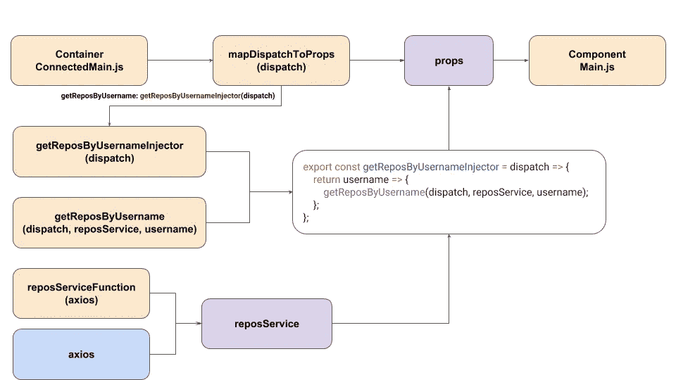

# 无中间件的异步 Redux 使用 ES2017

> 原文：<https://javascript.plainenglish.io/asynchronous-redux-without-middlewares-using-es2017-a42c2699d4d0?source=collection_archive---------0----------------------->


没有中间件也可以处理异步 redux 操作，有了 ES2017 async/await，我们可以用更清晰的方式来处理。

## 我该做吗？

我在这里不是说你不应该使用 thunk 或 saga。如果您愿意，您可以将它视为一个练习，帮助我们加深对 redux 和函数式编程的了解。此外，我们将以一种可测试的方式来完成这一切。

## 该项目

我们将创建一个简单的 React 项目，使用 GitHub API 通过用户名搜索存储库。如果你想看看最终产品的样子，请访问下面的链接:

[https://async-redux-without-middleware.herokuapp.com](https://async-redux-without-middleware.herokuapp.com)

# 让我们编码

我们将使用 create-react-app CLI:

```
npx create-react-app async-redux-without-middlewares
cd async-redux-without-middlewares
```

让我们也安装依赖项

```
npm install -s redux react-redux axios
```

## http 服务

创建服务是为了将 http 请求与业务逻辑分开。在此之上，我们将添加一个抽象层，导出的不是服务对象，而是生成服务对象的函数。这允许我们隔离 axios 依赖性，帮助我们测试服务，而不必实际调用 http 请求。

**services/repos.js**

## 行动

**actions/repos.js**

导出的函数`getReposByUsernameInjector`将用于我们的主容器`connect()`。它不会被引用，而是被执行，其结果将成为组件的一个属性。

接收`getReposByUsername`的所有依赖项作为参数，隔离函数，允许我们编写测试，而不必导入存储或实际调用我们的服务。

## 连接

在 react 中，容器是连接到 redux 状态的组件。出于教学的原因，我们将把连接从组件本身中分离出来。

**components/Main.js**

**containers/connected main . js**

`connect()`的第二个参数是一个名为`mapDispatchToProps`的函数，它允许您创建在被调用时调度的函数，并将结果对象属性作为道具传递给组件。

如果你想学习更多关于动作分派的知识，我强烈推荐阅读 redux 文档中的这一页。

[](https://react-redux.js.org/using-react-redux/connect-mapdispatch) [## 连接:使用 mapDispatchToProps 调度动作 React Redux

### 作为传递给 connect 的第二个参数，mapDispatchToProps 用于将操作分派给存储。派遣…

react-redux.js.org](https://react-redux.js.org/using-react-redux/connect-mapdispatch) 

连接所有这些之后，流程看起来像这样:



Click to expand

# 我如何测试它？

## 服务

为了测试我们的服务，我们只需要调用一个自定义对象作为 axios，并期望使用 repos url 调用`get()`函数。

**services/repos.test.js**

## 行动

为了测试我们的操作，我们将设置一个定制的`dispatch()`和服务来模拟四种可能性:成功、空 repos、用户名未找到和连接错误。

**actions/repos.test.js**

## 集装箱

因为我们将连接容器与组件分开，所以单独测试它更容易。

# 其他组件

有更多的代码文件来涵盖所有的项目。但是这些都是基本 React 的简单实现。现在评论会断章取义，而且会使这篇文章太长。如果你想探索更多的细节，这里是 GitHub 库:

[](https://github.com/andregardi/async-redux-without-middlewares) [## Andre gardi/async-redux-无中间件

### 在 GitHub 上创建一个帐户，为 Andre gardi/async-redux-无中间件开发做出贡献。

github.com](https://github.com/andregardi/async-redux-without-middlewares) 

**注**:在最终项目中，我添加了用于可视组件的`@material-ui/core`和`@material-ui/icons`，以及用于托管 Heroku 上静态服务器的`express`。