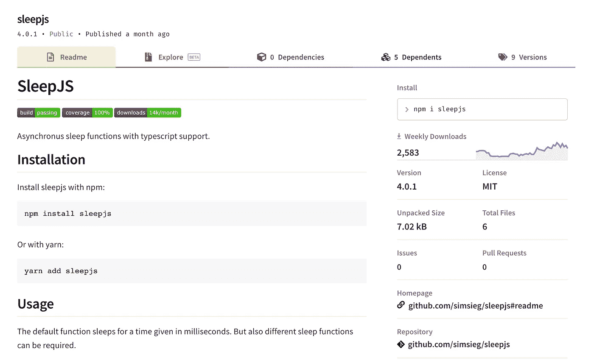

# JavaScript 的异步睡眠功能

> 原文：<https://javascript.plainenglish.io/asynchronous-sleep-function-for-javascript-9236fa4c5691?source=collection_archive---------13----------------------->

## sleepjs 是 JavaScript 的新的和改进的 setTimeout()

[https://www.npmjs.com/package/sleepjs](https://www.npmjs.com/package/sleepjs)

从 npm 获取并通过 npm/yarn 安装:`npm install sleep js`或`yarn add sleepjs`

那么启动异步睡眠和提醒就非常简单了:

Simple sleep and alert with sleepjs 👦🏼👍

就像 setTimeout()一样简单？肯定！并在顶部使用异步 Promise 语法。

Simple sleep and alert with setTimeout() 👴🏻👎

Sleepjs 具有使用承诺和异步/等待功能的所有优点。请点击这里查看:

 [## 睡眠

### 支持类型脚本的异步睡眠功能。用 npm:或者 yarn:默认功能安装 sleepjs

www.npmjs.com](https://www.npmjs.com/package/sleepjs) 

Sleepjs 自带以毫秒、秒、分钟、小时甚至天为单位的睡眠功能。使用这些函数将极大地提高代码的可读性，而不是在每次睡眠时转换为毫秒:

[https://www.npmjs.com/package/sleepjs](https://www.npmjs.com/package/sleepjs)

你再也不需要使用睡眠回调了，取而代之的是使用睡眠承诺，链接它们，同时执行它们，并将它们与你拥有的任何其他承诺相结合:

Examples for chaining sleep, executing sleep simultaneously, and integrating sleep with other promises

# 感谢阅读👏

更多内容请关注我的 Medium 和 IG:【https://www.instagram.com/antonbegehr/ 