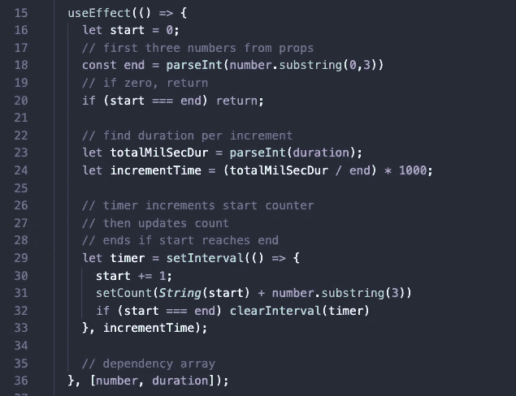

# 用 React 和 CSS 构建动画计数器

> 原文：<https://javascript.plainenglish.io/attempting-to-build-a-cool-animated-counter-with-react-and-css-e37f7f2d47e4?source=collection_archive---------3----------------------->

## 在这篇博客中，我试图创建我自己版本的动画计数器组件，我一直在网上到处寻找

我会告诉你我是怎么做的，但我希望得到反馈。有更好的方法吗？

请在`jason.melton2@gmail.com`给我留言或发邮件。

> [*Github 上的代码*](https://github.com/cooljasonmelton/count-comp)

# 辅导的

## 目录

*   初级垃圾
*   计数组件
*   增量函数
*   结论

## 初级垃圾

我设置了一个`create-react-app`，删除了一堆默认的东西，还有一个这样的文件结构:

我向应用程序组件添加了一些基本的 CSS 高度、宽度和一个 flex 框，用于居中显示所有内容。

我还设置了一个 json 文件，其中包含我将映射到 Count 组件中的数据。

## 计数组件

我的计数组件的对象是接受一些关于计数应该如何运行和渲染动画的数据。

首先，我设置了一个基本组件。

Count 从 data.json 中获取一个数据项的道具，我从道具中析构了`label`、`number`、`duration`。

使用 JSX，我返回`label`和`number`作为标题。稍后，我将更改`number`使其具有动画效果，但现在我可以对我正在构建的硬编码版本进行样式化。

## 增量函数

我将建立一个函数，在这三个步骤中从 0 递增到所需的数字。

1.  设置一个`useState`钩子来保存我们的显示号，当更新时，将触发组件的渲染。

钩子看起来像这样:

我更新了 JSX 以显示`count`而不是`number`。

2.设置一个计算计数和递增时间的`useEffect`钩子。

`useEffect()`首先采用一个匿名函数来处理计数。我创建变量`start`和`end`。`start`设置为 0。

最初，我用`number`作为我的`end`。然而，我意识到，对于非常大的数字，一个更好的方法是只递增`number`的前三个数字，并在更新计数之前粘贴其余的数字。这样的话，柜台不会花一整晚的时间。

我用持续时间(秒)除以我计划做的增量数，再乘以 1000 转换成毫秒，从而计算出每次增量的速率。

> 最初，我希望加快间隔以弥补大数，但`setInterval()`的最小持续时间为 10 毫秒。任何小于 10 的数字都将重置回 10。

3.在同一个`useEffect`钩子中，我使用了`setInterval()`来增加计数，副作用是重新呈现组件。

我给`start`加 1，并调用`setCount()`来更新我的`useState`钩子。我将`start`转换成一个字符串，如果它是一个很大的数字，我会将我之前截取的数字的剩余部分连接起来。

整个组件现在将如下所示:

## 结论

我通读了几篇关于这种动画的文章，并将他们的想法与我的直觉结合起来，制作了上面的抽象可重用组件。

我不确定我想到的是最好的方法。例如`setInterval`有我没有预见到的局限性。我希望得到一些反馈。欢迎评论或发邮件给我`jason.melton2@gmail.com`。

最好的，杰森