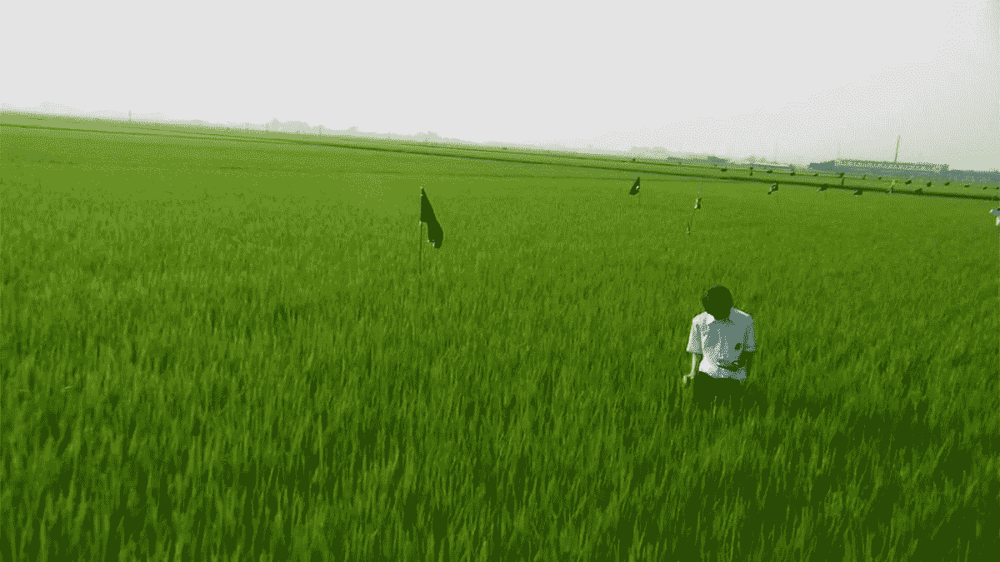
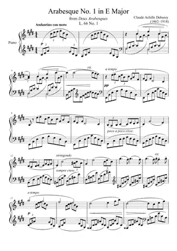

# 音频活动:一个可视化古典音乐的技术练习

> 原文：<https://javascript.plainenglish.io/audio-active-a-technical-exercise-on-visualizing-classical-music-a164d49be1a8?source=collection_archive---------13----------------------->

## 巴比伦的德彪西第一阿拉伯舞曲

Photo by [Markus Gjengaar](https://unsplash.com/@markus_gjengaar?utm_source=unsplash&utm_medium=referral&utm_content=creditCopyText) on [Unsplash](https://unsplash.com/s/photos/piano?utm_source=unsplash&utm_medium=referral&utm_content=creditCopyText)

# 音乐视觉效果

音乐真的需要视觉效果吗？你一定有过听一段美妙音乐的美妙体验，以至于你不得不闭上眼睛。也许，现实中任何可见的东西都比不上那种音乐，所以你必须在你的想象中寻找。

我不认为存在比你的想象更好的东西。不过，我们可以通过实验来创造出自然界中不一定存在的东西，这可能会丰富视觉体验。

# 什么感觉是对的

> “那是‘美妙的阿拉贝斯克’时代，音乐受制于自然运动本身所蕴含的美的法则。”

两首阿拉伯舞曲创作于 1888 年至 1891 年间。

虽然是相当早期的作品，但《阿拉贝斯克舞曲》包含了德彪西音乐风格发展的线索。这部组曲是很早的 [*印象派*](https://en.wikipedia.org/wiki/Impressionist_music) *的音乐作品，沿袭了法国的视觉艺术形式。德彪西仿佛在* [*调式*](https://en.wikipedia.org/wiki/Mode_(music)) *和* [*调*](https://en.wikipedia.org/wiki/Key_(music)) *中游走，通过音乐达到令人回味的场景。他对阿拉伯式音乐的看法是一条符合自然的曲线，他的音乐反映了当时的新艺术派艺术家对自然形状的赞美(维基百科)*

听着德彪西的《阿拉贝斯克 1 》,这是最优美的钢琴曲之一，人们不禁想象会有什么样的画面与之相伴。

日本电影*在配乐中大量使用了德彪西的音乐，并赋予德彪西一种截然不同的音色和感觉，但它保持了空气中流动的轻盈。*

All About Lily Chou-Chou (Movie, [Shunji Iwai](https://www.imdb.com/name/nm0412517/?ref_=tt_ov_dr) 2001)

我将收录一幅 1975 年的作品，与《阿拉伯风情》同名，以此向计算机图形先驱约翰·惠特尼致敬

Arabesque (John Whitney Sr., 1975)

# 如何将古典音乐形象化

从源头开始肯定会是可能的手段之一。至少，我们应该看看乐谱。

Arabesque № 1 (Debussy)

通过直接翻译右手的旋律，左手的和声，已经是视觉形式了。下面是德彪西的另一首曲子的视频，可以说是他最著名的曲子*。你可以看到音乐以不同的线条呈现，就像吉他音乐是用六根弦演奏的一样。*

# *可视化音乐在巴比伦. js*

*在 Babylon.js 中有一个声音*分析器*(它使用*分析器*而不是*分析器*，忍忍吧)从你的声音或音乐中获取 FFT 非常方便，这使得从音频而不是乐谱中工作成为可能。要让它为你工作，只需要做最小的改变。*

*之前，我使用移动曲线作为建模练习构建了一个 3D 形状。*

* [## Babylon.js 中的运动建模

### 一口大小的学习:空间中的形状研究

medium.com](https://medium.com/@reddotblues/modeling-with-motion-in-babylon-js-25d0df72a767) 

我们可以在此基础上稍微修改曲线，并附加一些粒子系统，以便它们在空间中传播粒子时随曲线移动。

有一个球体阵列用作粒子系统的发射器。我最初的想法是从这些球体中得到更多的几何图形，但是它们看起来不够好。我以后可能会回来尝试再次使用这些球体。

应该有更高效的方法来构建粒子系统。我将尝试一个快速的技术练习。

# 一些考虑

如果你观察这首钢琴曲的条形图，你会注意到低频部分很强，也很稳定。事实上，作为肖邦的学生，德彪西经常在和声中用连续的基音来支持旋律。FFT 结果的较低部分很强，但是对视觉图像的贡献不是很有效。在代码中，*第 107 行*，我简单的强调了更高频率的信息。

该程序实时运行。你可以在 Github 上得到这个项目。

 [## icezee/audioactive

### GitHub 是超过 5000 万开发人员的家园，他们一起工作来托管和审查代码、管理项目和构建…

github.com](https://github.com/icezee/audioactive) 

我录了一段视频。每一次，颜色都不一样。它需要一些细微的调整来使颜色协调，并且可以做很多事情来改善材料。

我将很快在 Arabesque 上做另一个实验，并在 Medium 上发表。我的计划是先做一系列的技术练习，当有视觉上足够有趣的时候，我会创作一首视觉上的音乐作品。

干杯。

## 简单英语的 JavaScript

你知道我们有三份出版物和一个 YouTube 频道吗？在[**plain English . io**](https://plainenglish.io/)找到所有内容的链接！*