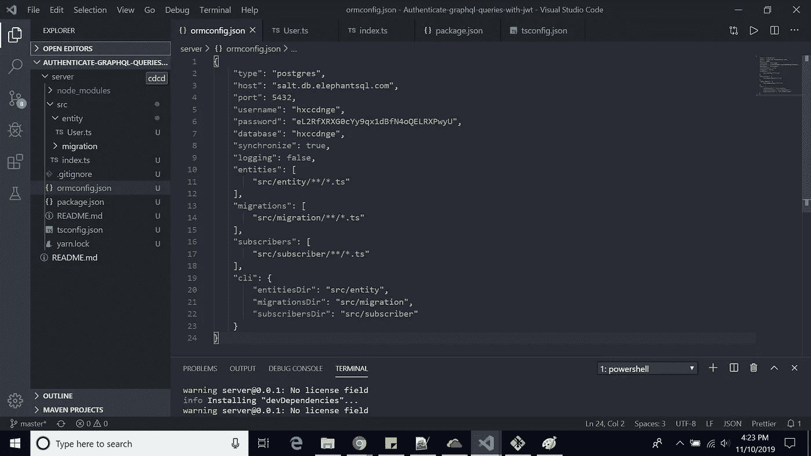
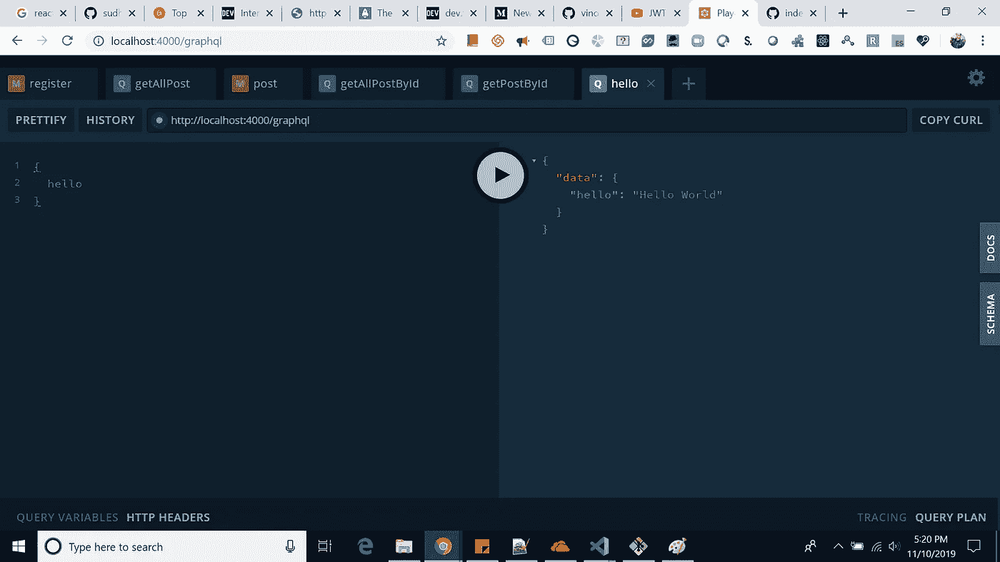
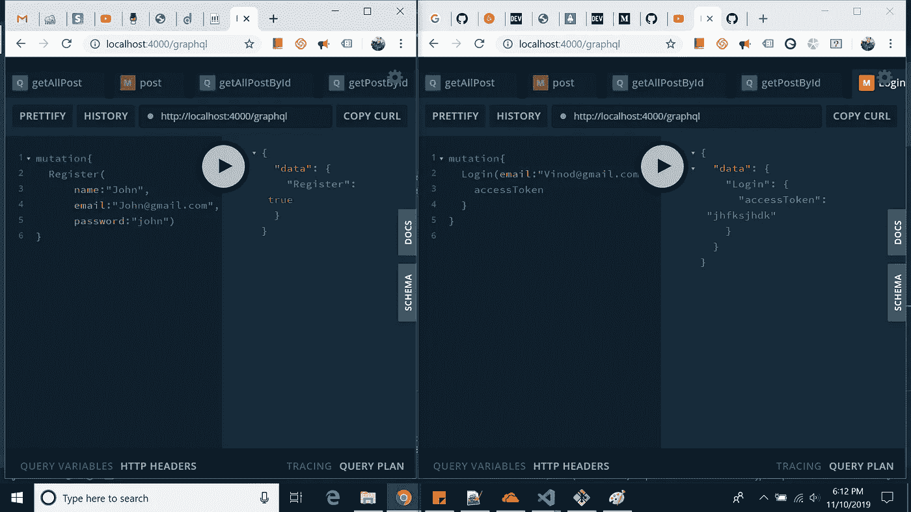
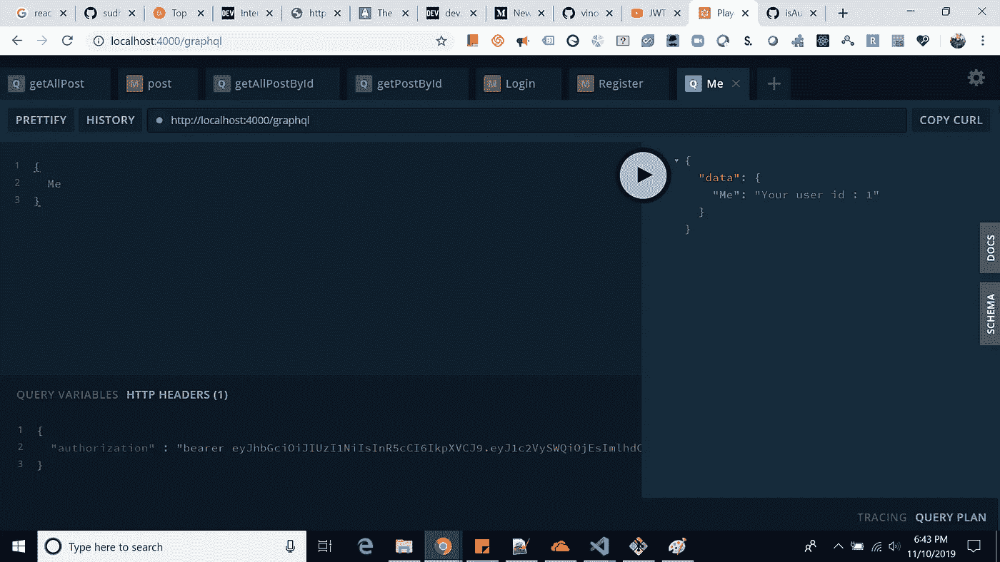

# 使用 TypeScript 在 NodeJS 环境中通过 JWT 验证 GraphQL 查询

> 原文：<https://javascript.plainenglish.io/authenticate-graphql-queries-with-jsonwebtokens-jwt-in-orm-nodejs-environment-using-typescript-eaab53eb6d24?source=collection_archive---------3----------------------->

Login Query

大家好，今天我写一篇文章，用 **JWT** 令牌认证 **Graphql** 查询。为了实现这一点，首先我要设置服务器，用户可以在其中注册/登录。成功登录后，我们进行一个需要认证的查询。

## 所以我要用的技术栈是:: **Nodejs，Expressjs，Typeorm，Typegraphql，graphql，jsonwebtoken，ApolloServerExpress** 等等。

> Github 链接:[用 JWT 认证 Graphql 查询](https://github.com/vinodchauhan7/Authenticate-graphql-queries-with-jwt)

我在这个例子中使用了 VS 代码编辑器。现在请首先在您的系统上安装**节点**和 **npm** 。请按照以下步骤快速设置服务器:

1.  创建“服务器”文件夹
2.  npm 安装-g 类型表单
3.  类型初始化—名称服务器—数据库 postgres
4.  cd 服务器
5.  npx tsconfig.json 并在选项中选择“node”。

现在我将使用 ***纱*** 进一步开发这个项目。

安装纱线: **npm 安装纱线-g**

现在，点击以下按钮更新我们的软件包:

1.  纱线安装
2.  纱线升级-互动-最新。在这个阶段选择下面的包:
    "[@ types/node](http://twitter.com/types/node)@ 12 . 12 . 7 "，" ts-node@8.4.1 "，" typescript@3.7.2 "。
3.  使用 postgres 详细信息更新 ormconfig.json 文件。

测试服务器点击:**纱线启动
并在终端中查看以下数据。**

$ ts-node src/index.ts
将新用户插入数据库…
保存了 id: 2 的新用户
从数据库加载用户…
加载的用户:[用户{ id: 1，名字:' Timber '，姓氏:' Saw '，年龄:25 }]

现在继续下一步，setup express，graphql & apollo-server-express。

1.  **纱加快递阿波罗-服务器-快递 graphql 类型-graphql bcryptjs**
2.  **yarn add-D @ types/node @ types/graph QL @ types/express @ types/bcryptjs**

现在更新 index.ts

Index.ts

您的 Graphql 服务器已经就绪。直接点击(http://localhost:4000/graphql)

现在进一步更新以实现注册/登录逻辑

Register and Login demo

现在安装 **jsonwebToken :
1。** *纱加 jsonwebtoken*
2。*yarn add-D @ types/jsonwebtoken*

> return { access token:sign({ userId:user . id }，“MySecretKey”，{ expi resin:“15m”})}；

通过上面的代码，我们为用户提供了一个唯一的令牌，当他/她每次登录时。

到目前为止，一切都很顺利，但为了验证我们的查询，我们需要任何中间件来验证我们的请求，然后让我们使用该查询。

我们正在进行一个“我”的查询，它需要 jwt 令牌来进行身份验证，并告诉哪个用户当前正在登录。

@ Query(()= > String)
@ use middleware(isAuth)
async Me(@ Ctx(){ payload }:my context){
return ` your user id:$ { payload！。userId } `；
}

“使用中间件”是我们实现认证逻辑的关键装饰。

在这个中间件中，我们从请求中获得“授权”头，你可以看到我们在上面的 pic 中作为 httpheader 发送。

Github 链接:[用 JWT 认证 Graphql 查询](https://github.com/vinodchauhan7/Authenticate-graphql-queries-with-jwt)