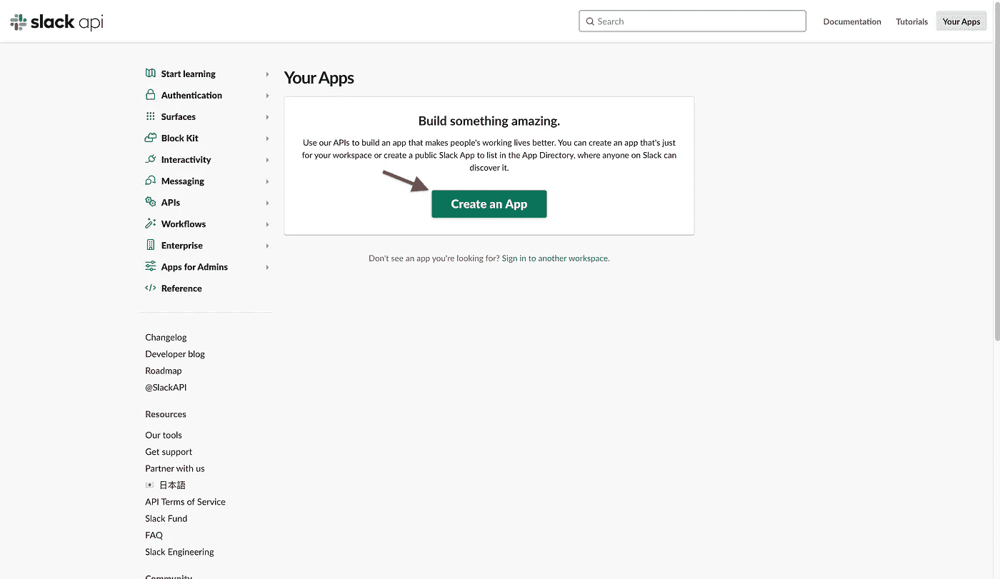
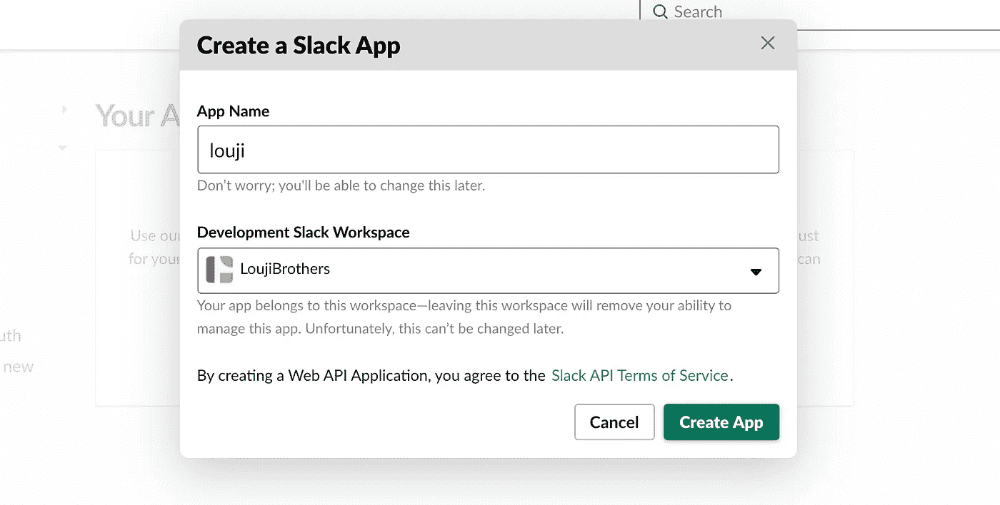
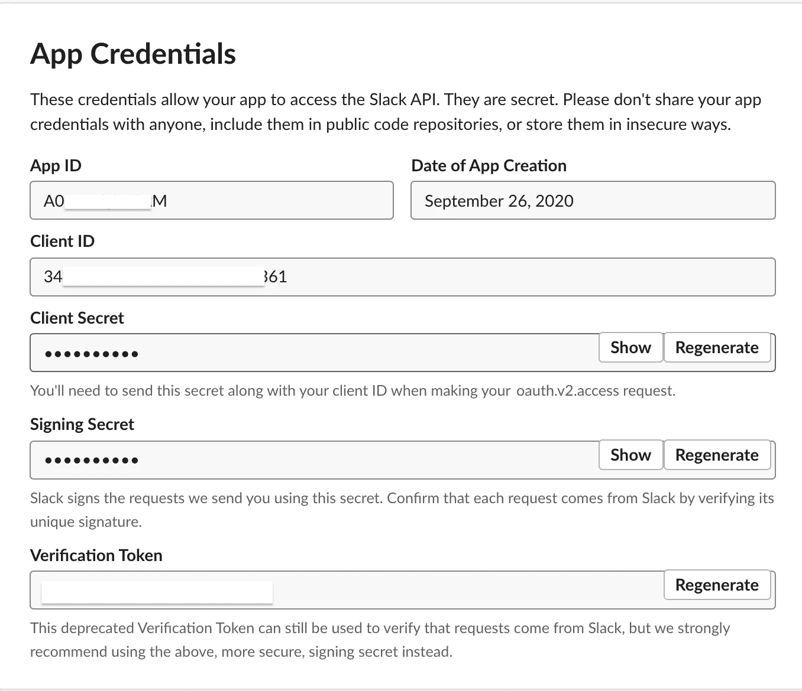
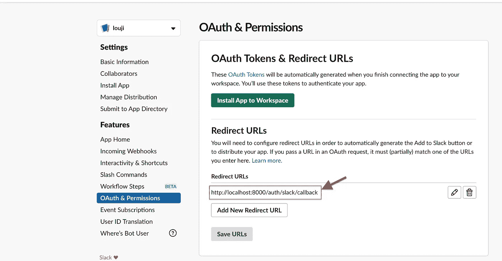

# 使用 Slack OAuth 验证您的应用

> 原文：<https://javascript.plainenglish.io/authenticate-your-app-with-slack-oauth-438c9ced4c6d?source=collection_archive---------6----------------------->


Cover Image

在这篇博客中，我将演示如何用 Node 和 Passport JS 实现 Slack OAuth。为了实现这一点，我们将使用一个名为 Passport JS 的第三方库。Passport JS 是 Node 和 Express JS 的认证中间件。Passport JS 可以与任何 Express JS 应用程序一起使用。Passport JS 提供 500 +策略。

[](http://www.passportjs.org/packages/passport-slack/) [## 护照-松弛

### 使用 OAuth 2.0 API 向 Slack 认证的 Passport 策略。已更新，支持以下人员在空闲时间登录…

www.passportjs.org](http://www.passportjs.org/packages/passport-slack/) 

目录

1.  [初始化一个节点 JS 项目](#ab7d)
2.  [创建备用 OAuth 客户端 ID](#a651)
3.  [配置松弛 OAuth](#af7e)
4.  [保护路由并添加注销](#8574)

1.  **初始化一个节点 JS 项目**

首先，让我们创建一个新的 Node js 项目。下面的命令创建一个新文件夹，然后初始化我们项目的节点。

```
mkdir slack_passport
cd slack_passport/
npm init -y
touch index.js
```

现在安装所需的软件包:

```
npm i express cookie-session passport passport-slack
```

安装后，将下面的代码复制到您的`index.js`文件中。

`index.js`

```
const express = require('express')
const app = express()app.get('/',(req,res)=>{
  res.send('Hello world')
})app.listen(8000,()=>{
  console.log('Serve is up and running at the port 8000')
})
```

现在使用`node index.js`启动服务器。然后导航到 [http://localhost:8000/](http://localhost:8000/) 。您应该会看到浏览器中显示“Hello world”。

2.**创建空闲 OAuth 客户端 ID**

在使用 passport 的 Slack 认证策略之前，您应该已经向 Slack 注册了您的应用程序或 web 应用程序。为此，请遵循以下步骤。

导航到链接:

 [## 松弛 API:应用程序|松弛

### 编辑描述

api.slack.com](https://api.slack.com/apps) 

该链接会将您带到 slack 的开发者仪表板。现在点击“创建应用程序”按钮来创建一个新的 slack 应用程序。



Create a new Slack App



Create app

创建新应用程序后，您将被重定向到一个新页面，在该页面上您可以看到应用程序凭据。记下我们将在代码中使用的那些凭据。



Client ID

另外，不要忘记更改重定向的 URL。转到 OAuth 和权限部分，更改重定向的 URL。该 URL 将是我们的回拨 URL。



CallBack URL

3.**配置松弛 OAuth**

现在让我们开始将 Slack 认证与我们的项目集成。为此，我创建了一个名为`passport.js`的新文件，它保存了我们从 Slack 的 OAuth 页面创建的凭证。

`passport.js`

```
const passport = require('passport');
**const SlackStrategy = require('passport-slack').Strategy;**passport.serializeUser(function(user, done) {
  done(null, user);
});passport.deserializeUser(function(user, done) {
  done(null, user);
});**passport.use(new SlackStrategy({
  clientID: "34******************61",
  clientSecret: "7f6***************************dea",
  callbackURL: "http://localhost:8000/auth/slack/callback",
  skipUserProfile: false,
  scope: ['identity.basic', 'identity.email', 'identity.avatar',  'identity.team'] // default
},
function(accessToken, refreshToken, profile, done) {
  return done(null, profile);
}
));**
```

将以下代码复制并粘贴到您的`index.js`文件中。

route `/auth/slack`将客户端重定向到 Slack 的登录页面。

路由`/auth/slack/callback`将充当回调 URL，如果 Slack 认证成功，将调用该 URL。

如果在松弛验证期间出现任何错误，将调用路线`/ath/error`。

`index.js`

```
const express = require('express')
const app = express()
const cookieSession = require('cookie-session')
**const passport = require('passport');
require('./passport')**app.use(cookieSession({
  name: 'amazon-auth-session',
  keys: ['key1', 'key2']
}))
app.use(passport.initialize());
app.use(passport.session());app.get('/',(req,res)=>{
  res.send(`Hello world ${req.user.displayName}`)
})app.get('/auth/error', (req, res) => res.send('Unknown Error'))**app.get('/auth/slack',passport.authenticate('slack',{scope: ['profile']}));****app.get('/auth/slack/callback',passport.authenticate('slack', { failureRedirect: '/auth/error' }),
function(req, res) {
  res.redirect('/');
});**app.listen(8000,()=>{
    console.log('Serve is up and running at the port 8000')
})
```

现在导航到[http://localhost:8000/auth/slack](http://localhost:8000/auth/slack)。您将被重定向到 Slack 的登录页面。登录您的 Slack 帐户后，您将被重定向回我们的网页，您将看到您的 Slack 用户名显示在我们的网页上。

4.**保护路由并添加注销**

现在让我们添加中间件，看看用户是否已经登录。为此，我在中间件文件夹中创建了一个名为`auth.js`的文件。

`Middleware/auth.js`

```
const isLoggedIn = (req, res, next) => {
  if (req.user) {
    next(); 
  } else {
    res.status(401).send('Not Logged In');
  }
}module.exports = isLoggedIn
```

完成后，将中间件传递给路由`/`。现在自动导航到 URL `[http://localhost:8000/](http://localhost:8000/auth).`，您将被重定向到`/auth/slack`路线。

现在让我们创建一个注销函数。只要调用函数`req.logout()`你就可以从 Slack 账户注销。

`index.js`

```
const isLoggedIn = require('./Middleware/auth')app.get('/',isLoggedIn,(req,res)=>{
  res.send(`Hello world ${req.user.displayName}`)
})app.get('/logout', (req, res) => {
  req.session = null;
  req.logout();
  res.redirect('/');
})
```

导航到[http://localhost:8000/logout](http://localhost:8000/logout)。您将被注销。

如有任何疑问，请随时联系我。

电子邮件:sjlouji10@gmail.com。

领英:[https://www.linkedin.com/in/sjlouji/](https://www.linkedin.com/in/sjlouji/)

我的 GitHub 上的完整代码:

[](https://github.com/sjlouji/Passport-Strategies---Medium/tree/master/slack_OAuth) [## sjlouji/Passport-策略-中等

### 此时您不能执行该操作。您已使用另一个标签页或窗口登录。您已在另一个选项卡中注销，或者…

github.com](https://github.com/sjlouji/Passport-Strategies---Medium/tree/master/slack_OAuth) 

编码快乐！