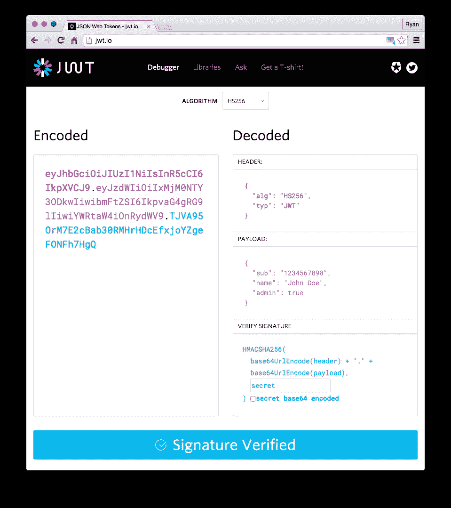

# 在 Node.js 后端 API 中使用 Passport.js 进行身份验证

> 原文：<https://javascript.plainenglish.io/authentication-using-passport-js-in-a-node-js-backend-api-51e9946549cb?source=collection_archive---------0----------------------->


对于我们的 web 应用程序、API 和移动应用程序来说，安全性是软件开发的一个重要方面。我们要么从头开始实现我们的身份验证，要么使用现有的库。大多数框架都有内置的安全模块。身份验证需要将用户凭证与文件或数据库进行匹配，这些文件或数据库可能位于本地文件系统或身份验证服务器中，如果它们存在，则允许它们访问受保护的资源。

## 护照

Passport 是 Node.js 应用程序最流行的用户验证外部库。它目前在 GitHub 上有 17.4k 颗星，并为超过 480 种策略提供中间件，如简单的用户名和密码，社交媒体登录，如 facebook，twitter，google 等等。

[](https://github.com/jaredhanson/passport) [## Jared Hanson/护照

### Passport 是 Node.js 的 Express 兼容认证中间件。Passport 的唯一目的是认证…

github.com](https://github.com/jaredhanson/passport) 

在使用 Express framework 开发的最小后端 API 中，我使用 Passport 通过不同策略的组合来保护后端。然而，为了实现无状态认证，使用了 JWT 技术。JSON Web 令牌(JWT)为我们提供了无状态形式的身份验证，因为服务器不需要维护状态，令牌用于确定用户身份验证是否仍然有效。发送到客户端(用户)的令牌使用数字签名(如 RSA)和给定的到期时间进行签名。客户端发送令牌，服务器调用中间件(在本例中为 Passport)来验证令牌是否有效且未过期。

根据[官方文档](https://jwt.io/introduction/)，JWT 也可用于信息交换而不仅仅是认证，它由三部分组成:报头、有效载荷和签名，这转化为这种形式的令牌

```
xxxxx.yyyyy.zzzzz
```



Source:[https://jwt.io/introduction/](https://jwt.io/introduction/)

## 配置

Passport 的配置是在我们的应用程序的引导文件中完成的，在这里是 Express 服务器上的 **src/index.js** 文件。

```
const passport = require(‘passport’); //require passportapp.use(passport.initialize());//initializes passport configuration //in package.json...
"passport": "^0.4.0", 
"passport-facebook-token": "^3.3.0",  
"passport-jwt": "^4.0.0",  
"passport-local": "^1.0.0",
...
```

## **中间件**

Passport 中间件是拦截器，它询问我们的请求和响应对象，验证用户，并将处理传递给下一个中间件。我们使用三种身份验证策略:

1.  本地策略(相当于用户名和密码)—用于用户登录和注销。
2.  JWT 策略—用于模拟用户会话。验证用户是否已经登录。
3.  脸书令牌策略—授权给 [OAuth](http://oauth.net/) 的社交登录

在上面的认证文件中，我们可以看到使用的各种认证策略=> create(创建用户)、login(使用用户名和密码登录)、JWT(验证用户是否已经登录)和脸书社交登录。在文件的最后，我们为 Passport 提供了一些函数，用于将经过身份验证的用户序列化和反序列化到 Passport 的持久会话中，这是为了抽象出我们将用户存储在数据库或文件中的方式。护照没有限制。JWT 秘密和脸书秘密被安全地保存在一个. **env** 文件和**中。dotenv** 用于访问它们。

**保护端点**

我们现在需要的是将 Passport 中间件应用于我们的端点路由。我们还可以看到应用的验证，但这些不是针对 Passport 的。他们只是确保发送的数据遵循特定的模式，例如在将身份验证处理传递给 Passport 之前验证电子邮件是否已收到。

为了创建客户或用户(v1/api/customers)，在 create 方法中创建令牌并发送给客户端。

Passport 身份验证方法采用第二个参数 *options* ，其中我们指出我们要求我们的服务器是无状态的，这是 JWT 身份验证所需要的。这可以在 getCustomer 配置文件端点中看到。

```
passport.authenticate('jwt', { session: false }, callback);
```

本教程的 Node.js Express 后端可以在 github 上找到[。查看所有的策略是如何使用的。](https://github.com/tksilicon/backend_challenge_template_master)

## 结论

有了 Passport，我们可以在开始更复杂、更严格的身份验证之前，最大限度地保护我们的 web 应用程序。在大规模项目中，我们通常会求助于构建自己的认证库来避免依赖性。