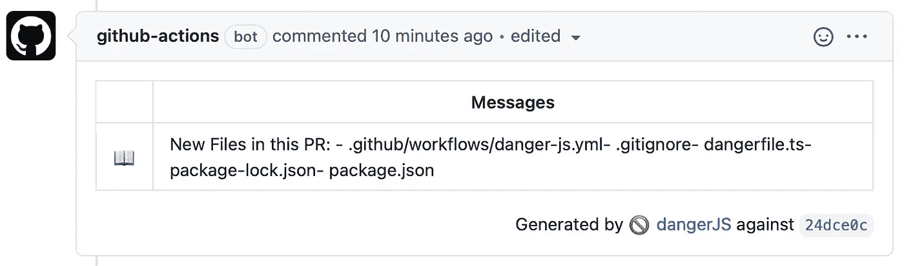
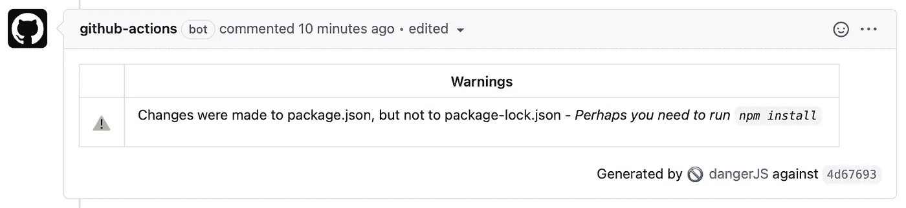
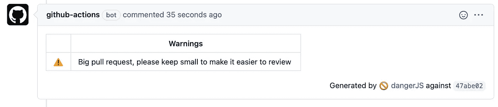
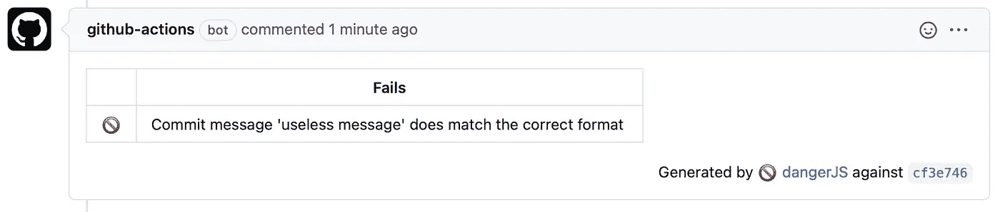
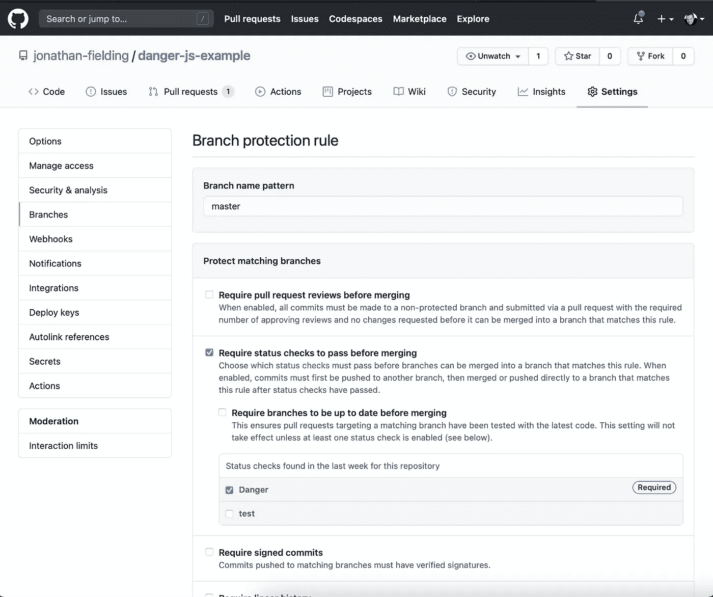

# 通过 Danger.js 和 Github 操作自动处理常见的拉式请求反馈

> 原文：<https://javascript.plainenglish.io/automate-common-pull-request-feedback-with-danger-js-and-github-actions-a09a27ec01c9?source=collection_archive---------1----------------------->

我喜欢软件工程的一个原因是，如果我发现自己经常做一项任务，我可以选择将时间投资在自动化上，从长远来看可以节省时间。


我在工作场所和家里的许多事情上都使用过这种技巧。

当我想买一栋特定的房子时，我已经自动化了一些事情。我没有痴迷地查看网站是否可用，而是在 Node.js 中编写了一个 web scraper 来帮我检查页面。它在 AWS 的服务器上每隔 15 分钟运行一次，当房子上市时，它会发短信告诉我预订房子所需的详细信息。

所有这些关于自动化的讨论让我想到了我最近一直在做的事情，那就是自动化对拉请求的公共反馈。

# 为什么要自动化拉式请求反馈？

当您提出拉动请求时，您收到反馈的速度越快，解决问题的速度就越快。因此，值得考虑的是，通过分析代码提供反馈的机器人总是比人快。

另一件要考虑的事情是，当您选择自动化您的拉式请求反馈时，您也通过代理来编纂您的团队最佳实践。这可以对您的代码产生积极的影响，因为它将减少不遵循您的最佳实践的代码在正常审查中被遗漏的情况。

自动化拉式请求反馈的最后一个原因是，来自机器人的反馈与来自同事的反馈具有不同的情绪反应。一个机器人不会对其他人的代码进行人身攻击，所以这会对士气产生积极的影响。

也就是说，拉式请求反馈的自动化应该与人工评审并行使用。自动化的重点是加强你的团队的最佳实践，而普通的评审将挑选出解决问题的整体方法的问题。

# 设置 Danger.js 以提供拉取请求反馈

首先，我将解释我们如何在 GitHub 库上设置 Danger.js。在第一个实例中，它将简单地输出一条关于 pull 请求的消息，其中包含已更改文件的列表。

## Danger.js 的初始设置

在项目中设置 danger 的第一步是创建一个新的分支，我通常在 CLI 中这样做

```
git checkout -b danger
```

创建了我们的分支后，我们现在需要从 npm 安装`danger`。

```
npm install danger --save-dev
```

安装了 *Danger.js* 之后，您现在需要在项目的根目录下创建一个 **danger** 文件。为此，我们可以使用 JavaScript 或 TypeScript，dangerfile.js 用于 JavaScript 和 dangerfile.ts。我在这里看到的使用 TypeScript 的主要好处是，节点模块提供的类型定义比文档更好地向您提供有关 API 的信息。

**dangerfile.ts/dangerfile.js**

```
import {**message**, **danger**} from "danger"*const* **newFiles** = danger.git.created_files.join("- ")**message**("New Files in this PR: \n - " + **newFiles**);
```

## 配置 GitHub 操作

下一步是配置一个 GitHub 动作，在发出 pull 请求时运行 Danger.js。

为此，我们需要创建一个工作流。我们通过在`.github/workflows`目录中创建一个 Yaml 文件来做到这一点。下面是工作流程的一个示例:

```
name: Danger JS
on: [pull_request]
jobs:
  test:
    runs-on: ubuntu-latest
    steps:
    - uses: actions/checkout@master
    - name: Use Node.js 12.x
      uses: actions/setup-node@v1
      with:
        node-version: 12.x
    - name: Danger
      run: npx danger ci
      env:
        GITHUB_TOKEN: ${{ secrets.GITHUB_TOKEN }}
```

如果我们将工作流程分解成关键部分:

*   **name** :将出现在 pull 请求上的 github 动作的名称。
*   **on** :动作运行的时间，在我们的例子中是创建或更改拉请求的时间
*   **作业**:将要运行的作业列表，在本例中，我们指定一个名为“test”的作业
*   **步骤**:GitHub 动作将运行的步骤，在本例中，检查存储库，设置 Node.js，然后使用它运行 danger。

## 拉取请求存在运行危险

配置了 Danger.js 和 GitHub 动作工作流之后，我们现在可以在 Github 中通过使用我们的分支发出一个 pull 请求来进行测试。

在提出我们的 pull 请求后，我们需要等待几分钟来运行这个动作，然后我们会在 github actions bot 发布的 PR 上看到反馈。



Screenshot of Danger.js with new files in the pull request

# 其他 Danger.js 操作的方法

在初始设置中，我们只是让 Danger.js 留下一个注释，其中包含由 pull 请求添加的新文件列表。虽然一个很好的设置示例用处有限，但在本节中，我们将列出一些更多的方法，您可以使用 Danger.js 使其更加有用。

## 如果 package.json 发生更改，请确保 package-lock.json 得到更新

从 npm 安装新的节点程序包时，会导致 package.json 和 package-lock.json 文件都发生更改。这两个文件都应该提交给存储库，这样如果 package.json 发生了变化，这个检查将确保您不会忘记提交锁文件。

**代码示例**

```
*const* **packageChanged** = danger.git.modified_files.includes('package.json');
*const* **lockfileChanged** = danger.git.modified_files.includes('package-lock.json');*const* **packageChanged** = danger.git.modified_files.includes('package.json');
*const* **lockfileChanged** = danger.git.modified_files.includes('package-lock.json');if (**packageChanged** && !**lockfileChanged**) {
    **warn**(`Changes were made to package.json, but not to package-lock.json - <i>'Perhaps you need to run `npm install`?'</i>`);
}
```

**GitHub 上的输出**



在 GitHub 上查看菜谱:[https://GitHub . com/Jonathan-fielding/danger-js-example/pull/2](https://github.com/jonathan-fielding/danger-js-example/pull/2)

## 鼓励小型公关

对于一个人来说，大的拉取请求很难被准确地审阅，因为很难跟踪所有已经改变的不同事物以及它们之间的关系。为了鼓励您的团队编写更小的拉请求，您可以让 Danger.js 在拉请求太长时发布一个警告。

**代码示例**

```
import {warn, danger} from "danger"*const* bigPRThreshold = 600;if (danger.github.pr.additions + danger.github.pr.deletions > bigPRThreshold) {
  warn('Big pull request, please keep small to make it easier to review');
}
```

**GitHub 上的输出**



在 GitHub 上查看菜谱:[https://GitHub . com/Jonathan-fielding/danger-js-example/pull/3](https://github.com/jonathan-fielding/danger-js-example/pull/3)

## 鼓励有用的提交消息

当处理语义版本化的 JavaScript 库之类的项目时，提交消息遵循类似的结构可能会有好处。这有助于您根据自上一个版本以来的提交消息，记住您的下一个版本应该如何版本化。

使用 Danger.js，通过检查 PR 中的提交消息，可以很容易地实施提交消息格式。

**代码示例**

```
import {**fail**, **danger**} from "danger"**danger.git.commits.forEach**(***commit*** => { if (!**commit.message.match**(/^(feat:)|(fix:)|(major:)|(chore:)/g)) {
    **fail**(`Commit message '${commit.message}' does match the correct format`);
  }})
```

**GitHub 上的输出**



在 GitHub 上查看菜谱:[https://GitHub . com/Jonathan-fielding/danger-js-example/pull/4](https://github.com/jonathan-fielding/danger-js-example/pull/4)

# 强制执行 Danger.js 检查

设置好 Danger.js 检查后，建议您在将代码合并到主分支之前强制执行 Danger.js 状态检查。

要做到这一点，你需要查看 GitHub 上的存储库设置。然后，您希望选择添加规则，然后为分支启用“合并前要求通过状态检查”。



# 包扎

在结束这篇文章时，我只想说，希望从我提供的食谱中，你可以看到你用 Danger.js 做的任何事情都只是 JavaScript。

实际上，这意味着您可以非常快速地编写更加复杂的 pull 请求检查，然后利用 Danger.js API 提供反馈。

我希望你觉得这很有用，我鼓励你关注我的更多关于编码、性能和可访问性的帖子。