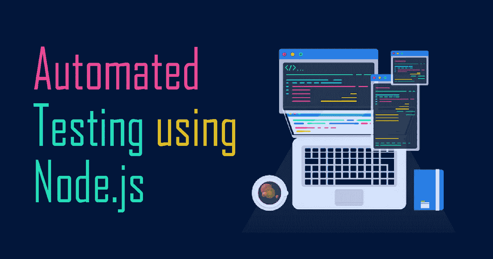
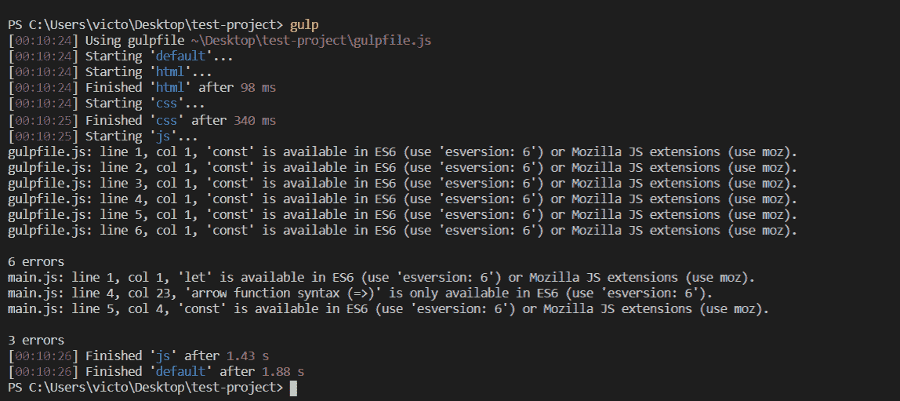

# 面向初学者的 Node.js 自动化测试

> 原文：<https://javascript.plainenglish.io/automated-testing-with-node-js-for-beginners-2e1fecd1ac68?source=collection_archive---------6----------------------->



# 为什么要测试？

测试代码是 web 开发的一个重要阶段。它防止您的代码运行出错，并确保它可以跨所有设备和浏览器工作。但是测试你的代码可能会很耗时和复杂，尤其是如果你是一个初学者。

一些常见的测试如**林挺**和**缩小**可以自动化，帮助你比以往更容易地修复代码中的常见 bug 和标记错误。这有助于在执行测试时节省大量时间！

> ***林挺:*** *运行程序的过程，分析代码中潜在的错误。—维基百科*
> 
> ***缩小:*** *从解释编程语言或标记语言的源代码中去掉所有不必要的字符而不改变其功能的过程。—维基百科*

在本教程中，我将向您展示如何使用 Node.js 和 npm 设置一个任务运行器来自动化 3 个过程:

1.  HTML 林挺和缩小:修复错误和不良格式
2.  CSS 自动修复和林挺:添加前缀以在旧浏览器中运行并修复错误
3.  JavaScript 林挺和转换文件:修复错误并转换新的 JS 代码以在旧浏览器中工作

# 步骤 1:下载 Node.js 和 npm

在[https://nodejs.org/en/download/](https://nodejs.org/en/download/)下载 Node.js(带 npm)

安装后，要检查它是否存在，请转到您的命令提示符:

```
node -v
npm -v
```

# 第二步:安装 Gulp

Gulp 是一个自动化工具包，我们将使用它来创建我们的测试任务运行器(参见[文档](https://gulpjs.com/docs/en/getting-started/quick-start))。您可以通过 npm 在命令提示符下运行以下命令行来安装它:

```
npm install --global gulp-cli
```

在初始化 npm 之后，将在您的项目目录中生成一个`package.json`。

# 步骤 3:创建一个项目，导航到它并初始化 npm

```
mkdir test-project
cd test-project
npm init
```

在初始化 npm 之后，您的项目目录中将会生成一个 **package.json** 。

# 步骤 4:将 Gulp 设置为依赖项

```
npm install --save-dev gulp
```

现在，您应该可以在`devDependencies`属性下的 **package.json** 中看到 gulp。

# 步骤 5:创建 gulpfile.js

在您的项目目录中，创建一个 **gulpfile.js** 文件，我们将在其中写入我们的任务运行器，并添加以下内容作为第一行:

```
const gulp = require('gulp');
```

现在，让我们创建 3 个自动化测试任务，从 html、css 开始，然后是 JavaScript。

# 步骤 6:创建“html”任务

让我们从用`gulp-htmltidy`创建 html 任务开始，它是 HTML 林挺的一个 gulp 插件。参见[文档](https://www.npmjs.com/package/gulp-htmltidy)。

首先，我们安装它:

```
npm install --save-dev gulp-htmltidy
```

然后，在 **gulpfile.js** 中添加依赖关系:

```
const htmltidy = require('gulp-htmltidy');
```

添加以下测试来检查 html 文件中的错误:

```
gulp.task('html', function() {
  return gulp.src('./*.html') // your html directory
        .pipe(htmltidy())
        .pipe(gulp.dest('build/')); //writes the output, cleanly formatted HTML to the build directory
});
```

太好了！我们已经创建了第一个测试来检查 HTML 中的错误和不良格式。让我们继续创建一个 CSS 测试。

# 步骤 7:创建“css”任务

通过运行安装`gulp-autoprefixer` ( [文档](https://www.npmjs.com/package/gulp-autoprefixer))和`gulp-csslint` ( [文档](https://www.npmjs.com/package/gulp-csslint)):

```
npm install --save-dev gulp-autoprefixer
npm install --save-dev gulp-csslint
```

然后，就像 htmltidy 一样，我们在 **gulpfile.js** 的顶部添加依赖项:

```
const autoprefixer = require('gulp-autoprefixer'); 
const csslint = require('gulp-csslint');
```

最后，我们在 html 任务下面添加 css 任务，如下所示:

```
gulp.task('css', function() {
    return gulp.src('./*.css') //your css directory
        .pipe(csslint())
        .pipe(csslint.formatter())
        .pipe(autoprefixer({
            browsers: ['last 5 versions'],  //config to add prefixes to work on older browsers
            cascade: false
        }))
        .pipe(gulp.dest('./build'));
});
```

现在，我们已经准备好 css 测试任务了！让我们为我们的 JavaScript 代码做最后一个。

# 步骤 8:创建任务

对于 JavaScript 测试，我们将通过运行以下命令来安装`gulp-jshint` ( [文档](https://www.npmjs.com/package/gulp-jshint))和`gulp-babel` ( [文档](https://www.npmjs.com/package/gulp-babel)):

```
npm install --save-dev gulp-babel @babel/preset-env
npm install --save-dev @babel/core
npm install --save-dev jshint gulp-jshint
```

然后，最后一次添加依赖项:

```
const babel = require('gulp-babel');
const jshint = require('gulp-jshint');
```

以及 **gulpfile.js** 底部的任务:

```
gulp.task('js', function() {
    return gulp.src('./*.js')  //directory of your .js file
        .pipe(jshint())
        .pipe(jshint.reporter('default'))
        .pipe(babel({
            presets: ['@babel/env']
        }))
        .pipe(gulp.dest('./build'));
});
```

好了，我们已经写好了 3 个任务！我们已经使用 gulp 完成了测试设置！Babel 会将我们的代码转换成旧的语法，以便在旧的浏览器上运行，而`gulp-jshint`会检查我们代码中的错误。

# 第九步:最终任务

最后，在 **gulpfile.js** 的底部，加上:

```
gulp.task('default', gulp.series('html', 'css', 'js'));
```

这样我们可以同时进行三项测试。

你最终的 **gulpfile.js** 应该是这样的:

```
const gulp = require('gulp');
const htmltidy = require('gulp-htmltidy');
const autoprefixer = require('gulp-autoprefixer');
const csslint = require('gulp-csslint');
const babel = require('gulp-babel');
const jshint = require('gulp-jshint');

gulp.task('html', function() {
    return gulp.src('./*.html') // your html directory
          .pipe(htmltidy())
          .pipe(gulp.dest('build/')); //writes the output, cleanly formatted HTML to the build directory
});

gulp.task('css', function() {
    return gulp.src('./*.css') //your css directory
        .pipe(csslint())
        .pipe(csslint.formatter())
        .pipe(autoprefixer({
            browsers: ['last 5 versions'],  //config to add prefixes to work on older browsers
            cascade: false
        }))
        .pipe(gulp.dest('./build'));
});

gulp.task('js', function() {
    return gulp.src('./*.js')  //directory of your .js file
        .pipe(jshint())
        .pipe(jshint.reporter('default'))
        .pipe(babel({
            presets: ['@babel/env']
        }))
        .pipe(gulp.dest('./build'));
});

gulp.task('default', gulp.series('html', 'css', 'js'));
```

您最终的 **package.json** 文件应该类似于:

```
{
  "name": "test-project",
  "version": "1.0.0",
  "description": "",
  "main": "main.js",
  "scripts": {
    "test": "test"
  },
  "author": "",
  "license": "ISC",
  "devDependencies": {
    "@babel/core": "^7.10.2",
    "@babel/preset-env": "^7.10.2",
    "gulp": "^4.0.2",
    "gulp-autoprefixer": "^7.0.1",
    "gulp-babel": "^8.0.0",
    "gulp-csslint": "^1.0.1",
    "gulp-htmltidy": "^0.2.4",
    "gulp-jshint": "^2.1.0",
    "jshint": "^2.11.1"
  }
}
```

# 运行测试

现在尝试运行项目目录中的命令`gulp`来运行自动化测试！

您应该会看到类似这样的内容:



看起来我有很多错误，这些错误大多与使用新的 JavaScript 语法有关，这些语法在旧的浏览器上无法工作。如果我查看“build”文件夹，我可以看到我新格式化的 HTML、CSS 和 JS 文件，它们是通过运行测试修复的！

# 后续步骤

恭喜你，你已经学会了如何使用 Node.js、npm 和 gulp 设置自动化的 html、css 和 JavaScript 测试。测试不仅仅是林挺和缩小你的代码，所以我鼓励你自己多读一些。对于这个特殊的测试，您可以进一步添加

```
gulp.task('watch', function(){
  gulp.watch('src/*.html', ['html']);
  gulp.watch('src/*.css', ['css']);
  gulp.watch('src/*.js', ['js']);
});
```

到你的 **gulpfile.js** 中，这样每当你保存一个文件时，测试就会运行(更多细节见[文档](https://gulpjs.com/docs/en/api/watch/))。

我希望这对你有所帮助。如果你对本教程有任何疑问，请在下面的评论中告诉我。祝您测试项目好运！干杯！

## **用简单英语写的 JavaScript**

喜欢这篇文章吗？如果有，通过 [**订阅我们的 YouTube 频道**](https://www.youtube.com/channel/UCtipWUghju290NWcn8jhyAw) **获取更多类似内容！**