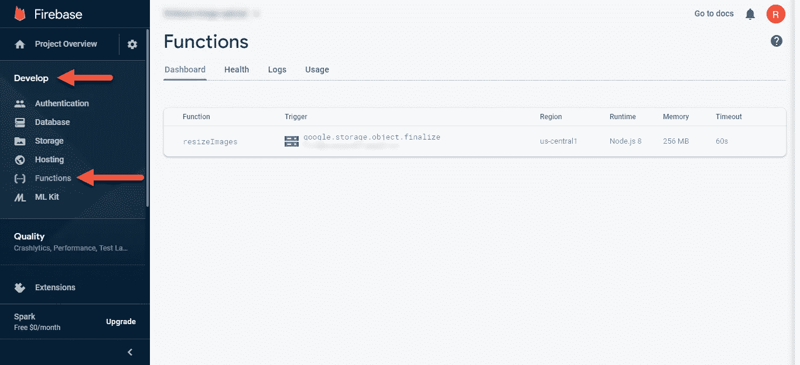

# 使用 Firebase 功能自动调整图像大小

> 原文：<https://javascript.plainenglish.io/automatic-image-resizing-with-firebase-functions-42a0e38b228a?source=collection_archive---------4----------------------->


Camera Lens Landscape

在本教程中，我们将在我之前的文章的基础上，用 Vue、Dropzone 和 Firebase 实现一个[拖放图像上传器。虽然这是一个好的开始，但还有一个步骤对于显示这些图像至关重要。我说的是调整它们的大小，使它们保持一致，并且不需要很长时间来加载。](https://medium.com/javascript-in-plain-english/drag-and-drop-image-upload-with-vue-js-dropzone-and-firebase-dd6fb7e2e54b)

在本教程中，我们将使用 Firebase 函数。因为我的前一篇文章使用 Firebase 存储图像，所以使用它们的无服务器功能才有意义。此外，您可以轻松地将它们的功能连接到 Firebase 存储中。

Vidoe Tutorial

# 项目设置

## Firebase CLI

Firebase 使得在我们的项目中安装样板函数变得非常简单。在我的上一篇文章中，我们注册了 Firebase，并将配置添加到我们的项目中，但是对于功能，我们需要在我们的计算机上全局安装 [Firebase CLI](https://firebase.google.com/docs/cli) 。为此，打开您的终端并运行以下命令:

```
npm install -g firebase-tools
```

现在我们已经安装了它，我们需要将其同步到我们的帐户。在命令提示符下运行以下命令并登录:

```
firebase login
```

登录后，在 VS 代码中打开项目(或项目根目录中的终端)，然后打开一个新终端(终端->新终端)。然后运行以下命令:

```
firebase init
```

我选择如下:
1。你准备好继续了吗？:Y
2。使用一个现有的项目:我选择我在上一篇文章中建立的项目。
3。语言:JavaScript
4。用 ESLint？:是
5。与 NPM 一起安装？:是的

然后，Firebase CLI 将在您的项目中建立一个单独的函数文件夹。如果你打开它，你会看到它是一个独立的项目。在 VS 代码中，打开一个新的终端，将 cd 放入 functions 文件夹的根目录。然后运行以下命令:

```
npm install @google-cloud/storage sharp fs-extra uuid
```

# 图像缩放器

接下来，在 functions 文件夹中，打开 index.js。这是我们将用来编写图像 resizer 函数的文件。我们将利用每次存储对象完成上传时触发的 *onFinalize* 函数。

Image Resizer Code

## 部署功能

现在我们已经编写了函数，是时候将它部署到 Firebase 了。在 VS 代码中打开终端，并运行以下命令:

```
firebase deploy --only functions
```

要验证已部署的功能，您可以登录 Firebase 控制台，然后转到“功能”选项卡(开发->功能)。您应该会看到类似这样的内容:



Firebase Functions

## 解决纷争

如果您在此过程中遇到任何问题，您可以通过单击主功能页面的日志选项卡来查看您的日志。通过使用控制台语句，您可以将任何内容打印到日志中。

# 结论

现在，您有了一个每次上传文件时都会自动触发的图像大小调整器。如果您对本文有任何问题或疑虑，请在下面留下您的评论。