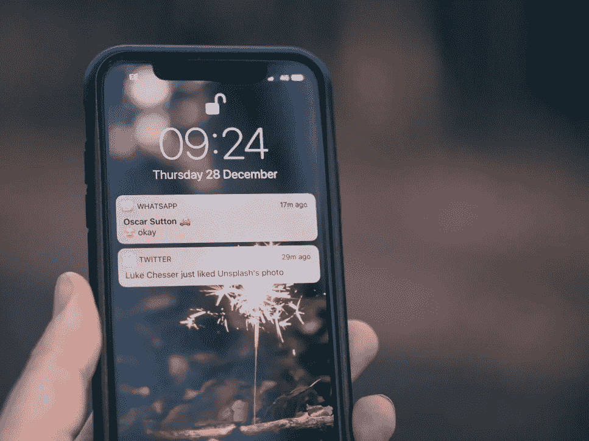
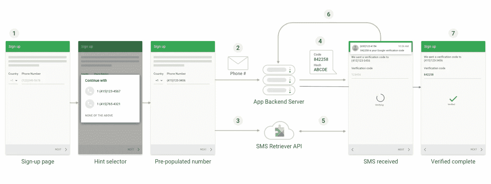
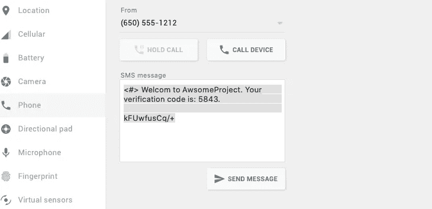

# 自动短信验证— React Native (Android)

> 原文：<https://javascript.plainenglish.io/automatic-sms-verification-react-native-android-9cf1af1cde53?source=collection_archive---------0----------------------->

Photo by [Jamie Street](https://unsplash.com/@jamie452?utm_source=unsplash&utm_medium=referral&utm_content=creditCopyText) on [Unsplash](https://unsplash.com/s/photos/message-phone?utm_source=unsplash&utm_medium=referral&utm_content=creditCopyText)

自动短信验证是一个功能，帮助用户做他们的任务 hustle 免费。这是一个令人印象深刻的功能，包含在几乎每个应用程序中，只是因为增加了“哇”的感觉。

下一个问题是如何？

好了，我们将了解更多关于自动 OTP 读取的内容。在我们开始之前，这只适用于 Android。

外面有几个图书馆。

[https://www.npmjs.com/package/react-native-otp-verify](https://www.npmjs.com/package/react-native-otp-verify)

[https://www . npmjs . com/package/react-native-SMS-retriever-API](https://www.npmjs.com/package/react-native-sms-retriever-api)

这两个软件包都与 SMS 检索 API 一起工作。为了侦听来自特定应用程序的 SMS，SMS 检索器 API 使用哈希密钥，该密钥是使用密钥库文件创建的。要进行调试和生产 APK，您需要创建一个单独的哈希键。

我从 developers.google.com 的[中找到了下面这张图片。这正是我们要做的。](https://developers.google.com/identity/sms-retriever/overview)

Originally from [https://developers.google.com/identity/sms-retriever/overview](https://developers.google.com/identity/sms-retriever/overview)

接下来，我们将讨论第一个包。

安装并链接库

$ npm 安装 react-native-OTP-verify-save

$ react-native link react-native-OTP-verify

OTP 监听器组件将使用提供的哈希密钥监听 SMS。它将读取短信作为一个文本字符串，你可以使用正则表达式或任何你喜欢的东西来修剪它。

下一步是创建散列键。下载以下脚本并保存在根目录中。

 [## Google archive/Android-凭证

### 已迁移:。通过在 GitHub 上创建一个帐户，为 Google archive/Android-credentials 开发做出贡献。

github.com](https://github.com/googlesamples/android-credentials/blob/master/sms-verification/bin/sms_retriever_hash_v9.sh) 

$./sms_retriever_hash_v9.sh —包“com . awesome project”—keystore。/android/app/debug.keystore

在这里，我使用 debug.keystore，因为该应用程序处于开发阶段，而“com.awesomeproject”是包名。之后需要进入 debug。密钥库密码；也就是大多数时候的‘安卓’。如果密码是正确的，您的哈希密钥生成的消息'短信检索哈希代码:'。

在构思 OTP 消息时，请记住以下事项

1.  应该以开头，注册为 OTP 短信
2.  消息应该以生成的哈希密钥结束

如果您没有短信服务，请使用模拟器进行验证。

在模拟器中安装应用程序。点击更多(三个点)，选择电话，从打开的小工具你可以看到一个文本输入，你可以在那里输入任何信息。

sending OTP SMS using Emulator

示例消息

> 欢迎来到 AwsomeProject。你的验证码是 5843。
> 
> kfuwfusq/+

进一步阅读

1.  [https://developers . Google . com/identity/SMS-retriever/overview](https://developers.google.com/identity/sms-retriever/overview)
2.  [https://developers.google.com/identity/sms-retriever/verify](https://developers.google.com/identity/sms-retriever/verify)

*更多内容看* [***说白了。***](https://plainenglish.io/)

*报名参加我们的* [***免费每周简讯***](http://newsletter.plainenglish.io/) *。关注我们关于* [***推特***](https://twitter.com/inPlainEngHQ) ，[***LinkedIn***](https://www.linkedin.com/company/inplainenglish/)*，*[***YouTube***](https://www.youtube.com/channel/UCtipWUghju290NWcn8jhyAw)*，以及* [***不和***](https://discord.gg/GtDtUAvyhW) ***。***

***对缩放您的软件启动感兴趣*** *？检查出* [***电路***](https://circuit.ooo?utm=publication-post-cta) *。*