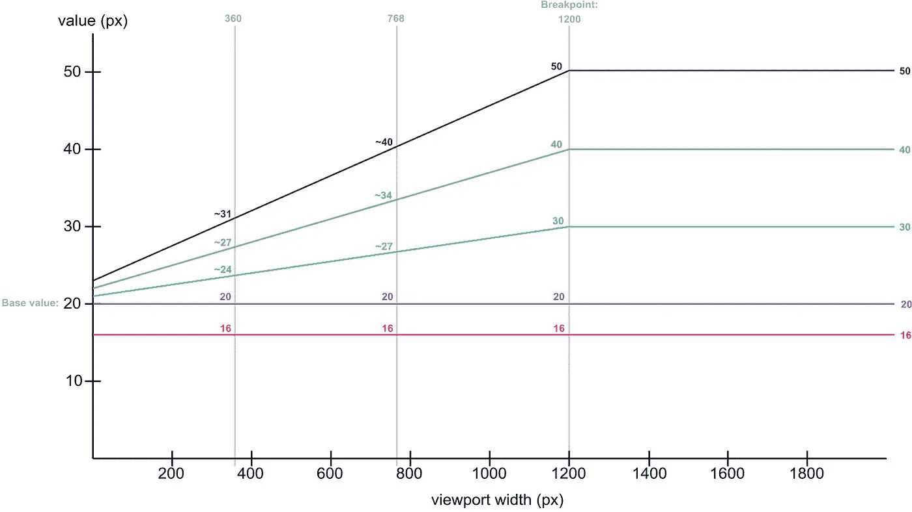

# 使用 RFS 自动缩放字体大小

> 原文：<https://javascript.plainenglish.io/automatically-scale-font-sizes-with-rfs-ca22549cc802?source=collection_archive---------3----------------------->

网络应该是为包容所有人而构建的。不用说，智能手机的普及无处不在。如果你正在设计一个网站，并且你正在解决使你的字体大小有反应的问题，那么继续读下去！我将向您介绍一个名为 RFS(代表响应字体大小)的惊人的 SASS 模块。

# RFS——使字体响应变得微不足道的包


是不是很神奇？随着视口宽度变小，字体大小也会随之调整。这有助于在字体大小方面提供线性体验，而不管屏幕大小如何！

**RFS 背后的魔力**

简而言之，RFS 采用您的固定字体大小单位(`px` 或`rem`)，并对`1200px`或更低的屏幕宽度尺寸应用线性尺寸缩减算法。这里是一个图表，展示了 RFS 的 [github 页面上显示的线性算法。](https://github.com/twbs/rfs)



初始字体大小越小，该算法对字体大小的影响越小。事实上，如果您的初始字体大小为`16px`或更小，rfs 将不会进一步缩小，因为任何缩小都可能导致字体太小或某些人无法使用。

# RFS 入门

现在，让我们带着这个令人惊奇的包裹让你站起来走吧！

**步骤 1:** 通过 npm 安装 RFS

以下命令应该从 npm 存储库安装 RFS

```
npm install --save rfs@latest
```

注意:RFS 是一个 SASS 模块，不能用于普通的 CSS。您需要安装 SASS！

**步骤 2:** 将 rfs 导入您的 SASS/SCSS 文件

将以下内容添加到您希望在其中使用 RFS 的任何 SASS 文件中

```
[@import](http://twitter.com/import) "./node_modules/rfs/scss.scss";
```

**步骤 3:** 开始使用 rfs() mixin

既然已经安装并导入了 RFS，剩下要做的就是利用`rfs()` mixin。这是我从上面的演示中得到的样式表。

就这样——我的 header `h1`和 body `p`标签现在保证会根据较小的屏幕宽度相应地改变字体大小！

感谢您的阅读。我希望本文对 RFS 的介绍有助于解决您在字体响应方面的一些问题。