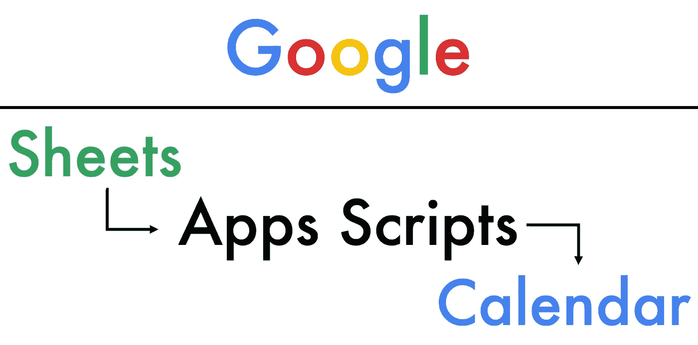
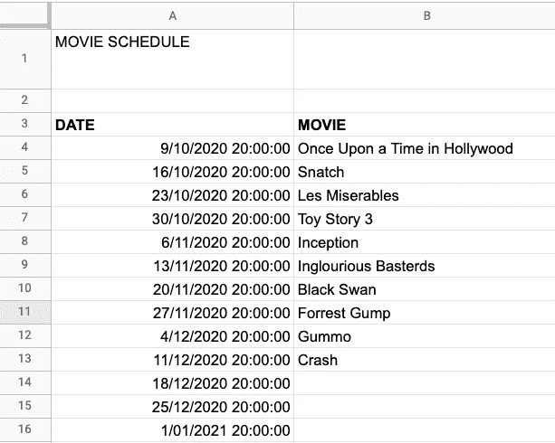
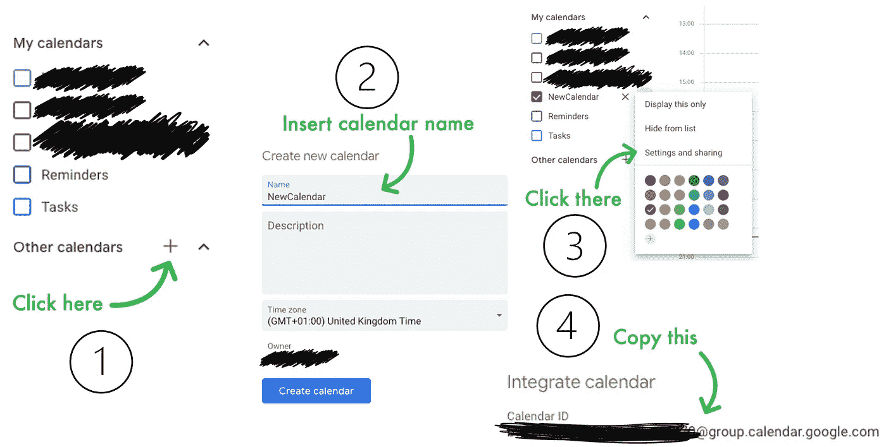
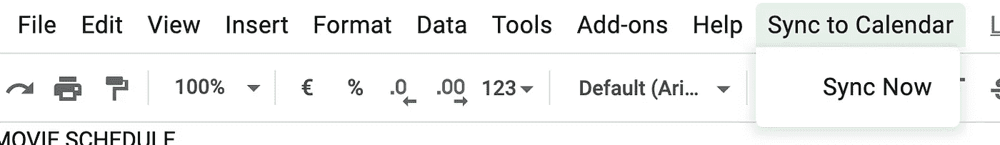
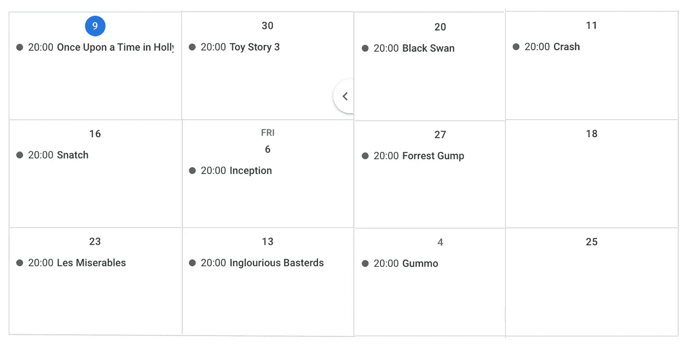

# 使用 Google Apps 脚本自动化事件管理

> 原文：<https://javascript.plainenglish.io/automating-event-management-with-google-apps-script-383a6704a455?source=collection_archive---------0----------------------->

Image by the author. Font used: Futura. Color styling: Google

用代码提高您的生产力！了解如何通过 Apps 脚本将工作表连接到日历，以自动化您的日程安排。

# 介绍

Google Apps Script 是一个脚本工具，允许你用 JavaScript 代码从一个地方链接所有的 Google Apps。开发环境(可在[script.googgle.com](https://script.google.com/home)访问)提供了几个高级应用程序编程接口(API)，允许你与你最喜欢的谷歌应用程序交互(创建、修改文档、读写表格、创建日历事件等)。

今天，我将展示如何编写一个简单的脚本，允许您将组织成电子表格的事件链接起来，并将其链接到您的个人或共享日历。

# 动机

在工作中，我不经常使用谷歌电子表格，但我发现它对管理我的个人活动非常有用，如费用、旅行或学习计划。今天，我联系了一个老朋友，我们决定恢复每周五看电影的老习惯，尽管因为当前的疫情有点遥远。我很快创建了一个 Google Sheet 电子表格，这样我们就可以列出每周要看的电影。

一旦我的标签被创建，我有了要看的电影列表和一组日期，我想，**如果能把这个电子表格同步到我的日历上该多好啊？快速的谷歌浏览把我带到了[的一篇博客](https://cloud.google.com/blog/products/g-suite/g-suite-pro-tip-how-to-automatically-add-a-schedule-from-google-sheets-into-calendar)，作者是 G Suite 开发者倡导者 [乔安娜·史密斯](https://medium.com/u/2918c49416d6?source=post_page-----383a6704a455--------------------------------)。这个简短的帖子和与之配套的 YouTube 视频展示了如何使用 Google Apps 脚本来完成这个任务。令 YouTube 视频[中的许多评论者失望的是，该任务的代码片段并不能在任何地方快速复制、粘贴和运行。](https://www.youtube.com/watch?v=MOggwSls7xQ&feature=emb_logo)**

**幸运的是，**代码相当琐碎，我们将展示如何通过几行额外的代码轻松地使它变得更好。

# 该过程

## 电子表格

我假设你知道如何使用谷歌工作表创建电子表格，当然，如果你想复制这项工作，你需要一个谷歌帐户。我的电子表格看起来像这样:

My movies spreadsheet

正如你所看到的，一些条目丢失了，因为我们还没有决定到时候看什么电影。此外，请注意，日期列采用的是*日期时间*格式，这是首选格式，因为这将使以后的代码更简单(在编程中处理日期有点麻烦)。要更改单元格的格式，选择日期单元格并点击**格式>数字>日期时间。**

## 日历

为了这个活动，我在 [Google Calendar](https://calendar.google.com/) 中创建了一个新日历，并通过以下简单的步骤检索了它的日历 ID:

Image by the author. Workflow to create a new calendar and retrieving the calendar ID

我们稍后在编写脚本时将需要日历 ID，以便代码知道要修改什么日历。复制日历 ID 后，将其粘贴到电子表格中的空白单元格中，这样我们就可以从电子表格中自动检索日历。或者，您可以简单地将日历 ID 存储在 JavaScript 代码的变量中。

## 代码—一步一步

本教程假设您对编程有所了解，最好是对面向对象编程有所了解，尽管代码几乎可以像普通英语一样阅读。此外，代码被完全注释。

现在一切都准备好了，回到电子表格，点击**工具>脚本编辑器。**现在我们已经准备好编码了，但是我们面前是一个名为`Code.gs`的空白画布，其中包含一个名为`myFunction()`的函数的空模板。鉴于代码没有在 [G Suite 教程](https://cloud.google.com/blog/products/g-suite/g-suite-pro-tip-how-to-automatically-add-a-schedule-from-google-sheets-into-calendar)中深入解释，我们将在这里对其进行分解(不要担心，完整的代码将在本文末尾提供)。

首先，我们设置电子表格和日历:

我调用了我的函数`sheet2calendar`。上面块中的第 4 行将`spreadsheet`变量设置为我们的日程表所在的电子表格，在本例中，我的工作表名为 CALENDARIO。第 5 行从单元格 H1 中检索日历 ID，最后，我内联 6 加载了`calendar`对象。

接下来，我们用这一行加载我们的电影:

这只是简单地说将条目从单元格 A4 加载到单元格 B15，有效地检索一个 12x2 的表格。第一列对应于日期，第二列对应于电影名称。

现在，我们将遍历这个表中的每个条目(FOR 循环！)并为指定日期创建一个日历事件。每个事件将有 3 个小时的长度，事件名称将是电影的标题。此外，我们将实现 G Suite 博客中没有讨论的几个特性:

*   如果没有电影标题，我们将跳过该条目，不创建任何事件。
*   如果在那个时间段有一个条目(在我们的新日历中，它独立于我们的其他日历工作)，删除那个事件并创建一个新的事件-你们中的许多人可能不同意这种处理冲突的方式，尽管这只是一个概念证明！
*   通过指定客人的电子邮件，添加与客人共享活动的功能。
*   包装代码以在独立函数中创建和共享事件。

我们的基本 for 循环如下所示:

不错！我们已经得到了我们需要的大部分东西，现在让我们添加我们的新功能。首先，如果`movie`变量为空(即等于`''`，我们将跳过当前迭代。接下来，我们需要我们的冲突处理代码。为此，我们将检索电影开始和结束时间之间的现有事件，并删除当前名称与新名称不同的事件。

冲突处理的逻辑很简单:如果`conflicts`对象的长度是 0，就没有冲突，我们可以和平地创建一个新事件。如果`conflicts`对象的长度大于 0，我们将遍历`conflicts`中的事件(以防不止一个)。接下来，我们对照`movie`名称检查冲突事件的名称，如果它们都相等，我们跳过当前迭代(不需要删除一个事件并创建一个同名的事件)。但是，如果名称不同，我们将删除冲突事件并创建一个新事件。

在前面的代码块中，我们调用了函数`createAndShare()`两次(在第 13 行和第 31 行)。我将这个函数放在了`sheet2calendar()`函数的外部，以避免重写代码和保持整洁。下面是它的实现:

## 点睛之笔——来自乔安娜的帖子

最后，为了避免每次我们希望将日历与电子表格同步时都必须访问脚本编辑器，我们可以在工作表工具栏中添加一个按钮，如 [Joanna Smith](https://medium.com/u/2918c49416d6?source=post_page-----383a6704a455--------------------------------) 在 2018 发表的[帖子所示。您只需要将这个函数添加到您的`.gs`文件中:](https://medium.com/@dontmesswithjo/custom-menus-94d8e4325b0d)

之后，您应该能够在电子表格工具栏中看到这样的图标:

Press **Sync Now** to run the code we just wrote!

这么简单。

# **结果**

当我们按下**现在同步**或者从脚本编辑器中运行代码时，我们成功地显示了我们的事件，客人应该会收到电子邮件邀请。

Our calendar is successfully synced to our spreadsheet

# 最终代码

# 你能做的更多

对于最佳实践，如果你在一个严肃的项目中使用它，我推荐使用 App Scripts `Logger.log()`函数来记录你的代码运行的所有操作。通过这种方式，您可以随时返回日志，查看进行了哪些更改以及执行了哪些代码/操作。在官方文档中阅读更多关于`Logger`类的内容。

此外，您可能认为我的代码对于手头的任务来说过于复杂，我本可以避免实现某些功能。我的观点是，即使是在玩具项目中，也要尝试编写遵循最佳实践的代码。

# 结论

我希望你觉得这篇文章值得一读。我个人觉得这个工具超级好用，而且它的可能性似乎是无限的。

# 资源

*   [谷歌企业应用套件脚本概述](https://developers.google.com/apps-script/overview)
*   将 Google Sheets 中的日程表添加到 Calendar [G Suite(现为 Google Workspace)博客文章](https://cloud.google.com/blog/products/g-suite/g-suite-pro-tip-how-to-automatically-add-a-schedule-from-google-sheets-into-calendar)
*   [点击按钮运行 Google Sheets 应用程序脚本](https://medium.com/@dontmesswithjo/custom-menus-94d8e4325b0d)由[乔安娜·史密斯](https://medium.com/u/2918c49416d6?source=post_page-----383a6704a455--------------------------------)