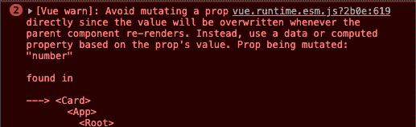
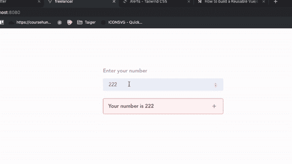
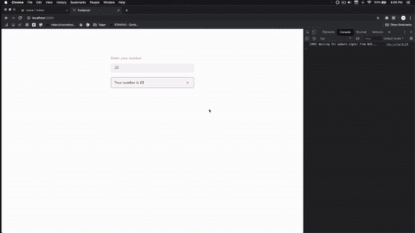
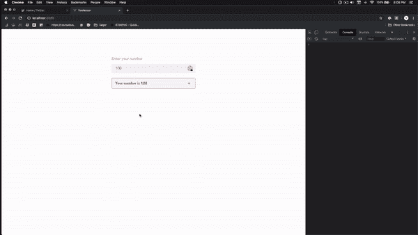
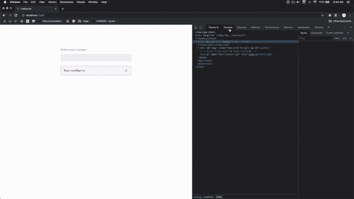

# 如何修复 Vue 中的“避免直接变异道具”

> 原文：<https://javascript.plainenglish.io/avoid-mutating-a-prop-directly-7b127b9bca5b?source=collection_archive---------0----------------------->

你有没有面对过这个错误-

> *避免直接改变道具，因为只要父组件重新渲染，该值就会被覆盖。相反，使用基于属性值的数据或计算属性。*

Vue 不建议修改`prop`数据的原因是因为如果父组件有不同的值，子组件中的数据将被重新渲染。

# 怎么解决？

我将创建一个简单的 Vue 组件，由附加了`v-model`的输入和另一个接受`v-model`数据作为`props`并显示它的卡组件组成。

这就是界面看起来的样子。

这就是界面的工作方式。

每次用户在输入时，它都会直接反映在下面的卡片上。这是因为我们在`Card`组件中将`v-model: number`作为`prop`传递。

用户输入的任何值都会立即反映出来。

我的下一个问题是，如果我们要操作子组件(即`Card`组件)中的数据，会发生什么。

令人惊讶的是，这就是正在发生的事情。

当我们想增加子组件中的值时，Vue 给我们一个错误信息，这是**不推荐的**方式。

# 为什么不推荐？

如果父组件中的数据 *v-model* 发生变化，子组件中的数据将重新呈现。

例如，我在输入中添加任意数字，并使用加号按钮增加`number`。如果我在`input`中添加一个新值会发生什么？

我们刚才增加的值是从输入中得到一个新值。

明白了吗？

# 我们怎么解决？

由于我们不能直接修改 props 数据，所以我们需要将`props`数据复制到一个变量中。

在`addNumber`方法中，将道具分配到一个新变量中并进行计算。

下一个问题是，我们如何将新的数值发送给父节点？🤔

感谢上帝，有一个自定义事件来解决它。我们需要在`addNumber`方法中添加自定义事件。

这意味着我们正在通过`update-number`事件名称发送一个`myNumber`数据。因为我们正在发送一个定制数据，父组件需要监听`update-number`事件。

在`App.vue`中，将监听器添加到`Card`组件中。

如果子组件中有一个名为`update-number`的`emit`事件被触发，就会调用`update`函数。

在`App.vue`文件中，在`methods`部分添加`update`功能。

记住，当我们发送自定义事件时，我们发送的是参数`myNumber`。所以，在`update`函数中需要有一个参数来获取数据。

之后，我们从自定义事件中获得的新值将被赋给`number`数据。因为，如果每次`props`数据改变，子组件数据将被重新渲染，我们可以看到`Card`组件的即时更新。

# 源代码

App.vue

Card.vue

最初发表于[https://jakzaizzat.com](https://jakzaizzat.com/avoid-mutating-a-prop-directly)