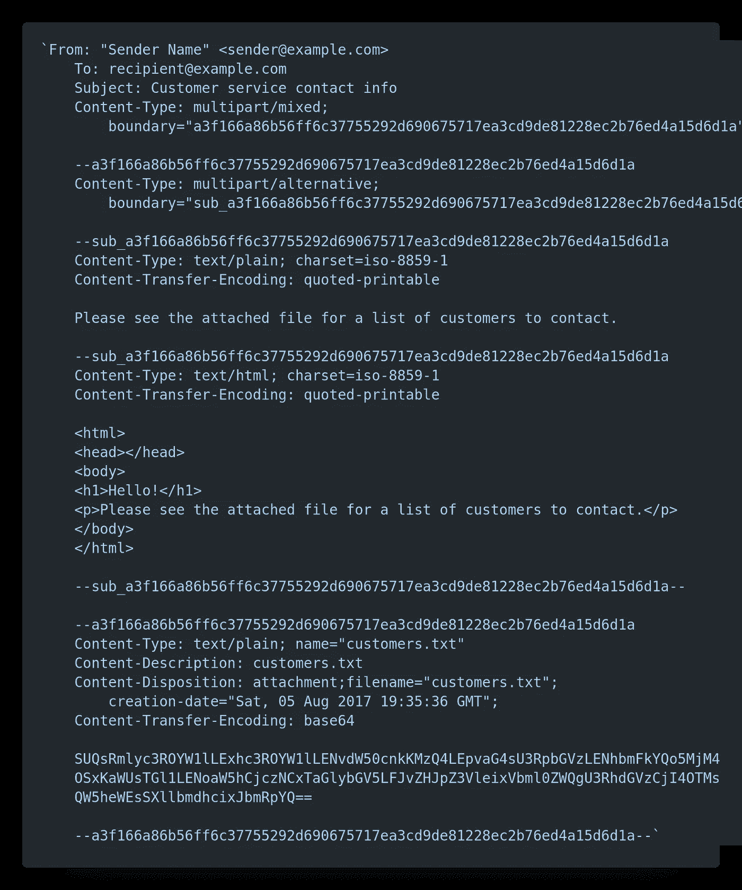

# AWS SES:如何在 Node.js 中发送带有附件的邮件

> 原文：<https://javascript.plainenglish.io/aws-ses-how-to-send-a-mail-with-an-attachment-nodejs-43a12cf98714?source=collection_archive---------0----------------------->


Image source: [wallpaperaccess](https://wallpaperaccess.com/)

在本文中，我将解释如何使用 AWS SES 发送附件，本文是为那些已经知道如何使用 SES 发送简单电子邮件的人准备的。

SES 只允许通过 ***发送附件*发送邮件**的方法。

发送电子邮件接受**多用途互联网邮件扩展** ( **MIME** )类型的电子邮件正文作为数据，所以让我们看看如何准备 MIME 类型的电子邮件内容。



典型的 MIME 电子邮件看起来像上面的例子，它是一个多部分的电子邮件，内容有 HTML 格式和文本格式，并且包含一个文本文件作为附件。

我们可以创建一个类似于上面例子的字符串，并作为数据发送给 sendRawEmail，但是格式化这个长字符串会非常混乱。为了简化 MIME 主体的创建，我们可以使用像 mimemessage 这样的 npm 模块。如下所示，安装 mimemessage npm 模块。

```
npm i mimemessage
```

mimemessage 模块帮助我们轻松创建电子邮件。首先，我们需要使用如下所示的 mimemessage factory 方法创建 ***mailContent*** 。所有邮件内容都将附加到此对象。

```
var mimemessage = require('mimemessage');var mailContent = mimemessage.factory({contentType: 'multipart/mixed',body: []});
```

现在，让我们添加标题。

```
mailContent.header('From', 'Sender Name <sender@example.com>');
mailContent.header('To','recipient@example.com');
mailContent.header('Subject', 'Customer service contact info');
```

现在，我们添加了标题，让我们添加邮件内容。使用 MIME 电子邮件类型，我们可以添加相同电子邮件内容的文本和 HTML 变体。要拥有这两种变体，我们首先需要创建一个*多部分/替代*对象。

```
var alternateEntity = mimemessage.factory({
    contentType: 'multipart/alternate',
    body: []
});
```

现在我们需要创建 HTML 和文本实体，并添加到上面的*alternate tity 中。*

```
var htmlEntity = mimemessage.factory({
   contentType: 'text/html;charset=utf-8',
   body:  '   <html>  '  + 
          '   <head></head>  '  + 
          '   <body>  '  + 
          '   <h1>Hello!</h1>  '  + 
          '   <p>Please see the attached file for a list of    customers to contact.</p>  '  + 
          '   </body>  '  + 
          '  </html>  ' 
 });var plainEntity = mimemessage.factory({
   body: 'Please see the attached file for a list of    customers to contact.'
});alternateEntity.body.push(htmlEntity);
alternateEntity.body.push(plainEntiFirstty);
```

现在我们需要将这个*alternate tity*添加到 *mailContent* 体内

```
mailContent.body.push(alternateEntity);
```

## **如何将文件附加到邮件中**

我们将添加附件，作为主邮件内容对象的一部分。首先，我们需要读取文件，并将文件内容转换成 base64 字符串，将其作为实体的主体添加。如下所示，我们需要指定内容类型和使用的编码。我们需要添加一个名为*内容-处置*的带有相关细节的标题。

```
var data = fs.readFileSync('customers.txt');var attachmentEntity = mimemessage.factory({
contentType: 'text/plain',
contentTransferEncoding: 'base64',
body: data.toString('base64').replace(/([^**\0**]{76})/g, "$1\n")
});attachmentEntity.header('Content-Disposition', 'attachment ;filename="customers.txt"');
```

现在将该实体附加到主邮件内容中。

```
mailContent.body.push(attachmentEntity);
```

最后，我们的邮件对象准备好了，我们需要将它传递给 SES sendRawEmail 方法，如下所示。

```
ses.sendRawEmail({
    RawMessage: { Data: mailContent.toString() }
}, (err, sesdata, res) => {});
```

如果我们配置正确，我们将在回调中收到一条成功消息。

注意:SES 仅允许 10MB 文件作为附件