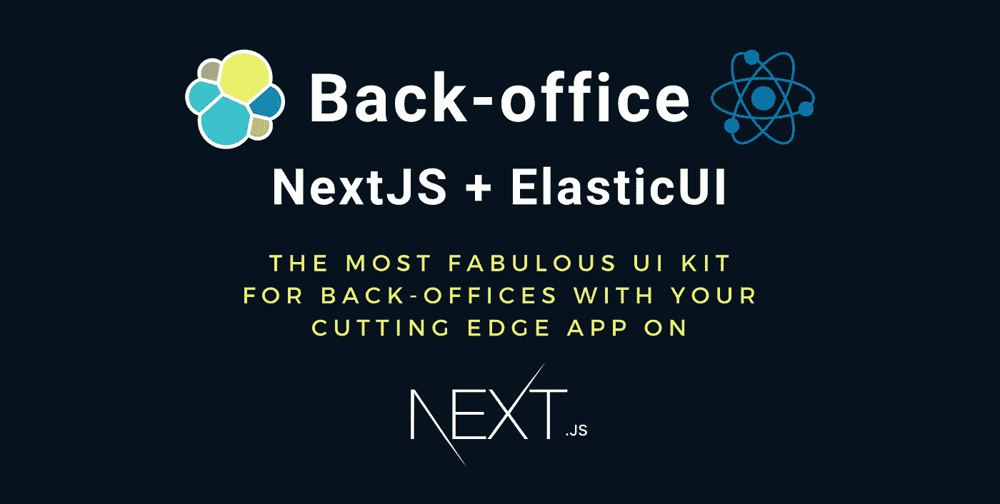
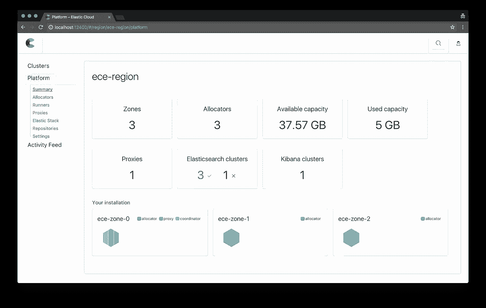

# 使用 NextJS (React) + ElasticUI (EUI)的后台

> 原文：<https://javascript.plainenglish.io/back-office-with-nextjs-react-elasticui-eui-168cba44a952?source=collection_archive---------2----------------------->

## 后台脚手架

## 使用 ElasticUI:最棒的后台 UI 套件，使用 NextJS 制作的尖端应用运行，并托管在 Zeit now 上，没有眼泪。



**💡开始注释:** *虽然这篇文章是关于使用 NextJS 应用程序实现 EUI 的，但我首先会给出一些背景，为什么这是您的管理工具的一个强有力的选择。*🎯 ***如果想直奔配置，直接到达文末即可。***

像我一样，有时您可能需要在开发前端应用程序的同时构建某种后台工具。这是显而易见的，有些内容需要团队来管理…

虽然使用一些 SASS 解决方案是一个好主意，就像我们在以前的文章中看到的那样

[](https://medium.com/javascript-in-plain-english/the-most-simple-contentful-react-tutorial-using-a-nextjs-application-8d0ce4596ad6) [## 使用 NextJS 应用程序的最简单的 Contentful + React 教程👊🏻

### 一个非常简单的果酱栈如何使用教程内容丰富和反应，而不必掌握+1000 工具，因为…

medium.com](https://medium.com/javascript-in-plain-english/the-most-simple-contentful-react-tutorial-using-a-nextjs-application-8d0ce4596ad6) 

有时你可能需要一些定制的、有品牌的、能满足你自己产品需求的东西，比如显示度量标准。为此，您可以使用许多前端框架，如 react 的 [*Material-UI。但在我看来，目前最好最完整的框架是*](https://material-ui.com/) *[**弹性 UI**](https://elastic.github.io/eui/#/) **。***

让我们用一点上下文来看看为什么。

# 👨🏻‍🔬elastic-UI(EUI):react 开发的后台最好的框架？

你要知道的第一件事是 EUI 是由一家名为 **Elastic** 的公司生产的。你可能听说过他们著名的**弹性搜索**工具。

但是 Elastic 不仅仅是做一个搜索引擎！他们还提供了一些工具来改进搜索引擎的数据获取和消费方式。

我们有**著名的 ELK (Elastic-Logstash-Kibana)堆栈**，它收集各种数据和数据流，通常用于通过 **Elastic Beats** 进行统计和系统监控，这是一种用于报告系统指标的守护进程。

*   **Logstash** 作为入口点，接收、处理和转发数据到弹性搜索。
*   **ElasticSearch** 用于索引和持久化。
*   最后， **Kibana** 将这些漂亮的数据显示在后台仪表板上。

> 你可能会问为什么那个家伙要告诉我们这些？我们只想知道反应和 EUI…

答案就在一句话里:

**Elastic-UI (EUI)是 Kibana 使用的 UI 套件，已经被开源以扩展 Kibana 或定制后台。**

# 👨🏻‍🎨一个以数据显示为中心的 UI 工具包！



A dashboard made with EUI

Kibana 是一个仪表板，它的唯一目的是以一种与用户消费相关的方式显示数据。Elastic 团队花了大量的研究来获得一个好的产品。他们甚至根据 UX 搜索优化。

**💁🏻‍♂ ️Everything 在** [**一节**](https://elastic.github.io/eui/#/guidelines/writing) 中有描述，我只能建议你读一下。

你也可以用 sass 很容易地扩展它，并和一些 CSS-in-JS 库一起使用，比如我最喜欢的 [**样式组件**](https://www.styled-components.com/) 。

除此之外，它可能是你能找到的最完整的后台 UI 套件。它配有布局、选择器、按钮甚至图表工具。

你可能不需要任何其他的库来使用它… **但是它有一个问题，虽然不好但并非毫无意义…**

## 💔EUI 不支持现成的服务器端渲染。

这意味着，如果不进行一些配置，就不能在 NextJS 中使用它。

以下是 GitHub***[***[***1830***](https://github.com/elastic/eui/issues/1830)***，***[***2074***](https://github.com/elastic/eui/issues/2074)***]***上的一些相关线程，正如你所看到的:他们并不指望在接下来的几个月里提供支持。

> 你为什么要这么做？

因为 NextJS 为 sass、后端代码、渐进式网络应用、渲染优化、代码分割和路由提供了很好的脚手架和工具。 *(这对你来说够了吗？*🤣 *)*

如果您按照文档中的描述安装它:`yarn add @elastic/eui`，您将会看到这样的结果:


该死…这么棒的工具，我不能用我最喜欢的软件…但是等等… **黑客来营救🕵🏿‍♂️**

# 用 NextJS 让 Elastic-UI 在 SSR 上工作的技巧

简而言之，它使应用程序崩溃，因为程序试图访问 NodeJS 上不可用的各种 API。

以下是基于两个文件的变通解决方案:

1.  首先，我们编辑`next-config.js`为 allows allow，不要忘记安装`@zeit/next-sass`包。然后扩展您的配置，使用定制的 webpack 配置，并用`withSass`包装它。
2.  从现在开始，当你重新加载`next dev`时，你的应用程序不会崩溃，但是你不会得到 CSS，因为它没有被加载。你将需要使用一个自定义的 SASS 文件，因为如果你使用 CSS 文件或者直接导入我们在 CSS 中导入的文件，一旦你运行`next build`你将丢失构建的 CSS，它将被我们上面的代码剥离。
3.  将我们刚刚创建的`scss`文件导入到您的`pages/_app.js`(或等效的 typescript)中

我的`pages/_app.tsx`开始区块看起来是这样的:

```
*// Load design* import "@modules/ui/app.scss";
```

我们到了。享受你的应用程序在 Zeit + EUI 上运行的乐趣，享受令人敬畏的管理体验！