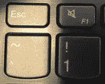

# 反引号与单引号

> 原文：<https://javascript.plainenglish.io/back-ticks-are-not-single-quotes-eef4e014115c?source=collection_archive---------7----------------------->

## JavaScript 技巧

## 演示如何在 JavaScript 中使用[重音符](https://en.wikipedia.org/wiki/Grave_accent)来创建模板文字。

Image by author

## 我们将做什么

在这篇短文中，我们将演示反勾号和单引号的区别。嗯，至少*是它们的用途之一。*

更多可以在 [MDN](https://developer.mozilla.org/en-US/docs/Web/JavaScript/Reference/Template_literals) 上找到。

## 为了演示

我将使用 [**Textpad**](https://www.textpad.com/) 但任何文本编辑器，让你创建。html 页面和编写 JavaScript 就足够了。 [**记事本++**](https://notepad-plus-plus.org/) 它也不错。

## 哪里有倒勾？

不。夏天在森林里走了很久后，你的背上没有。

> 我们需要的那个通常位于键盘左上角的波浪号~。

` there it is!`

## 示例:

1.  在硬盘上创建一个文件夹。
2.  创建一个名为**backtickdemo.html**的文件(或者任何你想要的东西)并保存在文件夹中。

3.添加以下 JavaScript 代码和 HTML 元素。

Note the back-ticks and ${} in addWithBackTicks()

4.在您的浏览器中运行它，然后单击每个按钮。

Same output. Two options

## 需要什么？

如果您选择反勾号方法，显然要使用反勾号，而不是单引号。

**还需要包含${}中的变量。**

# 结论

还有更多的反滴答声。当然可以。但我只是想让你开始，不占用你太多时间。

玩着玩着，多看看书。

*   [MDN](https://developer.mozilla.org/en-US/docs/Web/JavaScript/Reference/Template_literals)

感谢您的宝贵时间，祝您编码愉快！