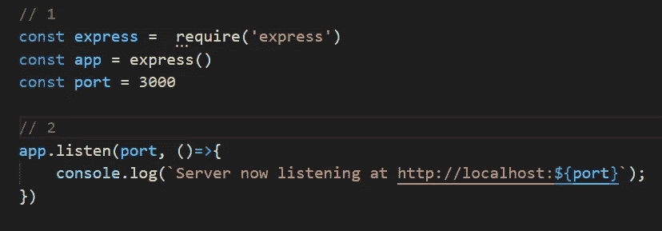
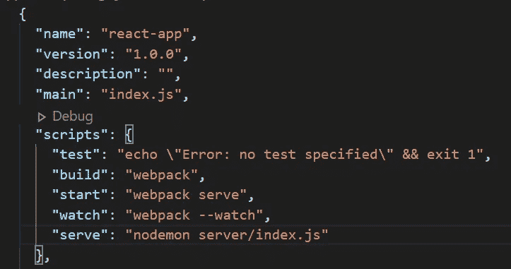
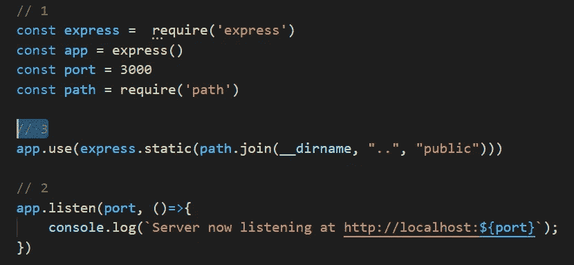
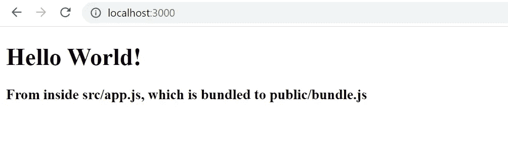
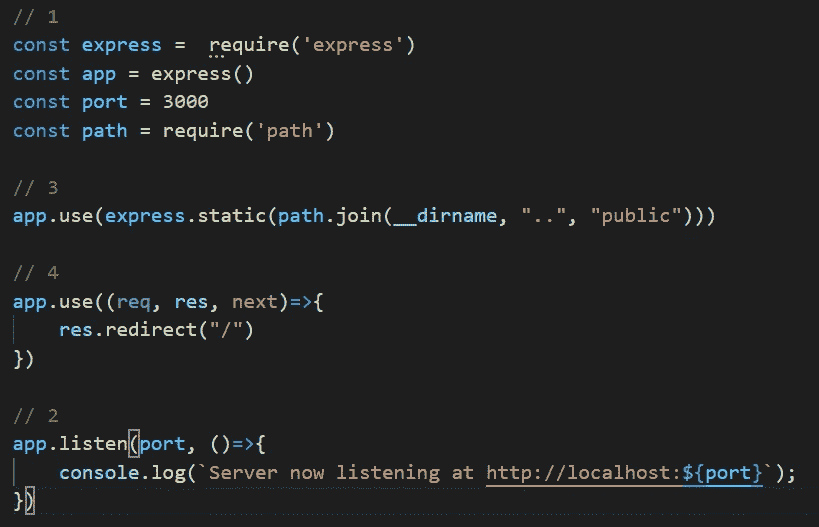

# 使用 Express.js 在客户端呈现 React 应用程序

> 原文：<https://javascript.plainenglish.io/back-to-basics-client-side-rendering-a-react-app-using-express-js-c828e3664b88?source=collection_archive---------4----------------------->

## 如何通过实现客户端渲染解决方案来使用 Express.js 服务 React 应用程序


Photo by [Kate Townsend](https://unsplash.com/@k8townsend?utm_source=medium&utm_medium=referral) on [Unsplash](https://unsplash.com?utm_source=medium&utm_medium=referral)

您已经设置并创建了 react 应用程序(使用 create-react-app、其他样板文件，甚至从头开始创建)。现在你试图把它发布到网上，让全世界都能看到你的成果。当然，为了便于部署和最小化设置，您可以使用已经建立的平台，如 Netlify、Heroku、Firebase Hosting、Github Pages 或许多其他平台。然而，这篇文章不是关于这个的。这篇文章是关于使用 good ol' Express.js 设置你自己的服务器和部署你的站点/应用的。

你可能会问，为什么？当然是为了学习。了解服务器如何交付你的应用/站点对你的编程基础是有益的。它还可以帮助您将来部署(和配置)您的站点。

在本文中，我将重点介绍在使用 Express.js 部署 react 应用程序时客户端渲染是如何工作的。为了更好地理解，您还应该检查一下服务器端渲染是如何工作的，作为比较。这样，您将对每种方法的工作原理有一个更清晰的理解，并获得客户端和服务器端渲染解决方案的整体视图。我写过一篇关于服务器端渲染的文章。所以，看看这个:

[](https://medium.com/javascript-in-plain-english/back-to-basics-server-side-rendering-a-react-app-using-express-js-6fab99db5770) [## 使用 Express.js 在服务器端呈现 React 应用程序

### 如何通过服务器端渲染使用 Express.js 为 React 应用提供服务

medium.com](https://medium.com/javascript-in-plain-english/back-to-basics-server-side-rendering-a-react-app-using-express-js-6fab99db5770) 

最后，您应该清楚地了解什么是客户端渲染，以及如何使用 Express.js 应用客户端渲染解决方案。除此之外，您还应该清楚地了解服务器如何工作，以及站点/应用程序如何部署到服务器。

# 该项目

如果你已经有一个 react 应用，你可以使用现有的 react 应用，或者你可以使用 create-react-app 创建一个新的应用，并保留`src`目录中的主要代码(因为我们关注的是后端)。你也可以尝试从头开始创建一个 react 应用程序，这可以增强你对 react 应用程序内部的点点滴滴的理解。

要了解 react 应用程序是如何从头开始构建的，您可以点击下面的链接，阅读我之前的文章:

[](https://medium.com/swlh/back-to-basics-how-to-set-up-a-react-app-from-scratch-2020-134908e17490) [## 回归基础:如何从零开始设置 React 应用程序 2020

### 使用最新的 Webpack 和 Babel 从空目录构建 React 应用程序。

medium.com](https://medium.com/swlh/back-to-basics-how-to-set-up-a-react-app-from-scratch-2020-134908e17490) 

我将使用上面文章中从头开始创建 react 应用程序的代码。请注意，通过“从头开始反应应用程序”的例子，您将理解公共文件夹中的 JavaScript 文件是如何产生的(这对于理解本文末尾解释的客户端呈现非常重要)。您的项目目录至少应包含以下文件夹结构和文件:

```
react-app/
|--public/
|  |--index.html
|  |--bundle.js
|--src/
|  |--app.js
|--babel.config.js
|--package-lock.json
|--package.json
|--webpack.config.js
```

本文将假设您已经对 JavaScript、Node.js 和 React 有了基本的了解。如果没有，对于基本设置(比如 Node 和 React)，我推荐你按照上面的链接从头开始做一个 react-app。

# 快递. js

Express.js 将自己标榜为“快速、非个人化、极简主义的网络框架”。如果您正在为项目构建后端，Express 是一个必不可少的 JavaScript 框架。到目前为止，如果 JavaScript 用于服务器端语言，您应该不会感到惊讶。

要安装 Express.js，请运行以下命令:

```
npm install express
```

安装 Express 后，在项目的根目录下创建一个名为`server`的新目录。

```
mkdir server
```

这个目录是我们将设置 Express 后端的地方。到目前为止，你至少应该在根目录下有三个目录(如果你是从“从头开始创建 react 应用”这篇文章开始的)，分别叫做`public`、`src`和`server`。

在`server`目录下，创建一个名为`index.js`的文件:

```
touch server/index.js
```

您的服务器目录现在应该如下所示:

```
react-app
|-server
|  |-index.js
|...
```

在`server/index.js`中，添加以下代码:



server/index.js

1.  我们需要 express 模块并调用顶部的 express 函数，`express()`。我们还设置了所需的端口号，在本例中是 3000。
2.  我们指示 express 启动服务器并监听我们设置的端口。控制台将输出“服务器正在监听 http://localhost:3000。

要启动服务器，请在项目目录的根目录下的终端中输入以下命令:

```
node server/index.js
```

当我们打开 [http://localhost:3000](http://localhost:3000) 时，浏览器中不会显示任何内容。反而只会出现一个错误信息“无法获取/”。这是因为我们还没有在 Express 中指定任何路线，尤其是要从“/”(home)路线传递的内容。我们只需要 express 模块，并指示 express 启动服务器并监听`server/index.js`中的端口 3000。

# Nodemon

在我们对`server/index.js`进行任何修改以提供 react 内容之前，让我们将 Nodemon 合并到我们的应用程序中。Nodemon 是一个开发基于节点的应用程序的工具，当检测到目录中的文件改变时，它帮助自动重启所述应用程序。这样，我们就不必在每次想要查看我们所做的更改是如何发生的时候，手动取消并重启我们的 express 服务器。

通过键入以下命令全局安装 Nodemon(推荐):

```
npm install -g nodemon
```

现在，您可以在机器中的其他项目上使用 Nodemon，因为它是全局安装在您的机器中的。

现在，让我们使用`nodemon`而不是使用`node`命令来启动我们的 express 服务器:

```
nodemon server/index.js
```

像`node`指令一样，该命令将启动我们的 express 服务器。然而，这一次，无论何时在我们的`server/index.js`中进行任何更改并保存，我们的服务器将自动重启以使这些更改生效。

更好的是，让我们在`package.json`中添加一个名为`serve`的 npm 脚本，用于使用 nodemon 启动我们的 express 服务器:



package.json

现在，要启动服务器，我们可以从项目终端的根目录调用以下命令:

```
npm run serve
```

# 快递()。静电

为了服务我们的 react 应用程序，我们将使用 Express.js 的内置`express().static`中间件。Express.js 应用程序基本上是一系列中间件和路由功能。中间件函数告诉 Express.js 如何处理传入的请求。是转换请求数据、发回响应，还是将其传递给下一个中间件。中间件指示 express 提供来自指定目录的静态文件。

在我们的`server/index.js`中，添加以下代码:



server/index.js

3.我们使用 Node 的 path 模块来获取到我们的`public`目录的路径，我们绑定的 react 应用程序(在一个名为`bundle.js`的 JavaScript 文件中)和它对应的 html ( `index.html`)就位于这个目录中。使用`public`目录路径，我们指示 express 静态地服务于所述目录中的文件。

现在，当我们再次转到 localhost 时，我们的 react 应用程序内容应该可以成功地在主路由('/')中提供:



react-app served through localhost

瞧啊。我们已经通过 Express.js 后端成功提供了 react-app。当指向 home ('/')路径时，express 将在公共目录中搜索并提供它找到的第一个`index.html`(包括该 html 中所有必需的文件，如 JavaScript 和 css)。

另一个问题出现了，如果用户输入不同路线(如`/home`、`/about`、`/sdfsadfs`等)会怎样。)不是专门设置在我们后端的？用户可能会收到错误“无法获取”。

为了解决这个问题，我们应该指示 Express 将所有传入请求重定向到 home ('/')路由。我们通过在我们的`server/index.js`文件中添加更多的代码来做到这一点:



server/index.js

4.我们添加了另一个中间件，它指示 Express 将除了本地路由('/')之外的任何路由重定向回本地路由('/')。这样，用户将无法输入任何随机路线，并得到一个“不能得到”的错误。

现在，每次用户访问我们的网站时，我们的后端会自动将传入的请求路由到“/”(home)路由。

# 客户端渲染

我们已经成功地使用 express.js 后端服务了 react 应用程序。在这个项目中，我们的 react 应用程序是通过客户端呈现的(因此得名“客户端呈现”)。当请求到达本地路由时，我们指示`express().static`发送回`index.html`文件以及 html 文件所需的 JavaScript 和 css 文件。我们的`index.html`文件只包含一个空的`div`元素，在 body 标签中有 id‘root’。页面 UI 的实际呈现是由 JavaScript 文件`bundle.js`完成的，我们所有的 react 代码都驻留在这个文件中。这就是为什么它被称为“客户端渲染”，在 JavaScript 文件被成功发送到客户端浏览器并由客户端浏览器下载之后，UI 渲染过程由客户端浏览器在客户端完成。这是“服务器端渲染”的反义词(另一篇文章中有更多相关内容，敬请关注！).

客户端渲染有其优点和缺点。客户端渲染最大的优势是它丰富且易于交互。在初始加载之后，UI 交互应该非常灵敏，因为所有需要的 JavaScript 代码都已经在初始加载时下载好了。当然，缺点是初始负载本身。随着应用程序变得越来越丰富和复杂，浏览器在初始加载时需要下载的文件越来越大。这可能对用户体验不利。

然而，最大的缺点是与搜索引擎优化(SEO)有关。因为我们应用程序的所有内容都是从服务器发送的 JavaScript 文件中提供给客户端的，所以它可能会阻止网络爬虫抓取我们应用程序的内容。因此，谷歌搜索结果将受到冲击。

# 摘要

在本文中，我们已经使用 Express.js 后端成功地提供了一个 react 应用程序(从头开始构建)。在下载了所有需要的 JavaScript(和 css)文件之后，通过客户端浏览器的客户端呈现来呈现 UI。