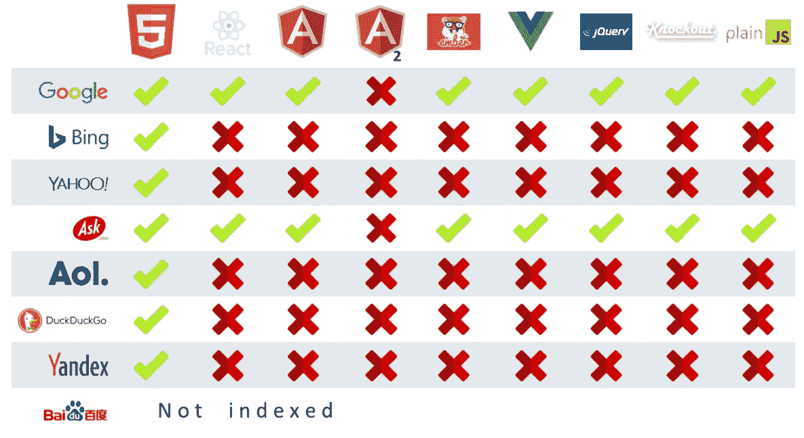

# 使用 Express.js 在服务器端呈现 React 应用程序

> 原文：<https://javascript.plainenglish.io/back-to-basics-server-side-rendering-a-react-app-using-express-js-6fab99db5770?source=collection_archive---------0----------------------->

## 如何通过服务器端渲染使用 Express.js 为 React 应用提供服务


Photo by [Science in HD](https://unsplash.com/@scienceinhd?utm_source=medium&utm_medium=referral) on [Unsplash](https://unsplash.com?utm_source=medium&utm_medium=referral)

您已经设置并创建了 react 应用程序(使用 create-react-app、其他样板文件，甚至从头开始创建)。现在你正试图把它放到网上，这样人们就可以体验你的应用了。当然，为了便于部署和最小化设置，您可以使用已经建立的平台，如 Netlify、Heroku、Firebase Hosting、Github Pages 或许多其他平台。然而，这篇文章不是关于这个的。这篇文章是关于使用 good ol' Express.js 设置你自己的服务器和部署你的站点/应用的。

你可能会问，为什么？当然是为了学习。了解服务器如何交付你的应用/站点对你的编程基础是有益的。它还可以帮助您将来部署(和配置)您的站点。

在本文中，我将重点介绍服务器端渲染如何使用 Express.js 服务 react 应用程序。我将首先解释概念，然后深入研究示例项目代码。为了获得更好的理解，您还应该检查客户端渲染作为比较是如何工作的。这样，您将对每种方法的工作原理有一个更清晰的理解，并获得客户端和服务器端渲染解决方案的整体视图。我写过一篇关于客户端渲染的文章。所以来看看吧:

[](https://medium.com/javascript-in-plain-english/back-to-basics-client-side-rendering-a-react-app-using-express-js-c828e3664b88) [## 回归基础:使用 Express.js 在客户端呈现 React 应用程序

### 如何通过实现客户端渲染解决方案，使用 Express.js 服务 react app。

medium.com](https://medium.com/javascript-in-plain-english/back-to-basics-client-side-rendering-a-react-app-using-express-js-c828e3664b88) 

最后，您应该清楚地了解什么是服务器端渲染，以及如何使用 Express.js 应用服务器端渲染解决方案。除此之外，您还应该大致了解服务器如何工作以及站点/应用程序如何部署到服务器。

# 服务器端渲染

与客户端呈现相反，服务器端呈现在将 react 组件发送到客户端之前，在服务器中呈现 react 组件**。在服务器端渲染过程中，从最初的请求到应用程序可用于交互的步骤如下:**

1.  对页面的请求从客户端发送到服务器。
2.  服务器通过在发送到客户端之前在服务器中呈现 react 组件来做出响应。
3.  客户端接收 html(带有 react 组件)并在浏览器中显示它。
4.  客户端还下载所需的 JavaScript 文件(包含 react 应用程序)。
5.  下载 JavaScript 文件后，它将从 JavaScript 文件中重新组合当前显示在 react 应用程序中的 html。

注意，在第二步中，react 组件在被发送到客户机之前在服务器**中呈现。因此，当等待下载所有需要的 JavaScript 文件时，将不会出现“白页”，这通常发生在客户端渲染过程中。**

在服务器中有一个预渲染的 React 应用程序的最大好处是 SEO(搜索引擎优化)。当一个典型的搜索引擎抓取一个网站时，它会从它抓取的每个 URL 索引 html 响应。搜索引擎爬虫通常跳过 JavaScript 代码或文件。这就是为什么客户端渲染 React 应用程序可能会损害 SEO。

在撰写本文时，已知只有 Google 搜索引擎能够抓取、解析和索引 JavaScript(有局限性)。根据 2017 年 moz.com 的一篇[文章](https://moz.com/blog/search-engines-ready-for-javascript-crawling)，几个搜索引擎的 JavaScript 索引性能如下:



source: [https://moz.com/blog/search-engines-ready-for-javascript-crawling](https://moz.com/blog/search-engines-ready-for-javascript-crawling)

# 该项目

如果你已经有一个 react 应用，你可以使用现有的 React 应用，或者你可以使用 create-react-app 创建一个新的应用，并保留`src`目录中的主要代码(因为我们关注的是后端)。然而，我建议你尝试从头开始创建一个 React 应用程序，这可以增强你对 React 应用程序内部的点点滴滴的理解。

要了解 React 应用程序是如何从头开始构建的，您可以点击下面的链接，阅读我之前的文章:

[](https://medium.com/swlh/back-to-basics-how-to-set-up-a-react-app-from-scratch-2020-134908e17490) [## 回归基础:如何从零开始设置 React 应用程序 2020

### 使用最新的 Webpack 和 Babel 从空目录构建 React 应用程序。

medium.com](https://medium.com/swlh/back-to-basics-how-to-set-up-a-react-app-from-scratch-2020-134908e17490) 

我将使用上面文章中从头开始创建 React 应用程序的代码。如果您已经完成了，那么您的项目目录应该至少包含以下文件夹结构和文件:

```
react-app/
|--public/
|  |--index.html
|  |--bundle.js
|--src/
|  |--app.js
|--babel.config.js
|--package-lock.json
|--package.json
|--webpack.config.js
```

本文将假设您已经对 JavaScript、Node.js、Webpack、Babel 和 React 有了基本的了解。如果没有，对于基本设置(有 Node、Webpack、Babel 和 React)，我建议你(再次)按照上面的链接从头开始创建一个 React 应用。

# Webpack 配置

我们将首先编辑和配置现有的`webpack.config.js`文件。在该文件中，定义了一个带有关键字`entry`、`output`、`module`和`devServer`的对象，并将其导出为 webpack 配置。然而，这个 webpack 配置专门用于配置、转换和捆绑我们的客户端 React 文件，使其可以由浏览器呈现。

对于服务器端渲染，我们还需要配置、转换和捆绑我们的服务器文件，因为它使用最新的 es 语法和 React JSX。因此，我们将导出两个对象，而不是导出一个对象作为我们的 webpack 配置。一个用于服务器文件配置，另一个用于客户端文件配置。在这两个对象中，我们将保持`entry`、`output`和`module`配置或多或少的相同。

## 客户端配置

这个项目中用于 webpack 编译的客户端配置应该与我们的[“从头开始创建 React 应用程序”文章](https://medium.com/swlh/back-to-basics-how-to-set-up-a-react-app-from-scratch-2020-134908e17490)中指定的默认 React web 配置相同。在那里，您应该可以找到设置 React webpack 配置的说明。在这个项目中，我们将配置包装在一个名为`clientConfig`的对象中:


client configuration

## 服务器配置


server configuration

正如我承诺的那样，`entry`、`output`和`module`的配置大致相同。但是，我们需要更改入口和输出文件。我们将入口文件指向`./server/index.js`，将输出文件指向`./dist/index.js`。您可能会注意到，我们还没有一个包含`index.js`文件的`server`目录。我们稍后将创建它。

除了`entry`、`output`和`module`键，我们还需要定义`target`、`externals`和`node`键。`target`键指定我们的文件将被编译到的目标环境。在我们的例子中，因为它是一个服务器文件，所以我们将目标环境设置为`node`。这样，webpack 将编译文件以便在节点环境(我们的后端)中使用。编译时，不会触及任何内置模块(如`fs`或`path`)。

`externals`键提供了一种方法来排除我们不希望包含在输出包中的任何依赖项。为什么？因为尺寸问题。相反，输出包依赖于消费者(任何最终用户应用程序)环境中存在的依赖性。在我们的例子中，我们指定外部为`webpack-node-externals`库。这个库创建了一个排除所有`node_modules`依赖的外部函数。

我们需要指定的最后一个键是`node`键。`node`键指定某些节点全局变量的配置。在这种情况下，我们配置`__dirname`变量。将它设置为 false 将确保 dirname 在节点环境中正常工作(也就是它将返回输出文件的绝对路径)。

## 导出 webpack 配置

在指定了服务器和客户端 webpack 配置之后，我们按如下方式导出了这两个对象:


configurations export

# 反应代码

从我们之前的[项目](https://medium.com/javascript-in-plain-english/back-to-basics-client-side-rendering-a-react-app-using-express-js-c828e3664b88)中，我们的反应代码只有一个文件:`src/app.js`。在该文件中，我们指定了组件(`App`)以及该`App`组件的渲染:


src/app.js

我们现在将把组件和渲染分成两个独立的文件。第一个文件(`src/hello.js`)包含`<Hello />`组件，而第二个文件(`src/app.js`)只包含我们的 React 组件的渲染(`<Hello />`)。


src/hello.js


src/app.js

请注意，我们使用`ReactDOM.hydrate(…)`代替了`ReactDOM.render(...)`。`hydrate`方法与`render`相同，但用于在服务器中对其 HTML 内容由`ReactDOMServer`呈现的容器进行水合(稍后解释)。使用`render`方法对服务器生成的容器进行水合(而非`hydrate`方法)可能比较慢，将在反应 17 中移除。

# 使用 Express.js 的服务器代码

现在，我们将使用 Express.js 在一个名为`server/index.js`的文件中创建后端服务器代码。Express.js 将自己塑造成“快速、无约束、极简的 web 框架”。如果您正在为您的项目构建一个后端，Express 就是一个现成的 JavaScript 框架。要安装 Express.js，请运行以下命令:

```
npm install express
```

安装 Express 后，在项目根目录下新建一个目录，命名为`server`。

```
mkdir server
```

我们将在该目录下设置 Express 后端。到目前为止，您至少应该在根目录下有三个目录，分别叫做`public`、`src`和`server`。

在`server`目录下，创建一个名为`index.js`的文件:

```
touch server/index.js
```

您的服务器目录现在应该如下所示:

```
react-app
|-server
|  |-index.js
|...
```

在`server/index.js`中，增加如下代码:


服务器/索引. js

1.  我们需要 express 模块并调用 top express 函数`express()`。我们还设置了所需的端口号，即 3000。
2.  我们指示 express 启动服务器并监听我们设置的端口。控制台将输出“服务器现在正在监听 [http://localhost:3000。](http://localhost:3000.)

这是我们 Express 服务器的基本设置。为了在将 React 应用程序发送到客户端之前将其呈现给服务器，我们在全局变量赋值(`const port = 3000`)和`app.listen(…)`之间添加了以下代码:


Server code inside server/index.js

在`port`变量定义和`app.listen()`之间，我们需要编写实际的请求处理程序和服务器发送的响应。

首先，我们需要进一步请求并导入几个全局变量:`path`、`ReactDOMServer`、`React`和`Hello`组件。`path`是一个内置的节点模块，用于处理文件和目录路径，`ReactDOMServer`是一个 React 对象，用于将组件呈现为通常在节点服务器中使用的静态标记，`React`是默认的 React JavaScript 库，最后，`Hello`组件是要在服务器中呈现的组件，我们之前在`src`目录中创建了该组件。

这里需要强调的两件事是在我们的后端服务器代码中使用 React 组件和 ES6 导入的能力。两者都受支持，因为这个服务器文件也将使用 webpack 和 babel 转换和编译成一个可以在节点环境中读取的 JavaScript 文件。我们之前已经设置了 webpack 配置。

一个 Express.js 应用程序基本上是一系列中间件和路由功能。中间件函数告诉 Express.js 如何处理传入的请求。是转换请求数据、发回响应，还是将其传递给下一个中间件。`express().static`中间件指示 express 提供来自指定目录的静态文件。这里，我们指定了`/static`路径来服务来自`public`目录的静态文件。`public`目录是 webpack 编译和转换的客户端 React 文件所在的位置。

最后，我们指定 home ('/')路径，服务器将在该路径上发送回包装在分配给`html`变量的基本 html 模板中的服务器呈现的`Hello`组件。在`Hello`组件被导入后，使用`ReactDOMServer`的`renderToString()`方法将其呈现为一个 html 字符串。然后将`Hello`组件字符串插入到基本 html 模板中。这样，服务器不仅返回基本的 html 模板(与客户端呈现一样)，还返回已经在服务器中呈现的 React 组件(因此称为“服务器端呈现”)。

另一件要注意的事情是 html 模板中的脚本标签。该脚本引用了我们之前定义为静态文件路径的“/static”路径中的文件。因为脚本标签是从客户端浏览器调用的，所以它不能直接访问服务器内部的文件系统。相反，它只能通过我们在服务器中定义的有效路径来访问文件。

# Nodemon

Nodemon 是一个开发基于节点的应用程序的工具，当检测到目录中的文件改变时，它帮助自动重启所述应用程序。这样，我们就不必在每次想要查看我们所做的更改是如何发生的时候，手动取消并重启我们的 express 服务器。通过键入以下命令全局安装 Nodemon(推荐):

```
npm install -g nodemon
```

您现在可以在您机器上的其他项目中使用 Nodemon，因为它是全局安装的。

# NPM 剧本

为了使我们的开发更容易，我们需要定义几个 npm 脚本。Npm 脚本是在项目文件夹的根目录下的`package.jsone`中定义的。我们已经拥有的现有脚本如下:


existing scripts

我们添加另一个脚本来启动名为“serve”的 express 服务器。该脚本将使用 nodemon 启动我们的服务器。我们不会直接使用来自`server`目录的服务器文件，因为它包含不能在节点环境中运行的 React 和 ES6 代码。相反，我们将使用使用 webpack 和 babel 转换和编译的服务器文件。该文件位于`dist`目录中。


edited scripts

# 运行服务器

在运行服务器之前，我们应该构建和编译我们的服务器和客户端代码(分别从`src`和`server`目录到`public`和`dist`目录)。要编译，在终端中键入`npm run build`命令。运行该命令后，我们的文件夹结构应该如下所示:

```
react-app/
|--public/
|  |--bundle.js 
|--dist/
|  |--index.js
|--server/
|  |--index.js
|--src/
|  |--app.js
|  |--hello.js
|--node_modules/
|--babel.config.js
|--package-lock.json
|--package.json
|--webpack.config.js
```

现在，要运行服务器，我们在终端中键入`npm run serve`命令。


npm run serve

打开浏览器并转到“http://localhost:3000”，


localhost:3000

瞧啊。我们的 React 应用程序应该会出现。我们如何知道我们的应用程序正在服务器端呈现？要找到答案，请打开浏览器开发工具。如果你使用的是 chrome，按键盘上的`ctrl` + `shift` + `I`打开 chrome 开发工具。点击`sources`标签。在左侧，点击`(index)`打开我们主页的源 html(http://localhost:3000/)。


home (‘/’) source html for server-side rendered app

如您所见，我们的`Hello`组件(带下划线)存在于服务器发送的 html 代码中！这与客户端呈现的应用程序不同，在客户端呈现的应用程序中，从服务器发送的 html 仅包含容器元素(在我们的示例中是 id 为`root`的`div`元素)。只有在下载完所有捆绑的 React 代码后，客户端浏览器才会呈现`root`容器中的组件。


home (‘/’) source html for client-side rendered app

# 摘要

在本文中，我给出了一些关于服务器端渲染的背景知识，并深入实际的 React 和 Express.js 项目代码来解释服务器端渲染过程。在发送回 html 响应之前，React 组件在服务器中呈现为 html。我们通过使用`ReactDOMServer`的`renderToString`方法来做到这一点。

在客户端，下载完所有需要的 JavaScript 文件(包含我们的 React 代码)后，渲染过程将开始。然而，我们没有使用`ReactDOM.render()`，而是使用`ReactDOM.hydrate()`来重新水合 html 代码。