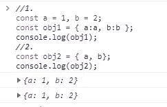

# 不要再用 JavaScript 做这些事情了

> 原文：<https://javascript.plainenglish.io/bad-coding-practices-in-javascript-and-solutions-326b42be1a61?source=collection_archive---------6----------------------->

## JavaScript 中的不良编码实践(及解决方案)


在这篇小文章中，我列出了我通常在代码评审中看到的一些事情。这些并不会使我们的程序失败，但是它们会使我们的程序更难阅读，更难维护，更容易出错。

开始吧！

# 条件式

## 使用 If

```
//1.
if( condirion === true){
   //A lot of code.
}//2.
if(condition){
   //A lot of code.
}//3.
const doSomething = () => (
  //A lot of code.
)if(condition){
   doSomething();
}//4.
if (condition) doSomething();
```

1.  这里，我们不必要地将条件与真实值进行比较，并在块代码中编写大量代码。
2.  对这段代码的第一个改进是删除了与 true 的比较，保留了它的等效项。
3.  然后我们可以把所有在 if 语句中运行的代码放到一个函数中。
4.  这里已经取决于你的个人喜好，但在这种情况下，我们只执行一个功能，我们可以避免括号。

## 使用三元

```
//1.
const value;
if( condition ){
 value = 1;
}else{
 value = 2;
}//2.
const value = condition ? 1 : 2;
```

1.  我们可以使用 if-else 语句或…
2.  改进代码并使用了三元运算符。结果是一样的。

## 使用 If-Else

```
//1.
if( condition1 ){
   doSomething();
}else(condition2 ) {
   doOtherthing();
} //2.
if( condition1){
   doSomething();
}
if( condition2){
  doOtherthing();
}
```

1.  这是另一个私人问题。我们可以使用 if-else 语句或…
2.  我们可以用 if 句子。我个人更喜欢这样的代码。

## 使用开关

```
//1.
if (*condition1*) {
  doSomething1();} else if (*condition2*) {
  doSomething2();
} else if (*condition3*) {
  doSomething3();
} else if (*condition4*) {
  doSomething4();
} else if (*condition5*) {
  doSomething5();
} else {
  doOtherthing();}//2.
switch(*expression*) {
  case *condition1*:
doSomething1();    break;
  case *condition2*:
doSomething2();    break;
  case *condition3*:
doSomething3();    break;
  case *condition4*:
doSomething3();    break;
  case *condition5*:
doSomething5();    break;
  default:
     doOtherthing();
}
```

1.  在这个例子中，我们有很多 if-else 语句。
2.  在这些情况下，建议使用“Switch”语句。生成的代码要干净得多，尽管它仍然相当冗长，而且相同的句子重复了几次(case…break)

```
//3.
const conditions= new Map()
    .set('*condition1*', '1'])
    .set('*condition2*', '2')
    .set('*condition2*', '3')
    .set('*condition2*', '4')     
    .set('*condition3*', '5');const condition = '*condition1*';function doSomething(condition) {
  return conditions.get(condition) || console.log('default);
}doSomething(‘condition1’);
```

3.使用(ES6) Map 可以获得相同的结果，但语法更清晰。

## 使用包含功能

```
//1
function inRGB(color) {
  if (color === 'red' || color ==='blue' || color ==='green') {
    console.log('The color is included in the RGB palette');
  }
}//2.
function inRGB(color) {
  const rgb = ['red', 'blue', 'green'];
  if (rgb.includes(color)) {
    console.log('The color is included in the RGB palette');
  }
}
```

1.  如果我们有更多的颜色会怎么样？我们要用更多的“||”来扩展这个语句吗？
2.  代码看起来更好，我们不再关心颜色的数量。

## 无效条件时提前返回

```
//1.
function inRGB(color) {
  const rgb = ['red', 'blue', 'green']; if (!color) throw new Error('No color!'); if (rgb.includes(color)) {
    console.log('The color is included in the RGB palette');
  }
}
```

1.  如果在发现无效条件时尽早返回，我们可以实现更少层次的嵌套语句。

## 使用默认函数参数

```
//1.
function logCar(car, quantity) {
 if( !! quantity ){
  quantity = 0;
 }
 console.log(`You have ${quantity} a ${car} car/s`);
}function logCar(car, quantity) {
  //2.
  quantity = quantity || 0; 
  console.log(`You have ${quantity} a ${car} car/s`);
}//3.
function logCar(car, quantity = 0) {
  if (!car) return;
  console.log(`You have ${quantity} a ${car} car/s`);
}logCar('Ford');
logCar('Mercedes', 2);
```

1.  第一种近似方法是不传递参数“quantity”，我们将值 0 赋给参数“quantity”
2.  在默认参数出现之前，有一种方法是使用“||”操作符，但是这种方法并不总是有效。根据传递的参数，它可能会产生意外的结果。
3.  使用默认函数参数。


Result in Chrome dev tools console

## 使用析构

```
//1.
function logCarModel(carObject) { 
  if (carObject && carObject.model)  {
    console.log (carObject.model);
  } else {
    console.log('unknown');
  }
}//2.
function logCarModel( {model} = {} ) {
  console.log (model|| 'unknown');
}logCar({ model: '250', color: 'black' });
logCar({});
```

1.  这里我们想在日志控制台中写入汽车模型，如果它可用的话。在其他情况下，我们将写入“未知”值。
2.  我们可以用默认函数参数(ES6)和析构(ES6)来避免条件性的“ca object & & ca object . model”检查。

# 函数和变量名称

## 功能名称

```
//1.
function biggerThanCero(money){
  return money > 0;
}

//2.
function isValidBalance(age){
  return money > 0;
}
```

1.  使用带有代码描述的名称，而不是功能。
2.  描述你的功能。

## 变量名

```
//1.
let a;
let b;//2.
let thisVariableIsForTheName;
```

1.  这些名称变量太短。什么是“a”或“b”？
2.  另一种情况，这个长名字是必不可少的吗？它不容易阅读。

## 类名

```
 class myclass{
  //...
}
class myClass{
  //...
}//1.
class MyClass{
  //...
}
```

1.  类名应该是大写的。

## 常量名称

```
const constantValue = 1;//1.
const CONSTANT_VALUE= 1;
```

1.  名称用大写字母表示，单词之间用下划线分隔。

*记住*常量有 const 声明，但不是所有的“const”都是不变的。

## 字段名称和局部变量名称

```
let carmodel;//1.
let carModel;
```

1.  字段名，不管是静态的还是其他的，都应该用大写字母书写。

## 私人名字

```
//1.
let _privateVariable = 0;
```

1.  在变量(方法等)名称前添加下划线“_”的约定表示私有变量。

# 简短符号

## 短路评估" || "

```
var someVariable;
var otherVariable = 'Hello!';
var finalValue;//1.
if ( someVariable == null || someVariable =='undefined' || someVariable== '') {
     finalValue = otherVariable;
}
console.log(finalValue); 
//Hello!//2.
finalValue= someVariable || otherVariable;
console.log(finalValue);
//Hello!//3.
someVariable = 0;
otherVariable = 'Hello!';
finalValue= someVariable || otherVariable;
console.log(finalValue);
//Hello!
```

1.  长符号:打印“你好！”
2.  简短符号:使用短路评估。打印“你好！”
3.  请记住，这并不总是很有效；如果您将变量“someVariable”设置为假或 0，则将分配“otherVariable”值。**打印“你好！”也是。**


Result in Chrome dev tools console.

## 短路评估" && "

```
const value1 =1;
const value2 =2;
const sumValues = (a,b) => a+b;//1.
if (value1 && value2) {
    const result = sumValues(value1, value2);
    console.log(result);
}//2.
const result = value1 && value2 && sumValues(value1,value2);
```

1.  长符号:如果 value1 和 value2 有值，则执行 sumValues 函数。
2.  简短注释:如果 value1 和 value2 有值，则执行 sumValues 函数。

## 声明变量速记

```
//1.
let a = 1;
let b = 2;
let c = 3; //2.
let a = 1, b = 2, c = 3;
```

1.  长符号
2.  短符号，都在同一个句子中，用逗号隔开。

## For 循环速记

```
const cars = ['Jeep', 'ford', 'Cadillac'];//1.
for (let i = 0; i < cars.length; i++){
  console.log(cars[i]);
} //2.
[cars].forEach(c => {console.log(c)});
```

1.  长符号
2.  简短符号


Result in Chrome dev tools console

## 对象属性速记

ES6 提供了一种更简单的方法来为对象分配属性。如果变量名与对象键相同，您可以利用简写符号。

```
//1.
const a = 1, b = 2;
const obj1 = { a:a, b:b };
console.log(obj1);//2.
const obj2 = { a, b};
console.log(obj2);
```

1.  长符号
2.  简短符号



Result in Chrome dev tools console

## 箭头功能速记

箭头函数表达式是传统函数表达式的一种简洁的替代形式，但是记住它们不能在所有情况下使用。

```
//1.
function sayHello(name) {
  console.log(‘Hello: ‘ +name);
}
console.log(sayHello("Amanda"));//2.
const sayHello2 = name => console.log(‘Hello: ‘ +name);
console.log(sayHello2("Amanda"));
```

1.  长符号
2.  简短符号


Result in Chrome dev tools console

## 解构赋值速记

```
//1.
const props = {
 p1 : 1,
 p2 : 2,
 p3 : 3
};const p1 = props.p1;
const p2 = props.p2;
const p3 = props.p3;
console.log(p1, p2, p3);//2.
const { p1, p2, p3 } = props;
console.log(p1, p2, p3);
```

1.  长符号
2.  简短符号


Result in Chrome dev tools console.

## 强制参数速记

```
//1.
function f1(param1) {
  if(param1 === undefined) {
    throw new Error('Missing parameter!');
  }
  return param1;
}//2.
mandatory = () => {
  throw new Error('Missing parameter!');
}

const f1 = (param1= mandatory()) => {
  return bar;
}
```

1.  长符号
2.  简谱。这样，生成的代码更加清晰。

## 指数幂速记

```
//1.
console.log(Math.pow(2,4));//2.
console.log(2**4);
```

1.  长符号
2.  简谱。这样，生成的代码更加清晰。


Result in Chrome dev tools console

# 评论

```
function isValidBalance(age){
  return money > 0;
}//1.
//check if the balace is greater than zero.
if(isValidBalance(account)) doSomething();//2.
//If the balance is positive we will doSomething.
//3.
if(isValidBalance(account)) doSomething();
```

1.  注释应该解释代码的目的，而不是阅读代码的内容。
2.  这里我们解释一下这个函数的用途。
3.  如果你定义了一个好的函数名，你就不需要注释；函数名本身表明做了什么。

# 全局

全局变量扰乱了全局名称空间，查找起来比局部变量慢。此外，拥有许多全局变量总是不好的，因为很容易忘记你在某个地方声明了一个变量，而不小心在其他地方重新声明了它，覆盖了原来的值。

在 Javascript 中，没有任何关键字(var，let，const)声明的变量将成为全局变量，并附加到全局对象上。

```
//1.
prefix= "Hello:";function hello(param) {
  //1\.   
  return prefix + param;
}

hello('Kesk');
//Hello: Kesk
```

1.  这里，我们用值“Hello”声明一个名为“prefix”的变量，没有任何(var，let，const)关键字。这样，它就变成了一个全局变量。

```
//1.
console.log(window.prefix) 
//Hello:
```

1.  如您所见，前缀变量是在全局窗口对象中定义的。

```
//2.
prefix = "Bye:";function hello(param) {
  //1\.   
  return prefix + param;
}

hello('Kesk');
```

1.  现在，在我们代码的另一部分，我们覆盖了“prefix”变量，如果他再次执行我们的 hello 函数而不是“Hello Kesk”，我们将获得“Bye Kesk”你看出问题了吗？


Result in Chrome dev tools console

# 结论

请记住，我们有责任编写干净、健壮的代码:易于阅读，将来易于维护。

我觉得写这个小指南很有趣，而且这是一个很好的方法来记住那些很多时候，因为各种原因，我们没有应用的好的实践。

感谢你阅读我！保重！

喜欢这篇文章吗？如果有，通过 [**订阅我们的 YouTube 频道**](https://www.youtube.com/channel/UCtipWUghju290NWcn8jhyAw?sub_confirmation=true) **获取更多类似内容！**