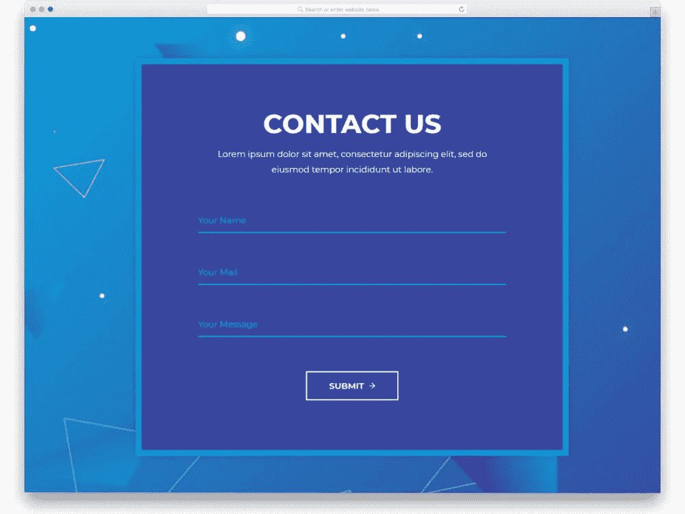

# 为什么设计糟糕的表单要花钱

> 原文：<https://javascript.plainenglish.io/bad-forms-cost-money-9b9429ac75a4?source=collection_archive---------9----------------------->

## “前端开发者需要尊重他们的影响”，Marina Mosti 说

## “我最近发现自己在一家航空公司遇到了这种情况，”玛丽娜·莫斯蒂告诉我。

“我就是不能让自己注册他们的里程计划……这些问题，有时作为开发者，我们并没有真正停下来考虑他们的影响。”

Marina Mosti 是 Vue 开发人员。她是社区中的重要人物，编写了大量广泛使用的 Vue 教程，包括在 [Dev.to](https://dev.to/marinamosti/hands-on-vuejs-for-beginners-part-1-2j2g) 上为初学者编写的 Vue.js 指南系列。最近，玛丽娜在表单上花了很多时间:她的第一本书 [***用 vue . js***](https://www.packtpub.com/business-other/building-forms-with-vue-js?utm_source=medium.com/javascript-in-plain-englishjavascript-in-plain-english&utm_medium=referral&utm_campaign=Outreach)*于 10 月底出版。对于前端开发来说，表单可能有点像一个基本话题，但 Marina 渴望鼓励开发人员花更多的时间来思考如何构建表单。*

# *表单对业务至关重要*

*她指出构建表单是前端开发中最关键的业务方面之一。“从公司层面来看，你在赔钱。她说:“你正在失去顾客。*

*这是有道理的:玛丽娜的糟糕形式的故事几乎任何人都可以认出来。这是如此普遍，以至于我们经常只是接受它，继续我们的生活。从开发人员的角度来看，以及从商业角度来看，这是不可接受的。“这是我们与用户沟通的方式，”玛丽娜解释道。“在这种情况下，用户要么会获得非常好的客户体验，要么会离开——他们只会去竞争。”*

# *使用 Vue.js 的内部建筑模板*

*正是因为这种低估 UX 表单价值的倾向，Marina 的书对今天的前端开发人员有如此的相关性。它不长:108 页，像一个精心构建的应用程序一样精简轻便。但这并不意味着它没有实用和集中的力量。*

*“这本书……将带你踏上一段旅程，帮助你理解如何用 Vue 构建表单”, Marina 说。所以，在一定程度上，它确实做到了它所说的。但这并不意味着它只是一本代码手册，就像你可能在网上找到的其他教程一样。*

*虽然，正如玛丽娜解释的那样，“你将非常简单地开始，设置好你的项目，理解如何创建可重用的组件”，但这本书随后继续探索更高级的主题，如**表单输入屏蔽**(玛丽娜说“表单的一个伟大的 UX 功能”，实现 Vuex 来管理全局状态的**，然后在本书的最后一章解释如何**构建模式驱动的表单**。***

*模式驱动的表单尤其重要，因为它们可以帮助开发人员管理大量的复杂性，而不会陷入无尽的代码行中。“作为一名开发人员，你甚至不需要进入你的前端代码来进行修改，”Marina 解释道。*

*“我见过很多现实生活中的例子…我见过人们做 API 驱动的表单，其中 API 向你抛出一个模式，前端只需要*知道*如何解析它并将表单交付给用户”Marina 说，同时还有“其他解决方案…其中他们使用 [Apollo](https://www.apollographql.com/) (一个用于管理数据的 GraphQL 工具包)，他们实际上以一种 vue 知道并理解他们将交付哪种表单的方式解析 Apollo 结构。”*

# *是什么让 Vue 成为一个伟大的 JavaScript 框架？*

*Marina 的书的另一个重要方面是，构建表单展示了使 Vue.js 成为一个伟大的 JavaScript 框架的一些东西。尽管它在下载量上仍然排在第二位，Marina——事实上，她的书——为使用 Vue 提供了一个非常清晰的案例。*

*最重要的优势是 Vue 的灵活性。“Vue 可以作为一个独立的库很好地工作，您只需将它用于应用程序中的一小部分或组件，或者它可以指数级增长到这个巨大的框架，其中有所有这些令人惊叹的工具，如 [Vue CLI](https://cli.vuejs.org/) 、 [Vuex](https://vuex.vuejs.org/) ，所有插入其中的库。”*

*更具体地说，表单构建是 Vue 的组件结构，它为开发可靠、时尚的表单提供了一个非常好的基础，这些表单支持典型的 UX。“这是 Vue 开始发光的地方。你可以为你的输入创建可重复使用的组件，”Marina 解释道。这意味着，“添加或删除字段对于开发人员来说是非常轻量级的。*

*在这方面，将 Vue 与较老的框架(如 Backbone 或 jQuery)进行比较，在这些框架中,“仅仅删除一个字段可能是一项相当大的任务，因为您必须挖掘如此多的文件，并且……弄清楚所有内容是如何连接的。”*

*然而，灵活性仍然至关重要。虽然能够以一种轻量级和更易于管理的方式构建表单是 Vue 的优势之一，但它也允许您根据需要使用 Marina 描述的“简单到大的方法”来扩展内容。*

# *把手弄脏，从经验中学习*

*如果你想开始学习 Vue，玛丽娜的书是一个很好的起点。但是玛丽娜强调，最重要的是你需要开始行动。知识积累很重要，但你需要从经验中学习:“(你)必须开始尝试构建一些东西。即使是非常简单的事情，也要动手去做，因为只有这样，你积累的所有知识才会开始对你有意义。”*

*玛丽娜正在和 Packt 的编辑理查德·高尔谈话。*

***在推特上关注玛丽娜:** [**@MarinaMosti**](https://twitter.com/MarinaMosti)*

***今天从 Packt 购买** [**带有 Vue.js**](https://www.packtpub.com/business-other/building-forms-with-vue-js?utm_source=medium.com/javascript-in-plain-englishjavascript-in-plain-english&utm_medium=referral&utm_campaign=Outreach) **的建筑形式。***