# JavaScript 中的 Base64 编码

> 原文：<https://javascript.plainenglish.io/base64-encoding-in-javascript-be4dda5f32f6?source=collection_archive---------2----------------------->

## 包括在 JavaScript 中使用 base64 上传图像

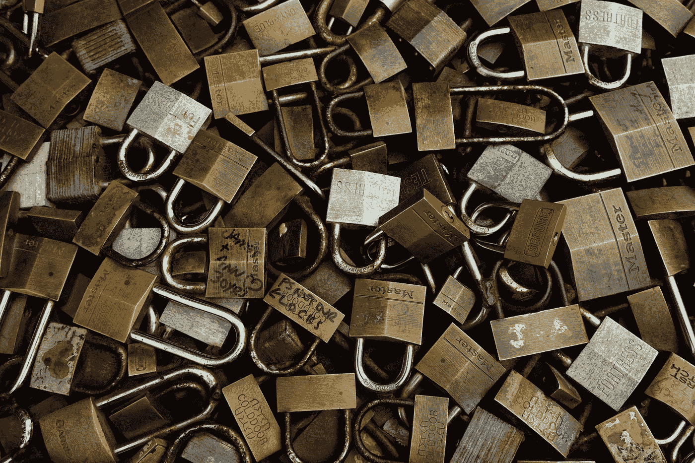

Photo by [Mackenzie Marco](https://unsplash.com/@kenziem?utm_source=medium&utm_medium=referral) on [Unsplash](https://unsplash.com?utm_source=medium&utm_medium=referral)

Base64 基本上是一种信息编码方式，通常用于通过基于文本的协议(如 HTTP)发送二进制数据。您还可以使用它来确保您的文本或信息在传输过程中不会损坏。例如，您可以使用 base64 作为编码类型来提交 HTML 表单。这不是隐藏信息或数据的方式。这意味着你应该把它作为一种安全措施来使用，因为在任何编程语言中，你都可以很容易地[把 base64](https://www.utilities-online.info/base64) 字符串转换回它的原始形式。

# 开始

下面是一个示例代码。

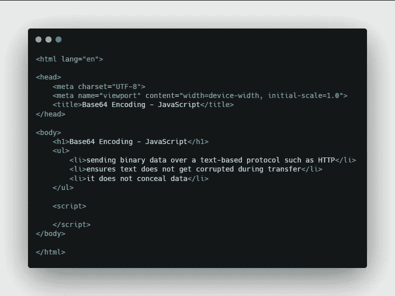

Sample Code

让我们首先在 JavaScript 中定义 base64 字符串。

```
<script>
   const str = "Hello world!";
   const base64 = btoa(str);
   const decode = atob(base64); console.log("Original: " + str);
   console.log("Base64: " + base64);
   console.log("Decoded: " + decode);
</script>
```

`btoa()`函数将内容编码为 base64。

`atob()`函数将 base64 字符串解码为其原始形式。

**结果**

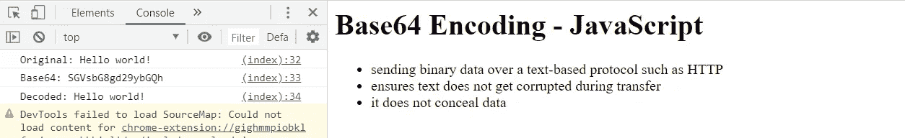

Result

这里我们有 3 个字符串——原始的、Base64 的和相应解码的。这是在 JavaScript 中编码和解码 base64 的基础。

让我们看看如何通过将 HTML 画布图像上传到服务器来实际使用 base64。

# 使用 Base64 上传图像

创建一个名为 **image** 的空白文件夹和一个名为**upload.php**的 php 文件。

**Upload.php**

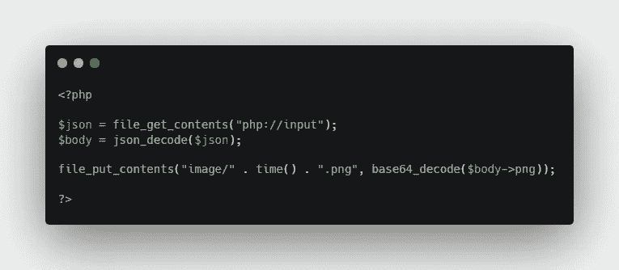

Upload.php

我们将把图像发送到这个文件中，这个文件将对 JSON 主体进行解码。然后，将图像保存在**图像**目录中，图像名称取自当前的 UNIX 时间戳点 png。

接下来，创建一个新的画布元素和上传按钮。

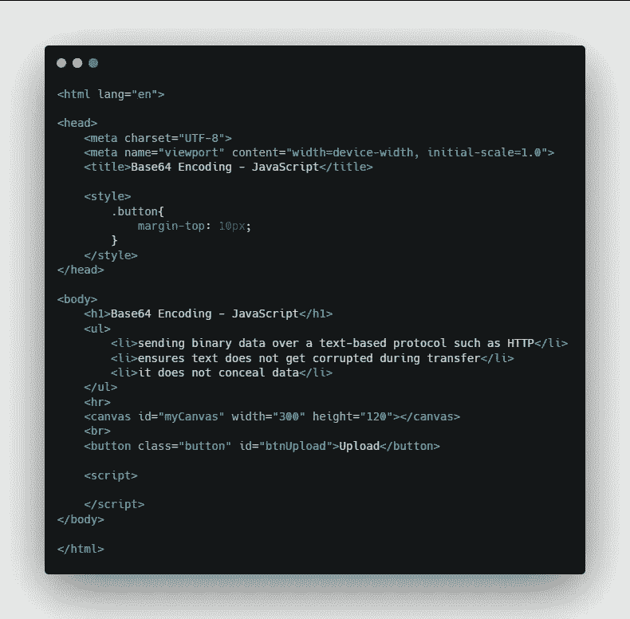

Create a canvas and button

现在让我们在这块画布上做一些基本的绘制来获得一些内容。

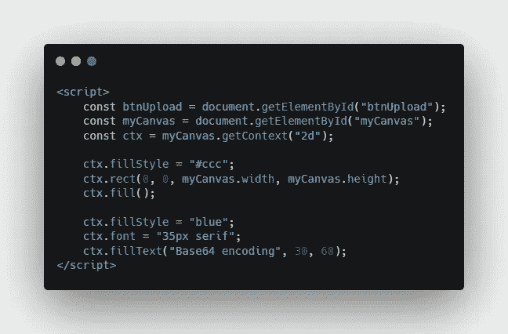

这里我们得到了画布和按钮的引用。然后我们得到画布 2d 渲染上下文。这是我们可以在实际画布上绘画的一种方式。

我们首先将画布的背景设置为浅灰色，然后设置画布的宽度和高度。为了让它更有趣，我们在上面放了一段文字。

**结果**

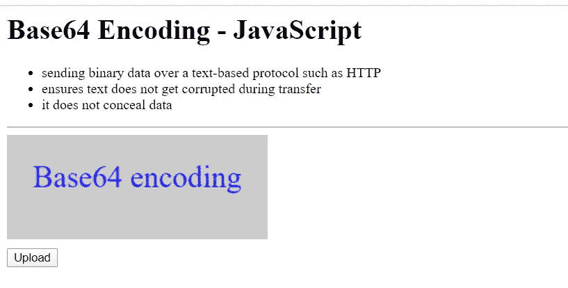

# **定义上传流程功能**

让我们创建一个名为 **uploadCanvasImage** 的函数。

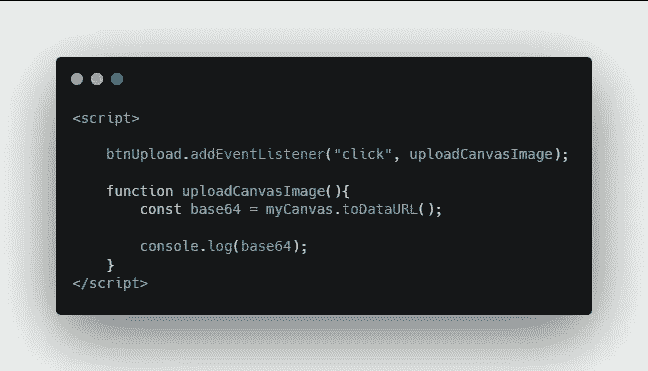

点击上传按钮时将触发该功能。首先，我们将通过使用**toda aul**方法获得实际画布的 base64 字符串。

**结果**

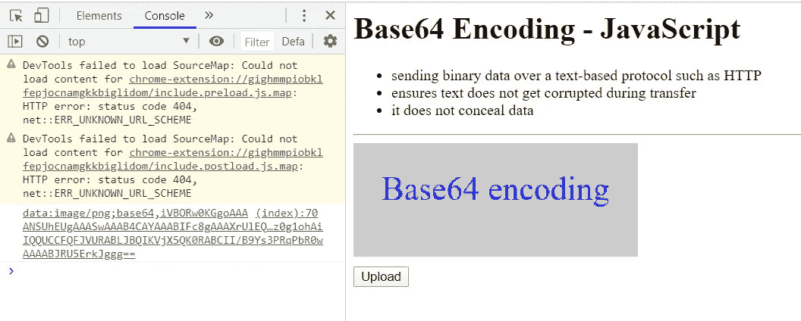

我们将得到如上的数据。逗号之后是画布的 base64 表示。所以我们需要在逗号上分割字符串，我们只能取索引 1 里面的数据。

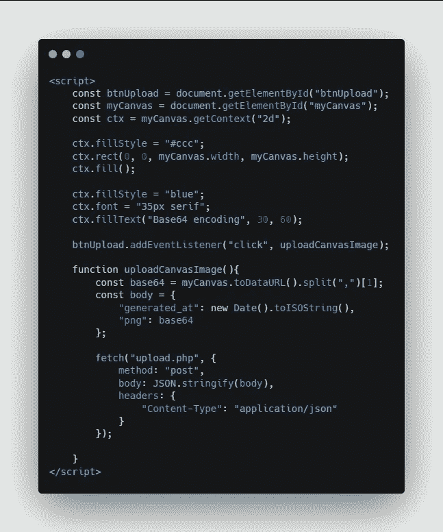

然后，我们创建一个名为 **body** 的常量，它将作为 JSON 发送出去。之后，我们向 upload.php 文件发出请求。

# 决赛成绩

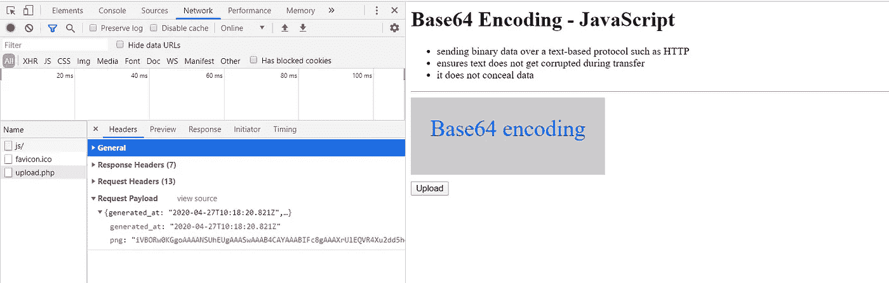

我们可以在 network 选项卡中看到，我们已经成功地将所有 base64 字符串发送到服务器。


在**图像**文件夹中，我们有一个画布的标准 PNG 文件。

*更多内容看* [***说白了。报名参加我们的***](http://plainenglish.io/) **[***免费周报***](http://newsletter.plainenglish.io/) *。在我们的* [***社区获得独家访问写作机会和建议***](https://discord.gg/GtDtUAvyhW) *。***

 [## Base64 在线编码/解码

### base64 转换器有助于用户快速轻松地编码或解码 base64 数据。转换器提供独特的…

www.utilities-online.info](https://www.utilities-online.info/base64)