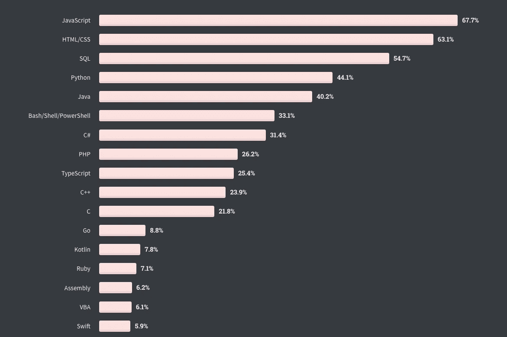
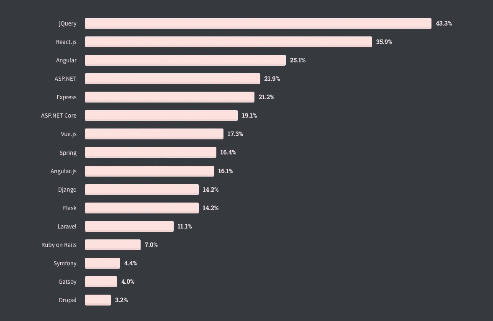
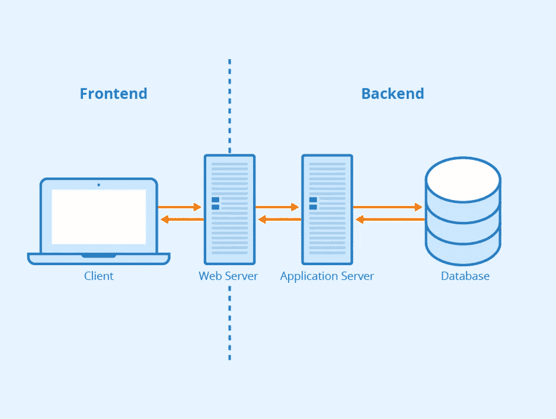
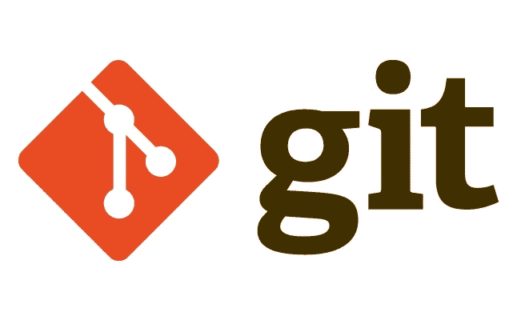
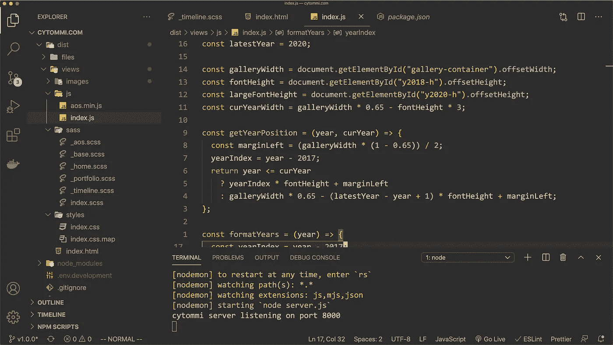
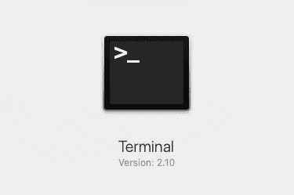

# Web 开发入门的基本概念和工具

> 原文：<https://javascript.plainenglish.io/basic-concepts-and-tools-to-get-started-a-guide-to-web-development-e34632ef269e?source=collection_archive---------10----------------------->

## 对我刚开始编码时困惑我的事情的一个快速总结

Planning is the first step of a journey

# 动机

一开始，接触 Web 开发这个宽泛的主题可能会令人沮丧。在谷歌上搜索“ *Web 开发教程”*只会得到大约 4.76 亿个结果。过多的选项以及看似无穷无尽的技术术语列表经常让初学者感到沮丧，处于瘫痪状态。

“So much to see so much to do” — Smash Mouth

回想我的编码之旅的开始阶段，我经常在随机的主题之间跳跃*教程，以一种全面的方式消化信息是极具挑战性的。通过这篇文章，我的目标是向您介绍一些基本的主题，我希望有人在我刚开始学习 web 开发时向我解释过这些主题。*

# 需要了解的基本概念

## 1.编程语言

计算机编程是为计算机执行特定任务创建指令的过程。类似于我们如何使用口头语言相互传达我们的想法，我们使用*编程语言向计算机传达指令。*

近年来，一些最流行的编程语言包括 JavaScript、Python、Java、C#、C++和 Go。

Most popular programming languages as of February 2020 (source: Stack Overflow Developer Survey)

> 由于每种语言都有自己独特的风格、目的，甚至哲学，关于“哪种语言最好”的争论是一个要避免的无意义的兔子洞。

然而，JavaScript 通常被认为是事实上的网络编程语言。如果你对学习 web 开发感兴趣，JavaScript 绝对是你应该考虑学习的语言。

你可以点击查看 2020 堆栈溢出开发者调查[。](https://insights.stackoverflow.com/survey/2020)

## 2.编程框架

*另一方面，*框架是建立在编程语言之上的功能抽象层，用于方便程序员的开发。框架通常是领域特定的，旨在允许程序员在解决类似问题时重用代码。例如， [React](https://reactjs.org/) 和 [Express](https://expressjs.com/) 分别是用于前端和后端开发的流行 JavaScript 框架。

Most popular web frameworks as of February 2020 (source: Stack Overflow Developer Survey)

> 尽管框架很有帮助，并且显著减少了开发时间，但是它们经常为了方便而牺牲灵活性。

## 3)前端、后端和全堆栈

*关注点分离* (SoC)是一个软件设计原则，它规定软件应该被分成不同的部分来处理不同的关注点。在 web 开发中，通常遵循这样的原则，将应用程序分成前端*和后端*。

*前端*指的是应用程序面向用户的部分。无论是移动的还是基于网络的——用户与之交互的任何东西都被归类为*前端。*

另一方面，*后端，*在幕后处理所有的业务逻辑，并处理客户端发出的请求。后端通常由服务器和数据库组成。数据库是服务器存储和检索数据的位置。

*全栈开发，*最后，既指前端开发，也指后端开发。

回到我们在[上一篇文章](https://medium.com/javascript-in-plain-english/a-guide-to-web-development-how-the-web-works-81065ec4eef9)中讨论的客户机/服务器模型，前端/后端关系通常反映了客户机/服务器模型的关系。

Clean architecture separates applications into independent components

# 基本工具

## 版本控制系统(VCS)

*版本控制*是一类软件工具，用于管理代码库随时间的变化。 [*Git*](https://git-scm.com/) *，*你可能已经听说过，是迄今为止最流行的版本控制系统。

Git is the most popular VCS today

版本控制系统在很多方面都非常有用(这是我能想到的):

1.  它使您能够将代码库恢复到给定时间的特定状态。(不需要 ctrl-z- ing)。
2.  它组织团队工作流并促进冲突管理(当团队成员以不同方式编辑同一文件时)
3.  它将功能开发模块化

当你开始编程时，你将很快开始意识到它在你的工作流程中的重要作用。

## 文本编辑器或 ide

文本编辑器顾名思义就是文本编辑器。与大多数非开发人员认为需要某种类型的“特殊软件”来编写代码不同，从技术上讲，你现在就可以使用像 Google Docs 或 Microsoft Word 这样的软件来编写代码。这将是一个痛苦的经历，但你可以。有专门为编码而构建的文本编辑器。流行的选项有 Sublime Text、Atom、Vim 等。我个人喜欢 [VS 代码](https://code.visualstudio.com/)的可定制性。

My VS Code setup looks beautiful (in my opinion)

同时*，ide*，或者*集成开发环境*，就像是文本编辑器的更大的增强版本。除了代码编辑功能，它们还包括内置的构建自动化工具、调试器和其他您可能需要或不需要的附加组件。

文本编辑器和 ide 之间的选择是个人偏好的问题。ide 倾向于特定于语言或框架，而文本编辑器倾向于更加轻量级和可定制的。

## 命令行

当您点击 *Finder* (或 *My Computer* (对于 Windows 用户)并浏览文件夹时，您正在通过所谓的图形用户界面(GUI)与计算机交互。您可以使用基于文本的*命令行工具*(如苹果操作系统的终端或视窗的命令提示符)直接向计算机发送命令，而不是使用鼠标并点击屏幕与计算机交互。

Terminal in macOS

学习如何通过命令行与计算机交互是一项必不可少的技能，它将极大地提高任何程序员的效率。

# 计划

对于初学者来说，要学习的主题不胜枚举。然而，有了一个清晰的计划，你就可以管理你的学习进度，专注于能让你达到目标的要素。

**步骤 1。学习 JavaScript —** 如前所述，JavaScript 被认为是事实上的网络编程语言。在我看来，对于初学者来说，JavaScript 是一种很好的学习语言，因为它不仅教会了你编程的基础，还让你接触到了*面向对象编程*和*函数式编程中的概念。*

> 在真正理解构建框架的语言之前，不要太快进入框架。对底层语法有一个整体的理解将你从成为一个绑在一个特定框架上的独角戏中解放出来。考虑到如今框架的发展速度，这一点尤为重要。

**第 2 步。了解 HTML 和 CSS —** HTML 和 CSS 是 Web 上任何网页的视觉构造块。与 JavaScript 不同，HTML 和 CSS 没有逻辑处理功能，因此不被视为实际的编程语言。HTML 和 CSS 对我来说是非常有益的学习，因为即时的视觉反馈让我觉得我正在构建一个真正的产品。

**第 3 步。使用普通的 JS、HTML 和 CSS 构建一个简单的网页—** 现在您已经有了开始构建东西的工具了！仅用 JavaScript、HTML 和 CSS，你就可以构建一些非常棒的网页甚至应用程序。不可避免地，自然地，随着项目的继续发展，您将不得不开始使用命令行和 Git(或任何 VCS)。这一步将是旅程中最困难，也是最有收获的一步。好好享受吧。

**第 4 步。学习一些框架，然后使用这些框架重建/扩展您的网页—** 随着基础知识的深入，是时候学习框架并将其应用到您的项目中了。虽然看起来是多余的，但这一步可以让你发现框架给你的开发和思考过程带来的不同。

**第五步。冲洗，重复—** 不断构建新项目，学习新的 web 技术，优化您的编码环境……无论是什么，作为开发人员，永远不要停止改进您的技能！