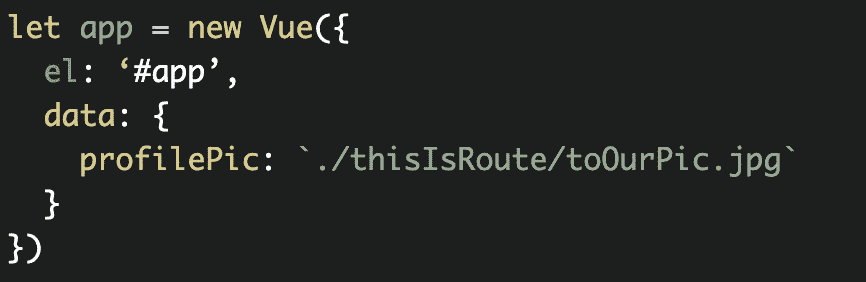

# Vue.js 中指令的基础

> 原文：<https://javascript.plainenglish.io/basics-of-directives-in-vue-js-783e1aac9bcb?source=collection_archive---------8----------------------->

在 Vue 中，您可以将命令附加到 DOM 元素，称为指令。有时它们与 v-bind 等属性相关联。因为这些通常指的是我们的数据，如果你不知道那是什么，请随意阅读我的文章[开始介绍 Vue.js](https://medium.com/@eselbeus/beginner-intro-to-vue-js-72b8a1053736) 。

**v-bind**

为了将数据链接到属性，可以使用 v-bind。这将数据链接到元素。假设我们有一张个人资料照片:

``

profilePic 指的是我们的数据:

**v-if 和 v-else**

为了有条件地呈现 DOM 元素，可以使用 v-if。

`
Hello World
`

如果在我们的数据中，somethingTrue 为真，那么就会呈现 div。现在，如果真值为假，什么都不会被渲染，但是当真值为假时，我们也可以用 v-else 来渲染。

`
Hello World
`

`
Hello Moon
`

如果要处理两个以上的情况，也可以用 v-else-if。