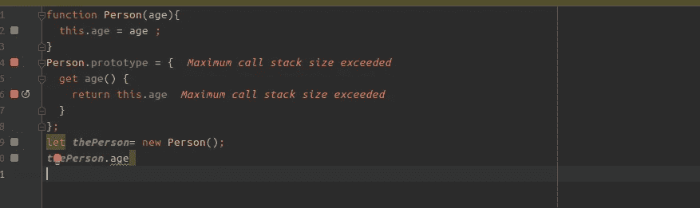

# 小心 JavaScript 的 getters 和 setters

> 原文：<https://javascript.plainenglish.io/be-careful-with-javascript-getters-and-setters-32752bb2d496?source=collection_archive---------2----------------------->

## 简短有用的 JavaScript 课程。让它变得简单



对象的默认“Get”和“Put”操作分别控制如何将值设置为新属性或现有属性，或者如何从现有属性中检索值。但是如果你不小心的话，就很容易犯一些不被注意到的错误。

示例:

## 案例 1:

get 方法总是返回相同的值给我们。无论我们赋予“a”什么值，在这种情况下，foo.a 总是返回 1。

```
var foo ={
    get a() {**return 1**}
}*//Another way (deprecated)
//__defineGetter__ and this.__defineSetter__ are deprecated!
//var foo = {}
//foo.__defineGetter__('a', () => 1);*foo.a=5;
foo.b=2const sum = (a, b) => a +b;console.log(sum(foo.a, foo.b));// 5+2 = **3!!**
```

## 案例二:

在这里，您触发了递归调用的无限堆栈，导致浏览器崩溃。

在案例 2.1 中

因为您引用了 person.age 属性，所以 JavaScript 需要获取该属性。当这种情况发生时，getter 被触发。JavaScript 调用 getter，但 getter 随后被告知做完全相同的事情:获取它要处理的属性。该函数总是调用自身，从而创建无限的递归调用。

在 2.2 的情况下，同样的想法也适用于 setter。

```
**//case2.1**
function Person(age){
 this.age = age ;
}Person.prototype = {
    get age() {
        return this.age //***Maximum call stack size exceeded!!***
    }
};var thePerson= new Person();//This generates the error.
thePerson.age**//case 2.2**
function Person(age){
 this.age = age ;
}Person.prototype = {
    get age() {
        return this.age;
    },
    set age(age) {
        this.age = age; //***Maximum call stack size exceeded!!***
    }
};//This generates the error.
var thePerson= new Person(40);
```

## 案例 3

在这个例子中，相反，我们实际上是把赋值的指定值 5([[Put]]操作)i **存储到另一个变量 _a_** 中。_a_ name 在这个例子中完全是约定俗成的，并不意味着它的行为有什么特别之处——它和其他任何属性一样，都是一个普通的属性。**通过这样做，我们避免了使用 gets 和 sets** 时的递归调用。

```
var myObject = {
    // define a getter for 'a'
    get a() {
        return this._a_;
    },
    // define a setter for 'a'
    set a(val) {
        this._a_ = val;
    }
};myObject.a = 5; //**OK!!**console.log(myObject.a); //5 **OK!!**
```

我希望这篇小文章能够帮助您理解 getters 和 setters 可能给代码带来的危险。

## 如果这对你有帮助，请点击下面的拍手按钮。非常感谢！