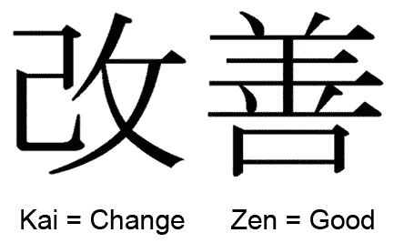

# 使用 Kaizen 成为开发人员

> 原文：<https://javascript.plainenglish.io/becoming-a-developer-using-kaizen-d1c2c89ce250?source=collection_archive---------6----------------------->

## 通过持续改进实现你的目标

无论你是一名经验丰富的开发人员，试图跟上潮流，还是刚刚开始你的编码之旅，最初为商业设计的[改善](https://en.wikipedia.org/wiki/Kaizen)的想法可以提供一个框架——个人和职业发展的思维定势。

## 目标

从一个目标开始。把它作为一个大目标，为什么不呢？如果需要，把它分成更小的目标。但是然后开始努力。

## 改善

改善的理念是，不要试图快速达到目标，你应该从小的、每日的(或增量的)改进开始。

每天的改善量常说是 1%。

> 每天进步 1%。

小规模的改进开始在前一天的成就上复合。

等等！1%?什么的 1%？*对不起，我不能回答你这个问题*。那是主观的。我不建议你关注 1%的数量。我的建议是，在一天结束时(或分配时间结束时)，问问你自己，

> 我今天知道的比昨天多吗？

> 如果你花了一整天的时间试着调试一些代码却没有弄明白，你学到了什么？大概有 100 种解决问题的方法。这就是进步。

## 思维定势

人类是情感动物。我们可能会气馁，不知所措，以及各种各样的情绪。用改善来重新聚焦。"我今天获得或学到了昨天不知道的东西."

也不要陷入“今天”和“昨天”的概念中。如果你一周只能做两次，那就和你上次做的做比较。

如果你忘记了，不得不重新学习一些东西，会发生什么？那么你正在学习那将会发生(我敢打赌你没有全部忘记。)

新闻快讯！你总是会忘记事情。所以不要有这种想法。

## 虚构的例子

让我们给自己举个例子。虚拟的人和虚拟的时间表。

> **Bob 决定成为一名** [**全栈开发人员**](https://www.w3schools.com/whatis/whatis_fullstack.asp) **，因为他看到雇主在寻找这样的人。**

鲍勃决定每天花三个小时。他有一个目标，也有实现目标的时间。

**第一天** Bob 花了很多时间阅读不同的例子，了解全栈开发人员意味着什么。现在他知道的比昨天多。这是一个好日子。

**第二天**鲍勃了解到有不同类型的[筹码](https://www.quora.com/What-does-stack-mean-within-programming) : [MERN](https://www.quora.com/What-is-MERN-stack-development) ，[的意思是](https://en.wikipedia.org/wiki/MEAN_(software_bundle))和一堆其他的筹码。他学会了字母的意思。他知道的比昨天多。这是一个好日子。

> 哦哦，情感，要学的东西太多了。恐慌。

鲍勃停下来，重新聚焦。"看看我今天比两天前知道的多了多少。"

第三天鲍勃意识到在这些堆栈的背后是一种叫做 JavaScript 的编程语言。但是很混乱。浏览器中有 JavaScript 和一个叫做[节点](https://medium.com/javascript-in-plain-english/node-is-not-javascript-e36228aaa407)的东西。Node 是 JavaScript 吗？Bob 研究并认识到没有。有 JavaScrip，它可以运行在前端，在浏览器中，或在服务器端的运行时环境中，称为节点。哇，鲍勃今天学到了很多东西。这是一个好日子。

**第四天**鲍勃真的开始谷歌搜索，看到 Youtube 视频、在线课程、各种资源。他加入了脸书组织，开了一个推特账户。他很兴奋地得知外面有这么多东西。鲍勃今天知道的比昨天多。这是一个好日子。

*快进*

鲍勃正在学习，其他刚开始学习的人开始向他提问。有时候他知道答案，有时候不知道。有人问，“什么是[回调函数](https://developer.mozilla.org/en-US/docs/Glossary/Callback_function)”他意识到自己一直在使用它们，但并不真正知道它们是什么。他研究了这个问题，了解了更多。哇！这是一个好日子。

> 知识的复利

## 知识

这个例子的重要之处在于 Bob 朝着他的目标获得了知识。一次一点，不要担心在一天之内学会并理解它。他专注于对自己不断学习感到满意。不仅如此，他的学习能力越来越强。

有了知识，Bob 现在可以自信地做出决策。

# 结论

你决定速度。但是不管怎样，每天结束的时候，问问你自己，“我今天知道的比昨天多吗？”如果是这样，今天是个好日子。

感谢您的阅读，祝您旅途愉快。