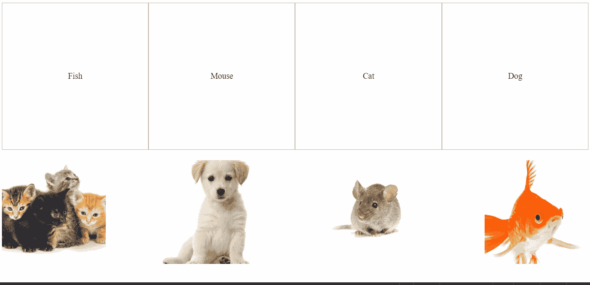

# 初学用 HTML，SCSS 和 JS 的拖放游戏

> 原文：<https://javascript.plainenglish.io/beginner-drag-and-drop-game-with-html-css-and-js-58653f974285?source=collection_archive---------1----------------------->

## 使用 HTML5 DnD API 构建一个简单的游戏



这个简短的教程将教你如何使用 HTML5 API 构建一个简单的拖放游戏。[密码笔在这里](https://codepen.io/andreeamaco/pen/qBbLdjY)。

DnD 行为是 HTML5 固有的，所以您可以使用 API，而不是试图用 jQuery 之类的工具来寻找变通方法。

让我们从大图开始:在任何拖放应用程序中，你都会有可拖动的元素，就像上面的图片，以及拖放区。在这个游戏中，我们有两种类型的拖放区:

*   顶部的盒子里有动物的名字
*   底部的容器，动物图像在开始的地方

只要在 HTML 代码中添加一个属性，页面的任何元素都可以拖动，如下所示:

```

```

注意，猫图片有一个名为`draggable`的属性，它被设置为`true`。

现在，为了在开始拖动元素时启用一个行为，我们需要在可拖动节点上添加一个事件侦听器。

DnD API 允许以下事件:

*   `ondragstart` -当您开始拖动元素时，该事件触发
*   `ondragend` -拖动动作完成时触发此事件
*   `ondragenter` -当可拖动元素被移动到放置区域时，该事件被触发
*   `ondragover` -当你拖动一个元素到拖放区域时，这个事件被触发
*   `ondragleave` -这与`ondragenter`相反，当可拖动元素被拖出拖放区域时触发
*   `ondrop` -当您将元素放入放置区域时，此事件触发

前两个应用于可拖动元素，后四个与拖放区有关。

所以这是你在创作这个游戏时需要思考的问题。首先，您需要使元素可拖动。我已经在上面展示了如何做到这一点。

下一步是将所需的事件侦听器附加到 draggable 元素。在我们的例子中，我们希望在开始拖动图像时发生一些事情，所以我们将添加以下内容:

```
// on the image, we add ondragstart="drag(event)"// in our JS file, we define the drag() functionfunction drag(event) {
   event.dataTransfer.setData("text", event.target.id);
}
```

当您开始拖动图像时，会调用`drag(event)`函数。在这个函数中，`dataTransfer`属性保存事件的数据，并带有管理被拖动数据的特定方法。

上面使用的方法`setData()`用于向拖动的数据添加一个项目。您可以使用不同类型的数据，被拖动数据的值由`event.target.id`定义。

现在我们已经完成了 draggable 元素，所以我们可以继续到拖放区。首先，我们希望这些区域接受孩子，当我们掉东西的时候。所以我们需要指出应该发生的事情:

*   当我们将一个元素拖动到拖放区的顶部时
*   当我们将元素放入放置区域时

为了定义拖放区，我们使用了`ondragover`事件。

```
<div id="animals" ondrop="drop(event)" ondragover="allowDrop(event)">
```

这两个 JS 函数如下所示:

```
function allowDrop(event) {
  event.preventDefault();
}function drop(event) {
  event.preventDefault();
  var data = event.dataTransfer.getData("text");
  event.target.appendChild(document.getElementById(data));
}
```

我们使用`event.preventDefault()`来取消这些 div 的默认行为。我们这样做是因为默认情况下一个元素不能被放到另一个元素中，但是我们希望它可以。

因此，为了表明一个区域可以接受可拖动的元素，我们使用了`allowDrop()`函数。然后，为了指示当我们放下图片时应该发生什么，我们使用了`drop()`函数。

就像以前一样，我们正在防止默认行为，并提到可以放入拖放区的数据类型。然后，我们将图像添加到拖放区域，一旦拖放。

下面是最终的代码:

```
// HTML<div id="dropZone">
  <div
    id="dropBox1"
    ondrop="drop(event)"
    ondragover="allowDrop(event)"
  >
    <p>Fish</p>
  </div>
  <div
    id="dropBox2"
    ondrop="drop(event)"
    ondragover="allowDrop(event)"
  >
    <p>Mouse</p>
  </div>
  <div
    id="dropBox3"
    ondrop="drop(event)"
    ondragover="allowDrop(event)"
  >
    <p>Cat</p>
  </div>
  <div
    id="dropBox4"
    ondrop="drop(event)"
    ondragover="allowDrop(event)"
  >
    <p>Dog</p>
  </div>
</div><div
  id="animals"
  ondrop="drop(event)"
  ondragover="allowDrop(event)"
>
  
</div>
```

然后，款式:

```
// SCSS#dropZone,
#animals {
  display: flex;
  flex-flow: row nowrap;
  justify-content: space-between;
  min-height: 200px;
  margin-bottom: 20px;
}#dropBox1,
#dropBox2,
#dropBox3,
#dropBox4 {
  display: flex;
  flex-flow: column nowrap;
  justify-content: center;
  align-items: center;
  height: 250px;
  width: 250px;
  border: 1px solid #aaaaaa;
  padding: 1rem;
}img {
  height: 200px;
  object-fit: cover;
  width: 200px;
}
```

最后，JavaScript 代码:

```
// JSfunction allowDrop(event) {
  event.preventDefault();
}function drag(event) {
  event.dataTransfer.setData("text", event.target.id);
}function drop(event) {
  event.preventDefault();
  var data = event.dataTransfer.getData("text");
  event.target.appendChild(document.getElementById(data));
}
```

在这里你可以找到代码。我希望你喜欢它！