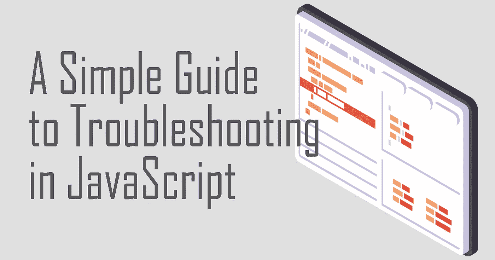
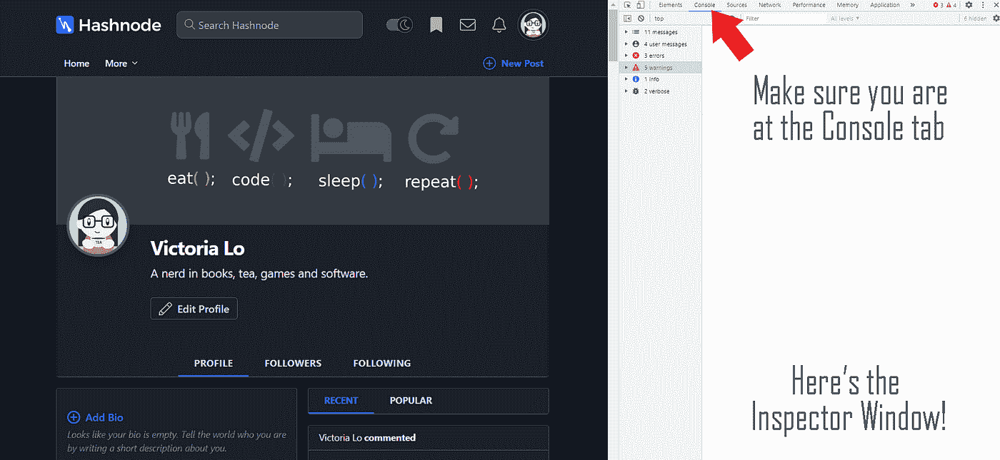
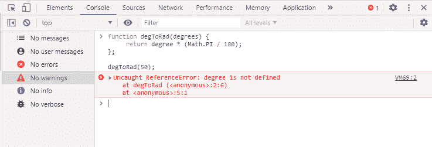
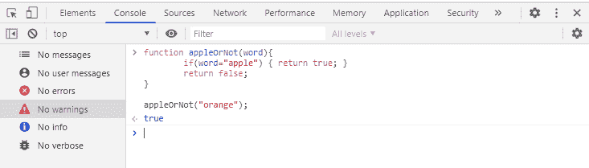
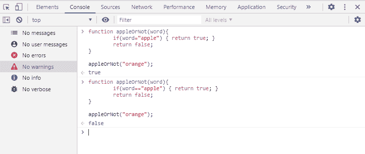

# JavaScript 故障排除初学者指南

> 原文：<https://javascript.plainenglish.io/beginners-guide-to-troubleshooting-in-javascript-9603eaac2ff4?source=collection_archive---------8----------------------->



# 错误类型

如果您是 JavaScript 新手，您可能会遇到两种最常见的错误:

1.  语法错误
2.  逻辑错误

> ***语法错误*** *基本上都是你代码中的拼写错误。JavaScript 是区分大小写的！因此，大小写上的小错误会导致代码无法运行，从而导致错误。*

另一方面…

> ***逻辑错误*** *比语法错误更难发现。简而言之，就是程序运行了，但结果却不是你，开发者，想要的那样。*

让我们继续看一些例子和提示，看看在出现这些错误的情况下，如何对代码进行故障诊断。

# 示例:语法错误

假设您正在编写一个函数，将角度转换为弧度。将角度转换为弧度的公式为:

> *度* (Pi/180)，其中 Pi 约为 3.1416*

因此，您将按如下方式编写函数:

```
function degToRad(degrees) {
     return degree * (Math.PI / 180);
};
```

德格托拉德(50)；现在让我们在浏览器中测试一下。打开一个新标签，按 F12(或 Ctrl+Shift+I)打开检查器窗口。以下是您应该看到的内容:



Your screen with the Inspector Window on the side or bottom

> ***注意:*** *检查器窗口对于开发者来说是一个很有用的调试工具。我鼓励您探索并熟悉它，以便在 web 上调试未来的项目。我建议你从阅读这里开始。*

只需复制上面的函数并将其粘贴到控制台上即可运行。而且…您应该会看到一个错误！



好吧，我们来看看为什么控制台上说‘度’没有定义……啊哈！参数的名称是“degrees ”,但我们要求函数返回“degree ”!难怪它没有被定义，并给我们错误。

让我们将“degree”改为“degrees ”,函数应该可以工作。


耶！它工作了。所以，50 度相当于 0.8726646259971648 弧度。很高兴知道。

# 语法错误的类型

控制台可以通过多种方式告诉您有语法错误。虽然他们不会明确地告诉你“嘿看！你拼错什么了！”但是就像上面的例子一样，他们会告诉你这是一个引用错误或类型错误，或者某个东西未定义或为空。

通常，这意味着这是一个语法错误，你必须逐行阅读你的代码来找到它。

> ***结论:*** *语法错误一般表述为 ReferenceError、TypeError 或 NullError。如果您遇到这些错误，请逐行阅读您的代码并确保它没有错误。*

# 示例:逻辑错误

对于这个例子，假设你想要一个函数，它接收一个单词并判断这个单词是否是“apple”。它看起来是这样的:

```
function appleOrNot(word){ 
        if(word="apple") { return true; }
        return false;
}appleOrNot("orange");
```

让我们在检查器窗口上测试一下。



嗯，没有错误，但有一些奇怪的事情。我们的单词是“orange ”,所以函数应该返回“false ”,而不是“true”……这是为什么呢？

这是逻辑错误的典型例子。在控制台中没有像语法错误这样的错误，但是很明显，您知道函数是不正确的。对于这个例子，如果您正确地检查了代码，您会发现 if 语句`if(word = "apple") { return true; }`将总是返回 true，因为有一个“=”符号。你必须写' == '来检查等式，所以修正它，函数现在应该可以正确运行了！



万岁！这个功能也是固定的！

# 逻辑错误的类型

与明确指出有错误的语法错误不同，逻辑错误对控制台来说是不可见的，因此它看起来像是代码工作了，但如果它没有按照您预期的方式出现，那就是逻辑错误。因此，可能很难发现逻辑错误。慢慢来，一行一行地分解代码，以理解代码可能如何处理并遵循其逻辑。一旦你在代码的逻辑中发现一些奇怪的东西，那么你可能已经发现了那个错误。耐心点，继续努力！

# 结论

通过本指南，我希望您现在能够了解如何使用检查器窗口在浏览器中调试代码，了解两种最常见的错误类型，并知道一些关于如何检测它们的提示。故障排除技能需要时间和经验，所以如果你现在不能很好地修复错误，不要放弃。你练习得越多，你就会越好。

我希望您发现这很有用！如果你对这个话题有任何疑问，欢迎在下面评论，这样我们可以帮助你。干杯！

## **一封用简单英语写的信**

你知道我们有四份出版物和一个 YouTube 频道吗？你可以在我们的主页 [**plainenglish.io**](https://plainenglish.io/) 找到所有这些内容——关注我们的出版物并 [**订阅我们的 YouTube 频道**](https://www.youtube.com/channel/UCtipWUghju290NWcn8jhyAw) **来表达你的爱吧！**