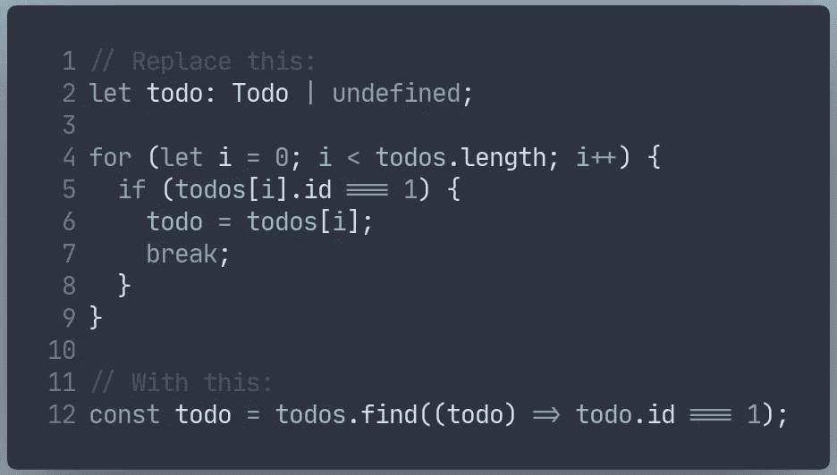

# JavaScript 中使用集合的初学者指南

> 原文：<https://javascript.plainenglish.io/beginners-guide-to-working-with-collections-in-javascript-b2065268e373?source=collection_archive---------10----------------------->

## 编程技巧

## 看看集合的内置功能

每当你学习一门新的编程语言时，不管你是第一次还是第二十次，我的信念是理解这种特定的语言如何实现集合是最好的起点。

> "如果你想学习一门新的编程语言，从集合开始，然后从那里开始学习."拉斯·莫滕森

因为在大多数语言中，使用集合能让你走得更远。因为不管你要做的事情有多少，你总是要和集合一起工作，并对它们进行计算或转换。

在本文中，我将向您展示一些非常有用的操作，您可以对集合进行这些操作，这会让您的生活更加轻松。

## 过滤器

第一个改进的机会通常是**循环**与 **if** 的结合。这很简单，也是作为学生你首先想到的事情之一。

imperative version of filtering completed todos

看看这个片段，你会发现很多事情同时发生。

你在开头(L13)声明了一个数组，你将把你的结果推送到那里，然后你有了 for 循环本身，它对任何非程序员来说看起来都是神秘的，当你刚开始编码时很难记住。

在我职业生涯的开始，C++风格的循环是我自己最难记住的风格之一。一旦你了解到许多语言支持一个对开发者更友好的版本，你就开始利用它。

这肯定有助于消除眼睛的压力，并有助于集中精力进行实际操作。

以命令式风格编写代码(你描述了如何做)对人类来说通常更难理解，因为我们需要在大脑中“运行”代码来理解它。我更喜欢你描述**做什么**的声明方式，因为这更接近开发者的心智模型。

你可以在这里阅读更多关于命令式和声明式编程的内容。

让我们来看看声明式方法:

declarative example of filtering todos

比较这两个片段，花一点时间理解它们的区别，欣赏它们的可读性。我们用一行代码替换了 7 行代码，使其可读性更好。

现在上面写着:

> 把完成的待办事项给我，我不管你怎么做，只管去做。

与命令式解决方案相比，我们会说:

> 声明一个数组来保存结果，使用这个计数器遍历这个数组，每次迭代递增 1，如果 todo 完成，则将其推送到该数组。

## 地图

一个经常需要的操作是当你需要从一个对象数组中转换或提取一组属性时。让我们继续上面的 todo 示例，看看如何将列表转换成 React 组件。

在上面的例子中，这是 React 开发人员最常看到的事情之一，因为需要呈现任何类型的列表是一项非常频繁的任务，这里的`map`函数是完美的匹配，因为它将处理将对象列表转换为 React 组件列表进行呈现。

## 发现

每当你在一个系列中寻找某个特定元素时，`find`就是你需要的朋友。

在上面的命令式版本中，我们非常喜欢 filter 函数，它使用 **if** 语句来确定我们何时找到元素，并将其赋给 for 循环之外的声明变量。同样，我们需要记住中断，这样我们就不会在找到数组后迭代数组中的剩余项。

在声明性版本中没有太多争论:*只要给我 id 为 1 的项目。*就像我们在命令式中定义了`todo`变量一样，这里的`todo`也可以不定义，这取决于我们是否找到了它。

## 每个

Every 让您检查集合中的每个元素是否满足特定条件。例如:**所有待办事项都完成了吗？**

在命令式方法中，我们必须将变量`completedAll`初始化为`true`，然后循环遍历所有变量，一旦我们遇到至少一个未完成的变量，我们将`completedAll`赋值为`false`，如下所示:

在这个超级简单的例子中，我们还有一个没有考虑的场景:如果有 0 个待办事项，那么它们都完成了吗？看看上面的代码`completedAll`被初始化为真，所以在这种情况下是。但这意味着我们也需要考虑这一点。

如果你看一下声明式方法，它会变得更加清晰，因为它是为我们处理的:

这只是在 JavaScript 中使用集合的几个例子。既然你已经看到了这些，我鼓励你也看看`reduce`、`flatMap`、`some`、`includes`和`join`。请在此处查看完整的方法列表。

感谢你的阅读，我希望你学到了一些东西，并喜欢它！

## **简单英语的 JavaScript**

你知道我们有三份出版物和一个 YouTube 频道吗？在[**plain English . io**](https://plainenglish.io/)找到一切的链接！