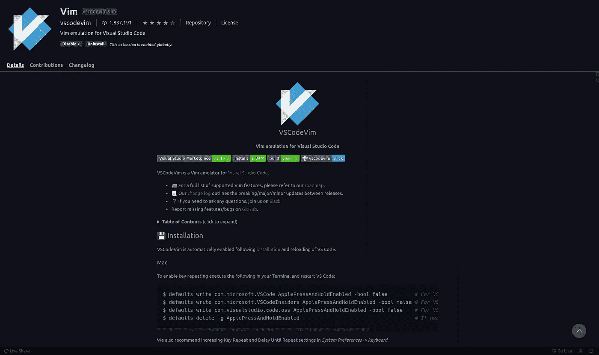

# 通过使用 VS 代码 Vim 仿真升级您的 VS 代码来提高工作效率

> 原文：<https://javascript.plainenglish.io/being-productive-by-upgrading-your-vscode-with-vscode-vim-emulation-a804aa0515a2?source=collection_archive---------6----------------------->


Photo by [Pankaj Patel](https://unsplash.com/@pankajpatel?utm_source=medium&utm_medium=referral) on [Unsplash](https://unsplash.com?utm_source=medium&utm_medium=referral)

[**Visual Studio Code**](https://code.visualstudio.com/) 是一个令人惊叹的文本编辑器，由于其轻量级的特性、广泛的语言支持、不断提供的扩展和无与伦比的用户体验，它是许多程序员的首选文本编辑器。

[**Vim**](https://www.vim.org/) 是另一款惊艳的文本编辑器，被更多铁杆和资深程序员认为是最好的。它是一个模态文本编辑器，提供了广泛的特性，给用户提供了非凡的流畅性和控制代码的能力，这是由 vim 语言实现的。

# 为什么要把两者结合起来，而不仅仅是分开使用呢？

正如介绍中所解释的，VS Code 和 Vim 都是卓越的文本编辑器，那么有什么必要将它们结合在一起呢？

这个问题的答案很简单，1+1=2，但让我详细说明一下。

VS 代码不提供流畅性、对代码的控制和快速可访问的宏，这些在正确使用时就像魔术一样，和 Vim 一样。另一方面，当谈到 VS 代码强大的自动完成功能和独特的导航功能以及弹出错误消息时，Vim 不如 VS 代码。虽然这都可以通过 *~/中的配置来实现。virmrc* 文件，这是非常繁琐的设置，而 VS 代码提供了开箱即用。

因此，当我们将两者结合起来时，我们可以达到一个新的编码效率水平，并享受令人眼花缭乱的丰富开发体验

# 入门指南

从 VS Code 的扩展市场安装 vim 扩展:



安装后，您可以使用基本的 vim 命令进行破解，需要记住的最重要的事情如下:


*   `**h, j , k , l**` 分别向左、下、上、右导航
*   `**i**`切换到插入模式。
*   `**a**`切换到追加模式
*   `**ESC**`切换到 vim 模式
*   `**x**`删除一个字符
*   `**dd**`删除一行

# 在 VS 代码中配置 Vim 以获得更好的开发体验

您可以通过向 settings.json 文件添加所需的更改来配置 VS 代码 Vim。为此，

1.  按下 **Ctrl+Shift+P**
2.  搜索 **settings.json** 并打开
3.  滚动到 json 文件的底部，粘贴以下内容-

```
"vim.useCtrlKeys": true,"vim.normalModeKeyBindingsNonRecursive": [{"before": ["u"],"commands": ["undo"]},{"before": ["<C-r>"],"commands": ["redo"]}],"vim.handleKeys": {"<C-d>": false,"<C-c>": false,"<C-v>": false,"<C-x>": false,"<C-a>": false}
```

现在，让我稍微了解一下为什么我觉得这些改变是必要的:

*   *从 VS 代码的角度来看，vim 中的撤销操作是一个基本的编辑操作，因此不会被记录为 VS 代码撤销操作。*这打乱了你从重做中期望的结果，因此需要重新映射到 VS 代码的撤销和重做动作。
*   *当您使用 VSCode 快捷方式时，剪切、复制和粘贴功能停止工作*，因为 vim 覆盖了它，因此此配置修复了该问题，并允许在 VSCode 模式中使用更常见的剪切、复制和粘贴快捷方式，并在 Vim 模式中使用 Vim 命令。
*   *CTRL+D 选择一个单词的下一个出现并使用多个光标*是一个很棒的 VS 代码特性，它会被 vim 扩展覆盖，但是这个配置允许在 VS 代码模式下使用这个命令。
*   *CTRL+A 选择文件中的所有内容也很方便*，这就是为什么我更喜欢让 VS 代码 Vim 扩展忽略它。

# 高效开发的基本 Vim 命令

*   `**{**`和`**}**`来上下导航段落。
*   `**0**`和`**$**`移动到行的起点和终点。
*   `**e**`和`**b**`移到单词的末尾和开头。
*   `**{num}w**`向前移动光标`*num*`字样。
*   `**v**` 切换到选择模式，`**shift+v**`选择一条线。
*   `**dw**`删除从光标位置到单词末尾的单词内容。
*   `**/{pattern}**`和`**?{pattern}**`搜索模式。
*   `**di"**`删除引号内的文本。
*   `**di(**`删除括号内的内容。
*   `**R**`切换到替换模式

前面提到的命令只是触及了 vim 中可用命令的表面，但是记住这些命令对增加您的开发经验和生产力大有帮助。

祝您好运，开始您丰富、高效和多产的编码之旅！

*更多内容尽在*[*plain English . io*](http://plainenglish.io/)