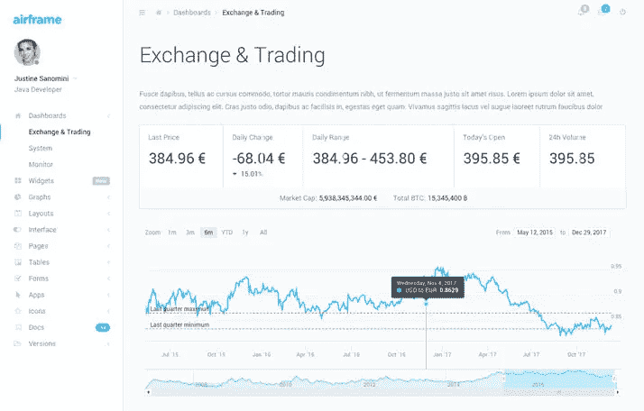
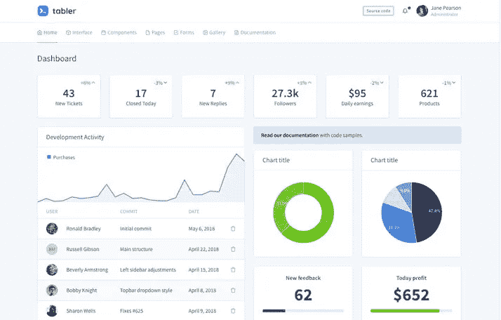
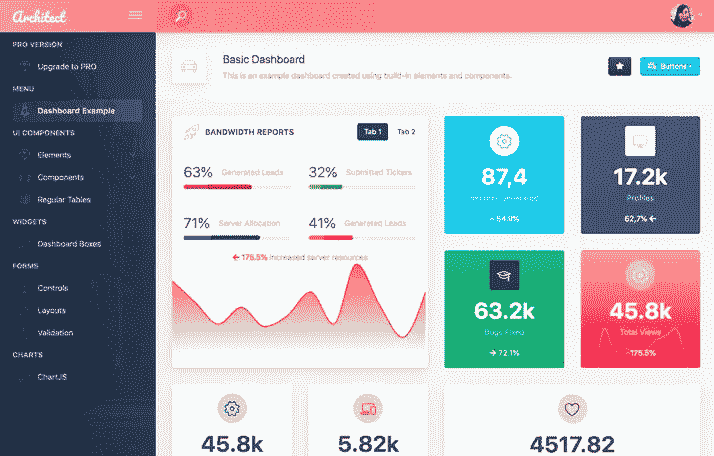
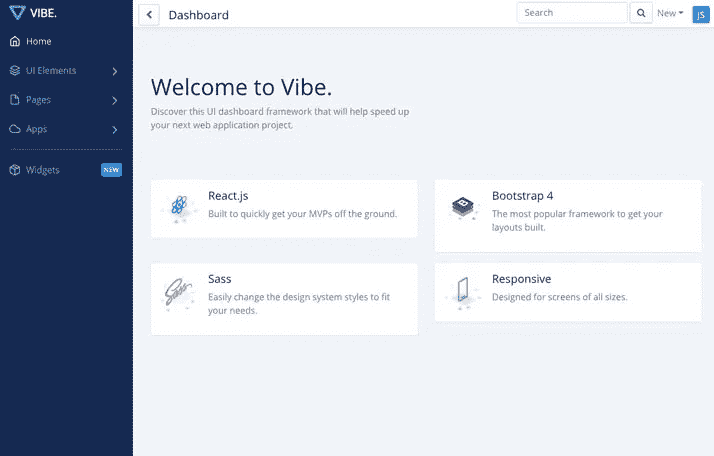

# 7 大最佳免费 React 仪表板库

> 原文：<https://javascript.plainenglish.io/best-free-react-dashboards-resources-for-every-react-developer-90b08c1f9f21?source=collection_archive---------3----------------------->

## 7 个有用的仪表板 UI 库，帮助您快速启动并运行统计驱动的 React 应用程序

# [material pro React Admin Lite](https://www.wrappixel.com/templates/materialpro-react-admin-lite/)

MaterialPro React Admin 是一个最小化的 React 模板，其挂钩灵感来自于 Google 的材质设计 UI。

MaterialPro React Admin Lite 是 2019 年精心手工制作的精美 React Admin 仪表盘模板。它采用模块化的现代设计理念。MaterialPro React Admin Lite 完全免费下载，可用于个人和商业项目。

[**material pro React Lite 的现场预览**](https://www.wrappixel.com/demos/free-admin-templates/materialpro-reactadmin-lite/landingpage/index.html)[**下载 MaterialPro React Lite**](https://www.wrappixel.com/templates/materialpro-react-admin-lite/)

# [机体反应](https://github.com/0wczar/airframe-react)

这款 react 仪表盘设计简约，具有创新的轻型用户界面。Airframe dashboard 将帮助您构建强大的应用程序，这些应用程序由出色的用户界面培育。人们可以使用机身仪表板来开发一个大规模的 web 应用程序，通过逐步编制文档来实现。

这是一个名为 React app 的网络包，具有最小的依赖性，将及时更新。

[**机身现场预览**](http://dashboards.webkom.co/react/airframe/)[**下载机身**](https://github.com/0wczar/airframe-react)

# [admin pro React Dashboard Lite](https://www.wrappixel.com/templates/adminpro-react-admin-lite/)

AdminPro React Dashboard Lite 是一个基本但有用的 React 管理模板，可以创建一个漂亮的管理面板。

AdminPro React Admin Lite 是 2019 年精心手工制作的干净的管理模板。它的建筑采用模块化和现代设计。AdminPro React Admin Lite 完全免费下载，可用于您的个人和商业项目。

[**admin pro React Dashboard Lite 的实时预览**](https://www.wrappixel.com/demos/free-admin-templates/adminpro-react-lite/landingpage/)[**下载 admin pro React Dashboard Lite**](https://www.wrappixel.com/templates/adminpro-react-admin-lite/)

# [表反应](https://github.com/tabler/tabler-react)

CodeCalm 提供了一个用 React 编码的漂亮、优雅、干净的 UI 工具包。用户可以免费使用它，因为它是开源的，易于使用。

一旦您访问我们的 Github 项目，您就可以获得免费的 React dashboard tabler 模板。

[**查看 Tabler React 的现场预览**](http://tabler-react.com/)[**下载 Tabler**](https://github.com/tabler/tabler-react)

# [建筑师](https://github.com/DashboardPack/architectui-react-theme-free)

这是一个免费的开源 React 仪表板模板。它的完整包包含了一组惊人的特性，以及面向开发人员和用户的组件。这是开发 web 应用程序的最佳方法之一，可以让您的业务有一个良好的开端。

它配有多种独特的配色方案和一个响应式布局。这些方案既支持引导元素，也支持不同的布局组件。这个架构由使用 Create-react-app 的 Bootstrap 4 提供支持。

[**建筑师 UI**](https://demo.dashboardpack.com/architectui-react-free/#/dashboards/basic)[**现场预览下载建筑师 UI**](https://github.com/DashboardPack/architectui-react-theme-free)

# [盛传](https://github.com/NiceDash/Vibe)

React Dashboard Vibe 是一个令人惊叹的管理仪表板模板，用 Bootstrap4 构建，在 MIT 许可下发布。

[**Vibe 的现场预告**](https://vibe.nicedash.com/home)[**下载 Vibe**](https://github.com/NiceDash/Vibe)

# [Xtreme React Admin Lite](https://www.wrappixel.com/templates/xtreme-react-admin-lite/)

如果您一直在为您的网站和应用程序搜索最好的免费/高级 React 模板，您的搜索可以在此结束。WrapPixel 的 React 主题，尤其是 Xtreme react admin lite，采用模块化的现代设计，手工制作精美。

Xtreme React Admin Lite 是最好的 React 本地主题之一，融合了风格和功能。此外，它有大量可定制的页面变体和 UI 元素可供选择，可以帮助您将项目提升到一个新的水平。

[**查看 Xtreme React Redux Admin Lite 的现场预览**](https://www.wrappixel.com/demos/free-admin-templates/xtreme-reactadmin-lite/landingpage/index.html)[**下载 Xtreme React Redux Admin Lite**](https://www.wrappixel.com/templates/xtreme-react-admin-lite/)

现在，您已经非常了解在线提供的一些最好的开源 react 仪表板模板。如果你想知道更多关于这些模板的信息，请给我们积极的反馈。我们想听你说。