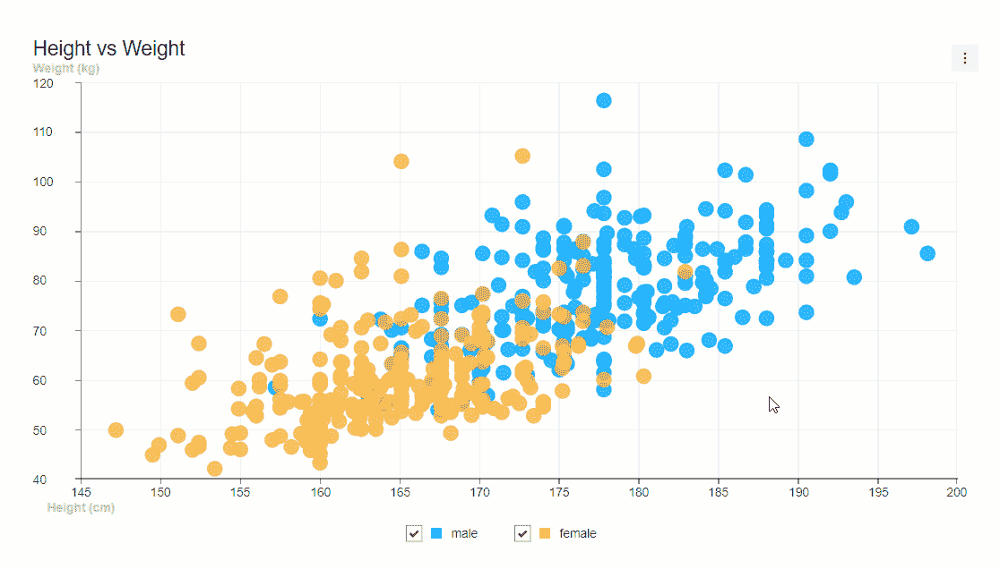
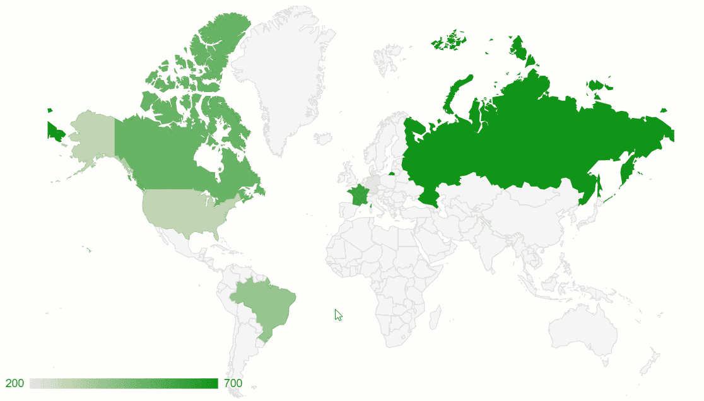
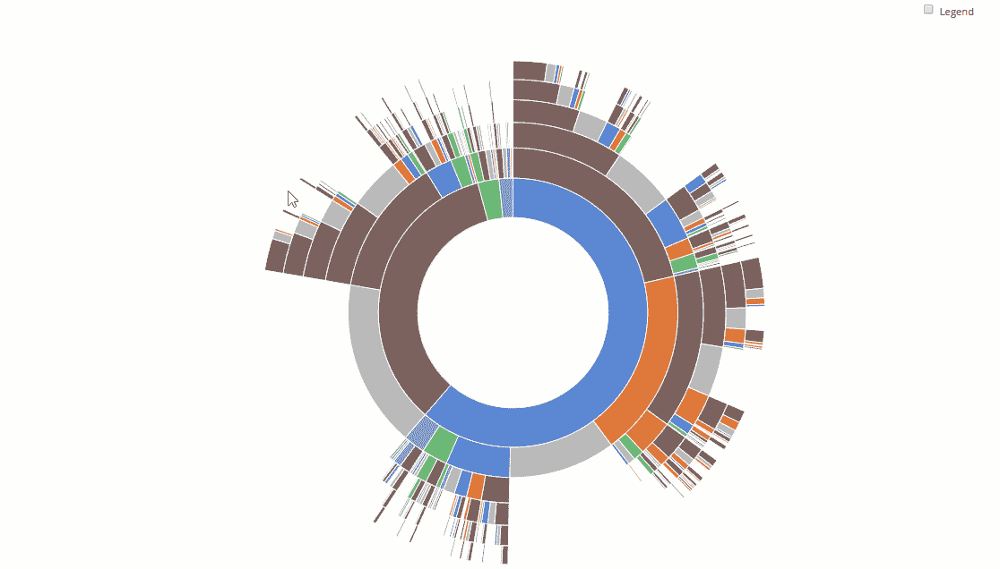
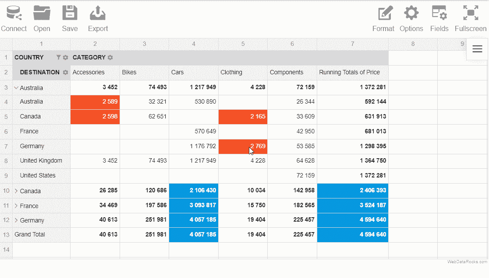
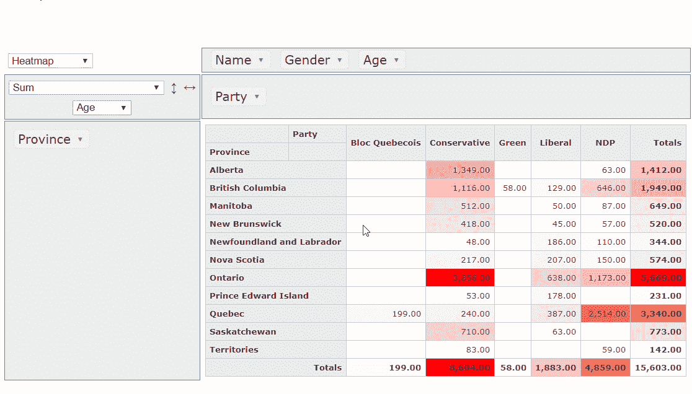

# 2020 年最佳 JavaScript 数据可视化库

> 原文：<https://javascript.plainenglish.io/best-javascript-data-visualization-libraries-for-2020-15291919a176?source=collection_archive---------1----------------------->

*数据可视化既是一门科学，也是一门艺术。*如果您处理数据，您可能会遇到的最大挑战之一就是选择正确的方式以可读的形式塑造和呈现您的数据。适当的可视化完美地传达了所进行的数据分析的意义。

由于市场上有数不清的各种数据可视化工具，难怪在找到一个完美的工具之前可能要花很多时间。

*为了节省您完成更复杂任务的时间*，我将向您展示我最喜欢的 **JavaScript 库**，它们极大地简化了数据处理。选择分为以下类别:

*   **数据透视表**
*   **图表**

这种选择背后的逻辑是最直观和简单的——使用这些工具，您可以通过从多个角度查看您的数据来进行全面的分析。

开始吧！

# 图表

## [***吐司 UI 图***](https://ui.toast.com/tui-chart/?r=jspe)

这个开源的 JavaScript 图表库是今年真正的发现。我不得不承认这些图表看起来棒极了。动画的颜色、风格、流畅度——一切都很完美。我确信这些图表完全有可能成为任何数据可视化项目的装饰品。

有了 Toast UI 图表，你可以*创建简单和复杂的可视化效果*。可用的 API 将有助于实现您的定制逻辑。图表可以导出为。jpg 和。png 图像。

另一个很棒的事情是，你可以免费使用这个库用于商业、教育和个人目的。

如果你是 React 或 VueJS 的开发者，你可能会喜欢这些框架的包装器。

## [**谷歌排行榜**](https://developers.google.com/chart/?r=jspe)

很难找到一个从未听说过**谷歌图表**的人。这是一个由 Google 开发和维护的经典图表服务。

它在世界范围内被用于各种 web 项目，从小型到大型的项目，它拥有丰富的图表种类，适合各种口味和目的，并为开发人员提供了大量的配置选项。要创建自定义图表，对 HTML、CSS 和 JavaScript 有一点*的基础知识就足够了。此外，你可以边做边学——试着在网站上玩这些[可编辑的例子](https://developers.google.com/chart/interactive/docs/gallery/?r=btpg)。*

说到*定制图表*，材质设计是我最喜欢的主题。但是，请注意，它并不适用于每种图表类型，而是计划提供材料版本。

Google Charts 是一个很好的工具，可以用可视化来丰富你的应用程序或网络项目。它可以*自由*用于*商业* *用途*。

但是你应该知道它的 Google Charts API 只能在网上使用——没有互联网连接你就不能使用它。

## [**D3.js**](https://d3js.org/?r=btpg)

毫不夸张地说， **D3.js** 是 JavaScript 世界中的*初级数据可视化库。这背后是有原因的。无论你想到什么，你都可以用 D3 实现它。我毫不怀疑热情的开发人员贡献的无数[样本](https://github.com/d3/d3/wiki/Gallery/?r=btpg)会启发和帮助你。*

尽管这个开源库提供了无限的可能性，但它有一个陡峭的学习曲线。因为它是非常低级的，如果你是一个初学者，可能需要时间来构建简单的可视化，更不用说复杂的了。但是我希望这不会成为你的绊脚石。如果你的数据表示中有很多其他图表库无法提供的定制逻辑，D3.js 是最好的选择。甚至纽约时报也用它。为什么不在你的项目中也尝试一下呢？

# **透视表**

## [**WebDataRocks**](https://www.webdatarocks.com/?r=jspe)

**WebDataRocks** 是一个基于 web 的数据透视表，可以在任何项目中使用，无论是免费的还是商业的，没有任何成本。*用纯 JavaScript* 构建，顺利集成所有流行的前端框架。

终端用户可以从各种*聚合函数*中受益，这些函数可以顺利地汇总数据。还可以基于现有的聚合构建新的公式，并跟踪您的自定义指标或 KPI。

生成的报告是*交互式的*，这意味着您可以**将**字段拖放到网格上，并在几分钟内准备一份新报告。有了这个功能，您可以随时轻松地改变您的分析重点。此外，您可以在任何设备(PC、手机或平板电脑)上查看您的报告。

我喜欢的另一件事是它的*简单简洁的设计*。要定制报告工具的外观，您可以应用[预定义主题](https://www.webdatarocks.com/doc/changing-report-themes/?r=jspe)、*自定义数字和条件格式*。通过一点点代码，也可以用图标代替单元格的编号。

另一个优点是*为工作*设置工具花费的时间最少。因此，您可以为高级**报告和分析**节省大量时间。要开始，只需完成[快速入门](https://www.webdatarocks.com/doc/how-to-start-online-reporting/?r=jspe)的基本步骤。

将数据透视表与第三方图表相结合也不是问题——你可以[将它与 Google Charts](https://www.webdatarocks.com/doc/integration-with-google-charts/?r=jspe) 、 [Highcharts](https://www.webdatarocks.com/doc/integration-with-highcharts/?r=jspe) 或任何其他图表库相集成。

所有这些特性使得 WebDataRocks 成为高效提交报告的完美工具。此外，作为开发人员，您有很多控制组件行为和外观的选项。

这里有一个[例子](https://codepen.io/webdatarocks/pen/PxQpJB)告诉你如何使用它进行销售分析。

## [**pivot table . js**](https://pivottable.js.org/examples/?r=btpg)

网络上最流行的开源枢纽网格之一。它以其嵌入式*热图可视化、统计聚合和拖放功能而闻名。*

Pivottable.js 提供了很多定制功能。然而，通常需要使用第三方插件来实现这种或那种缺失的功能，例如，导出到 Excel 或 PDF。因此，根据项目需求定制报告工具需要更多的时间和精力。但是，您可以开箱即用地将网格导出到 TSV。

要体验该工具提供的所有功能，我推荐使用[演示](https://pivottable.js.org/examples/)并将这个库集成到您的项目中。请注意，如果您需要将它与 React 集成，web 透视表有一个[单独版本](https://react-pivottable.js.org/)。

如果您需要将 pivot 与图表库集成，可以使用 D3、C3、Plotly 和 Google 图表渲染器。

您可以在开源和商业项目中自由使用它。

# **带有图表和数据透视表的仪表盘**

为了以尽可能好的方式传达您的结果，您可以将所有内容集中在一个仪表板上。我强烈建议坚持使用这种强大的方法来处理这些库。

为了让您了解如何一起使用这些库，让我向您展示一些演示:

*   [WebDataRocks 以谷歌图表为轴心](https://codepen.io/webdatarocks/pen/aPyNJW)
*   [web data rocks Pivot with high charts](https://codepen.io/webdatarocks/pen/gdzWPJ)
*   [web data rocks Pivot with fusion charts](https://codepen.io/webdatarocks/pen/oVpebp)
*   [带有 D3.js 的 PivotTable.js】](https://pivottable.js.org/examples/d3.html)
*   [带有 C3.js 的 PivotTable.js】](https://pivottable.js.org/examples/c3.html)
*   [带有谷歌图表的 PivotTable.js】](https://pivottable.js.org/examples/gchart.html)

## **总结**

我真的希望现在您已经准备好做出明智的决定，选择工具来增强您的应用程序的报告和数据可视化功能。