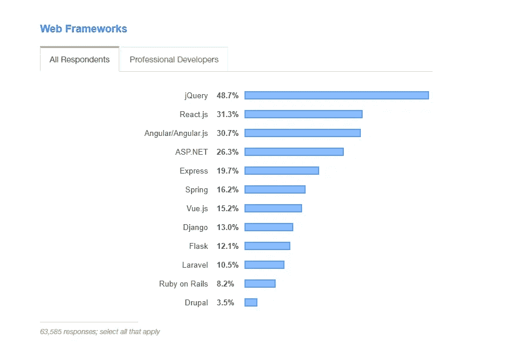
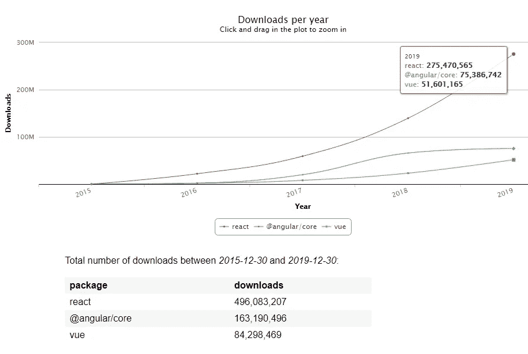
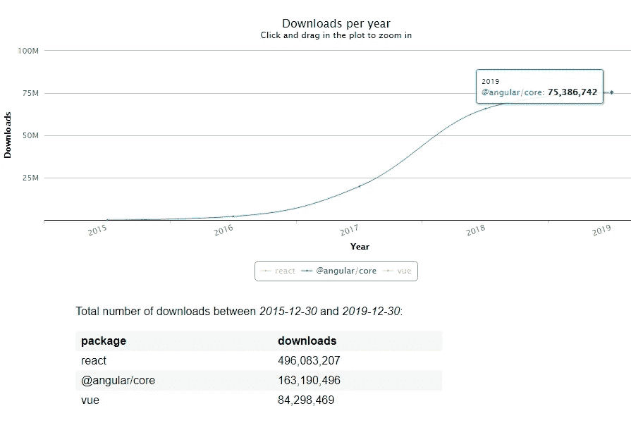
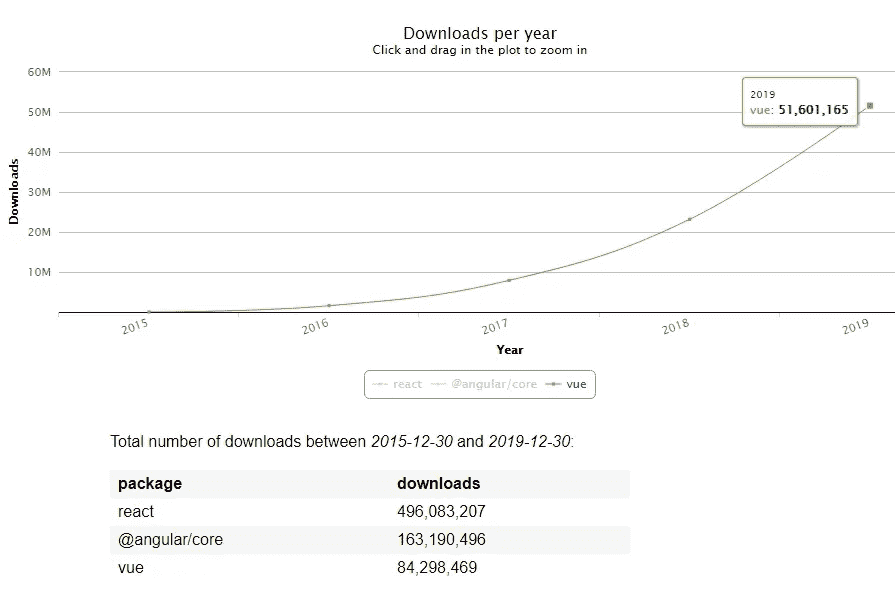
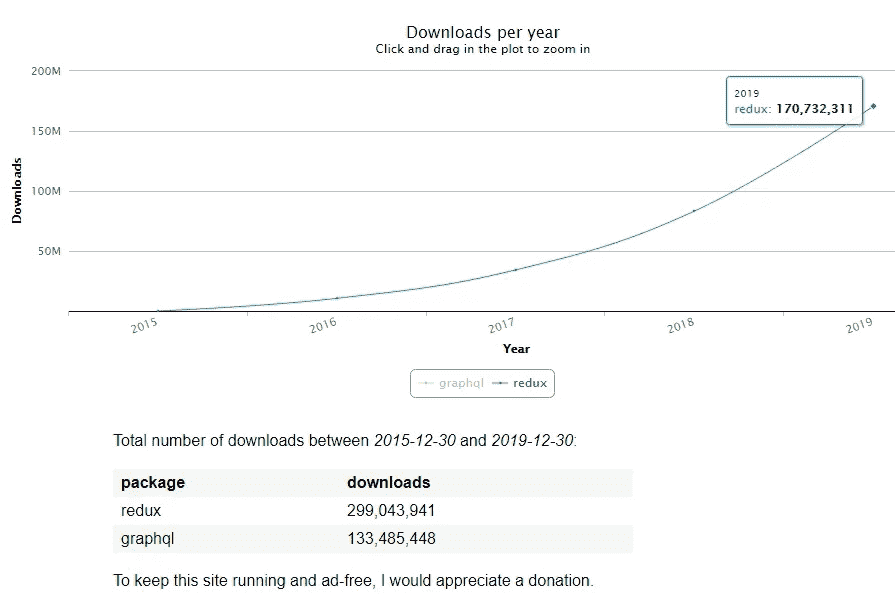
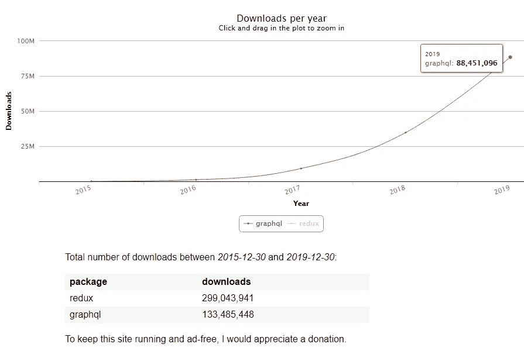
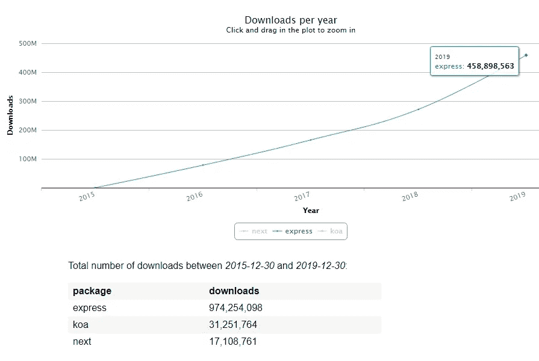
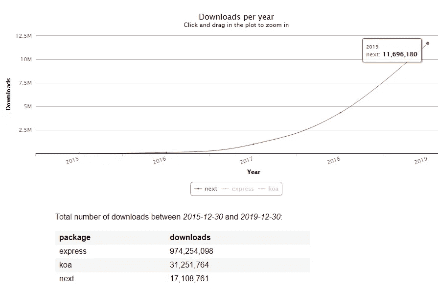

# 最佳 JavaScript 框架和库:2020 年用什么

> 原文：<https://javascript.plainenglish.io/best-javascript-frameworks-and-libraries-what-to-use-in-2020-2bc336a3aeb5?source=collection_archive---------2----------------------->

我可以肯定地说，2010 年是 JavaScript 的十年。在本世纪初，很明显，创建高质量的 web 应用程序并不比开发大型桌面产品复杂。JavaScript 似乎没有减速，继续稳步增长。

新的 JS 库和框架定期出现，在各种论坛上热烈讨论。把它们都列出来是一个巨大的挑战。相反，下面我们将看看一些最流行、最受欢迎和最有前途的框架。

# 前端框架

尽管 JS 框架的数量正在以不可思议的速度增长，但一个“所向披靡”的前端三重奏已经牢牢地巩固了它的地位。这些是 React.js、Vue.js 和 Angular。这些框架已经成为最流行和最常用的框架好几年了。接下来，我们将逐一处理它们。

## [反应](https://reactjs.org/)

React.js 是一个高效灵活的 JavaScript 库，由脸书团队创建，用于构建用户界面。React 使创建交互式 UI 变得容易。它不仅仅支持以对象为中心的应用程序构建——React 刺激了它。

得益于声明式视图，React 代码是可预测的，并且易于调试。此外，该框架的创建者还考虑到了向后兼容性:React 支持*学习一次，随处编写*的原则，这允许您在 React 中开发新功能，而无需重写现有代码。

根据[stack overflow](https://insights.stackoverflow.com/survey/2019#most-loved-dreaded-and-wanted)2019 年的数据，React 在最受欢迎的 web 框架中排名第二。

在过去的几年里，React 的使用水平显著提高。如果你看看 [npm-packages](https://npm-stat.com/charts.html?package=react&package=vue&package=%40angular%2Fcore&from=2015-12-30&to=2019-12-30) 下载的数量，这表明使用该框架的活动，你会看到 React 在 2019 年明显占主导地位(过去 5 年也是如此):

像 Airbnb 和 Twitter 这样的公司使用 React，这就是为什么脸书在高层次上支持框架的功能和稳定性。有理由假设 React 将继续占据主导地位。

## [有角度的](https://angular.io/)

这是一个流行的企业级框架，用于开发大型复杂的业务逻辑应用程序。

Angular 可以被称为 AngularJS 的高级版本:它更整洁、更灵活、更像企业，因此具有高度的可伸缩性。这是一个由谷歌和微软支持的开源框架。Angular 结合了声明性模板、依赖注入、双向数据绑定和最佳实践来解决开发问题。

根据 [Stackoverflow](https://insights.stackoverflow.com/survey/2019#most-loved-dreaded-and-wanted) 的数据，Angular 成为 2019 年最受欢迎的三个 web 框架之一，仅损失 0.6%进行反应。

至于 npm 包的下载数量，我们可以说今天这个开发环境的地位已经下降了。尽管如此，对懂得这一工具的专家的需求仍然很大，这种需求在未来几年内不太可能消失。

## [武威 js](https://vuejs.org/index.html)

Vue.js，一个用于构建用户界面的渐进式库。Vue 和 React 一样，是为逐步实现而设计的。它的核心主要解决视图级任务，从而简化与其他库和现有项目的集成。此外，它还有一个附加库的生态系统，允许您创建复杂而可靠的单页应用程序。

让我们回到 2019 年的 Stackoverflow 统计数据:

考虑到 Vue.js 比 React 和 Angular.js 年轻，所以现在占据其他框架中间位置也就不足为奇了。

下载情况如下:

可以肯定的是，随着更新的“推出”，Vue.js 将继续加强在技术市场的地位。

## [身材苗条](https://svelte.dev/)

我不能遗漏这个年轻的框架，因为对它的兴趣正在迅速增长。

简而言之，Svelte 旨在成为一个框架，而不是真正的框架——它只是一个代码创建工具。React 和 Vue 在浏览器中完成大部分工作，而 Svelte 将这些工作转移到应用程序构建时的编译阶段。

Svelte 没有使用虚拟 DOM diffing 这样的复杂技巧，而是编写代码，在应用程序的状态改变时逐点更新 DOM。

[的下载量](https://npm-stat.com/charts.html?package=react&package=vue&package=%40angular%2Fcore&package=svelte&from=2015-12-30&to=2019-12-30)显示其可用性逐年增长:

由于其独特的应用开发方法，Svelte 完全有机会在 2020 年达到最高评级。

你可以在这里阅读更多关于苗条身材的信息。

# 数据层框架

## [还原](https://redux.js.org/)

今天，这个库被认为是管理应用程序状态的最佳软件。

Redux 有助于编写稳定的应用程序，这些应用程序可以在客户机、服务器和本机环境中运行，并且易于测试。Redux 可以和任何视图库一起使用。

根据图表，我们看到使用率的增加是明显的。还值得一提的是，Redux 通常与 React 一起使用，React 也占据最前沿。

## [GraphQL](https://graphql.org/)

GraphQL 是 API 的查询语言，也是使用现有数据执行这些查询的运行时。GraphQL 为您的 API 中的数据提供了完整且可理解的描述，允许客户端只请求他们需要的东西，仅此而已。得益于此，随着时间的推移，开发应用程序编程接口和使用强大的开发工具变得更加容易。

专家表示，与前几年相比，GraphQL 有了显著增长。我们可以在图表上观察到。

由于这项技术仍然很新(第一次发布是在 2015 年)，文档和支持工具很难理解，但希望学习该工具的人数每年都在增长。而且，也许很快对图表专家的需求就会增加。

# 后端框架

尽管 Express 是后端框架中的明显领导者，但也有更多的框架值得关注。让我们逐一研究一下。

## [快递](https://expressjs.com/)

Express 是一个灵活的、极简的、支持良好的 Node.js 应用程序 web 框架。它被列入 2019 年五大最受欢迎的网络框架:

Express 提供了广泛的 HTTP 实用程序，以及高速度。这个 Node.js 环境用于各种应用程序，并提供基本的 web 应用程序特性。它非常适合开发可以同时处理多个请求的简单应用程序，并且依赖于 Express 技术的功能。

2019 年的下载量达到 4.58 亿次，几乎是 2018 年的两倍。最有可能的是，Express 将继续巩固其地位。

## [Koa](https://koajs.com/)

Koa.js 是一个相对较新的 web 框架，旨在弥补 Express 的缺点。开发者自己说“从哲学上讲，Koa 的目标是“修复和替换节点”，而 Express 的目标是“增强节点”。

Koa 允许您使用异步函数来处理请求，这大大简化了错误处理。尽管这个工具可能是最复杂的工具之一，但是许多开发人员声称它完全值得花费时间和精力。

Koa 的可用性每年都在增长。考虑到框架的稳定性(由于现代 JS 结构的应用，Koa 比 Express 和其他具有回调式方法的框架更稳定)，您可以肯定它的前景。

## [Next.js](https://nextjs.org/)

Next.js 是由 [Zeit](https://zeit.co/) 构建的一个极简框架。它允许您使用 React 创建服务器端渲染和静态 web 应用程序。

该框架的主要优点是易于使用。开发人员可以忘记设置 webpack、react-router、react 和 react-dom。这一切都包含在“开箱即用”中。它还拥有基于文件系统的路由、自动代码分割、静态导出和对 SEO 友好等特性。

下一次使用量的增长相对来说和 Koa 是一样的。它将继续发展，这不仅是因为它的优势:该框架得到了开源社区中一个稳定且非常活跃的组织的支持。

# 结论

我已经描述了 JS 框架，它是去年最受欢迎的，并且在不久的将来很可能会继续如此。哪个最好用？没有明确的答案。毕竟，工具的选择仅仅取决于特定项目和业务的需求。

在现代世界，技术每天都在发展和传播。不同语言和工具之间的竞争越来越激烈。可用的 JS 框架数量巨大。只需要选择一个完全符合您要求的即可。

【https://intexsoft.com】原载于 2020 年 2 月 10 日**。**