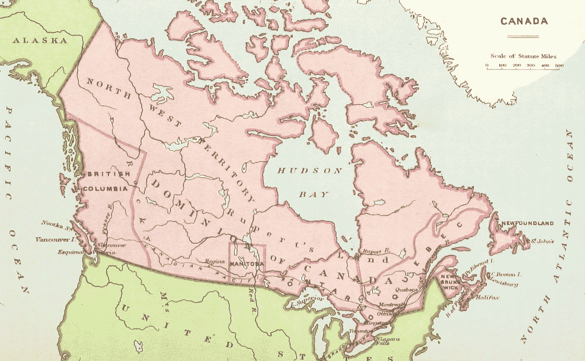

# 现代 JavaScript 的精华——地图

> 原文：<https://javascript.plainenglish.io/best-of-modern-javascript-maps-7db0744b8943?source=collection_archive---------12----------------------->


Photo by [Ruthie](https://unsplash.com/@rrruthie?utm_source=medium&utm_medium=referral) on [Unsplash](https://unsplash.com?utm_source=medium&utm_medium=referral)

自 2015 年以来，JavaScript 有了巨大的进步。

现在用起来比以前舒服多了。

在这篇文章中，我们将看看如何以各种方式使用地图。

# 映射到 JSON

地图可以转换成 JSON 对象。

我们可以将 spread 运算符转换成数组。

例如，我们可以写:

```
const map = new Map()
  .set('foo', 'one')
  .set('bar', 'two')
  .set('baz', 'three');const arr = [...map];
```

因为映射是可迭代的，所以我们可以将映射展开成一个键值对数组。

一旦我们这样做了，我们就可以用`JSON.stringify`将数组转换成 JSON 字符串:

```
console.log(JSON.stringify(arr));
```

然后我们得到:

```
[["foo","one"],["bar","two"],["baz","three"]]
```

我们可以用`JSON.parse`和`Map`构造函数将键值对数组的字符串化数组转换成一个映射。

例如，我们可以写:

```
const parsed = new Map(JSON.parse(str));
```

然后我们拿回原来的地图。

# 映射到对象

我们可以通过遍历 map，然后将键作为属性，将值作为值，从而将 map 转换为对象。

例如，我们可以写:

```
const map = new Map()
  .set('foo', 'one')
  .set('bar', 'two')
  .set('baz', 'three');const obj = Object.create(null);
for (const [k, v] of map) {
  obj[k] = v;
}
```

我们通过将`null`传入`Object.create`来创建一个没有原型的对象。

然后我们通过我们的`map`循环获取键和值，然后用 for-of 循环将键设置为属性名，将值设置为值。

我们可以用`JSON.stringify`把对象转换成 JSON。

例如，我们可以写:

```
console.log(JSON.stringify(obj));
```

我们得到了:

```
{"foo":"one","bar":"two","baz":"three"}
```

记录在案。

我们可以调用`JSON.parse`将它解析回一个对象。

例如，我们可以写:

```
const map = new Map()
  .set('foo', 'one')
  .set('bar', 'two')
  .set('baz', 'three');const obj = Object.create(null);
for (const [k, v] of map) {
  obj[k] = v;
}const str = JSON.stringify(obj);
console.log(JSON.parse(str));
```

# 地图 API

`Map` API 允许我们用键值对数组的可迭代对象创建一个映射。

这是可选的。

如果我们不把它传入，我们就会创建一个空的地图。

例如，我们可以写:

```
const map = new Map([
  ['foo', 'one'],
  ['bar', 'two'],
  ['bar', 'three'],
]);
```

来绘制地图。

`Map.prototype.get`方法接受一个字符串键，并返回带有给定键的值。

如果在映射中没有这样的键，那么返回`undefined`。

`Map.prototype.set`接受一个键和值作为参数，然后返回添加了新条目的映射。

`Map.prototype.has`获取一个键并返回一个布尔值，表明该键是否存在。

`Map.prototype.delete`获取一个键并移除给定键的项目。

如果项目被移除，则返回`true`。

否则，什么也不发生，返回`false`。

`Map.prototype.size`是一个 getter 方法，返回 map 中有多少条目。

`Map.prototype.clear`清除地图中的所有条目，不返回任何内容。



Photo by [British Library](https://unsplash.com/@britishlibrary?utm_source=medium&utm_medium=referral) on [Unsplash](https://unsplash.com?utm_source=medium&utm_medium=referral)

# 结论

地图可以转换成数组和对象。

此外，它有许多我们可以用来操作和获取地图数据的方法。

喜欢这篇文章吗？如果是这样，通过 [**订阅解码获得更多类似内容，我们的 YouTube 频道**](https://www.youtube.com/channel/UCtipWUghju290NWcn8jhyAw) **！**