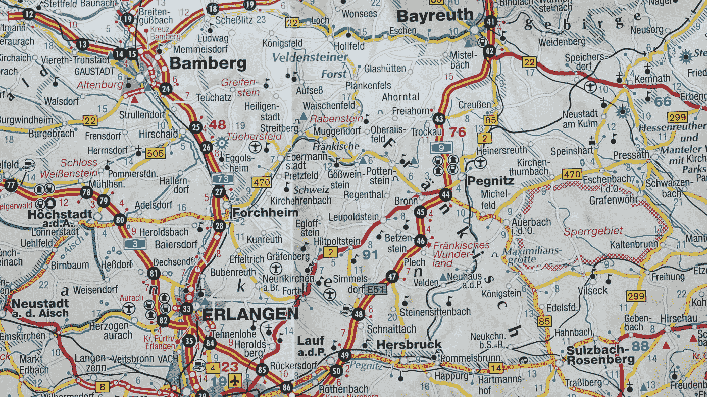

# 现代 JavaScript 的精华——地图

> 原文：<https://javascript.plainenglish.io/best-of-modern-javascript-maps-de03148f11d2?source=collection_archive---------16----------------------->


Photo by [Andrew Stutesman](https://unsplash.com/@drewmark?utm_source=medium&utm_medium=referral) on [Unsplash](https://unsplash.com?utm_source=medium&utm_medium=referral)

自 2015 年以来，JavaScript 有了巨大的进步。

现在用起来比以前舒服多了。

在这篇文章中，我们将看看如何使用地图。

# 地图大小

我们可以通过使用`size`属性来获得地图的大小。

例如，我们可以写:

```
const map = new Map();
map.set('foo', 1);
map.set('bar', 2);console.log(map.size);
```

`map.size`会返回 2。

# 清除地图

我们可以用`clear`方法清理地图。

例如，我们可以写:

```
map.clear();
```

从地图中删除所有条目。

# 设置地图

有两种方法可以设置地图。

一种方法是传入一个数组，数组中有键值对。

例如，我们可以写:

```
const map = new Map([
  ['foo', 'one'],
  ['bar', 'two'],
  ['baz', 'three'],
]);
```

创建地图的另一种方法是调用`set`方法。

例如，我们可以写:

```
const map = new Map()
  .set('foo', 'one')
  .set('bar', 'two')
  .set('baz', 'three');
```

`set`以一个键及其值作为参数。

它们都用给定的键值对放入 3 个条目。

# 地图键

映射键可以是任何东西，甚至是一个对象。

例如，我们可以写:

```
const map = new Map()const KEY1 = {};
map.set(KEY1, 'foo');const KEY2 = {};
map.set(KEY2, 'bar');
```

我们创建了两个对象，并将它们用作键。

然后我们可以用那些对象调用`get`来获取值。

然后我们可以写:

```
console.log(map.get(KEY1));
```

用键`KEY1`获取数值。

我们应该看到`'foo'`被记录。

键查找是用 SameValueZero 算法完成的，所以它与`===`基本相同，但`NaN`被认为等于自身。

这意味着只有当对象在内存中引用相同的东西时，它们才被认为是相等的。

例如，如果我们有:

```
const map = new Map()
map.set(NaN, 'foo');console.log(map.get(NaN));
```

然后控制台日志将记录`'foo'`，因为我们添加了一个以`NaN`为关键字的条目，并且`NaN`被认为等于自身。

`-0`和`+0`被认为是相同的值。

所以如果我们有:

```
const map = new Map()
map.set(-0, 'foo');console.log(map.get(+0));
```

然后我们得到`'foo'`日志。

试图用不在映射中的键获取条目会返回`undefined`。

例如，如果我们写:

```
new Map().get('foo')
```

然后我们得到`undefined`。

# 迭代地图

我们可以通过使用 for-of 循环来迭代地图。

要循环遍历这些键，我们可以用`map.keys()`方法获取它们。

例如，我们可以写:

```
const map = new Map()
  .set('foo', 'one')
  .set('bar', 'two')
  .set('baz', 'three');for (const key of map.keys()) {
  console.log(key);
}
```

然后我们记录了`'foo'`、`'bar'`和`'baz'`。

方法返回一个带有地图值的迭代器。

例如，我们可以写:

```
const map = new Map()
  .set('foo', 'one')
  .set('bar', 'two')
  .set('baz', 'three');for (const value of map.values()) {
  console.log(value);
}
```

然后我们记录了`'one'`、`'two'`、`'three'`。

`entries`方法返回一个数组中有键值对的迭代器。

例如，我们可以写:

```
const map = new Map()
  .set('foo', 'one')
  .set('bar', 'two')
  .set('baz', 'three');for (const [key, value] of map.entries()) {
  console.log(key, value);
}
```

我们析构了键和值并记录它们，因此我们得到:

```
foo one
bar two
baz three
```

记录在案。



Photo by [Thomas Kinto](https://unsplash.com/@thomaskinto?utm_source=medium&utm_medium=referral) on [Unsplash](https://unsplash.com?utm_source=medium&utm_medium=referral)

# 结论

我们可以用各种方式使用地图。我们可以添加、更新、获取和删除其中的条目。

此外，我们可以通过各种方式循环它们。

喜欢这篇文章吗？如果有，通过 [**订阅获取更多类似内容解码，我们的 YouTube 频道**](https://www.youtube.com/channel/UCtipWUghju290NWcn8jhyAw) **！**