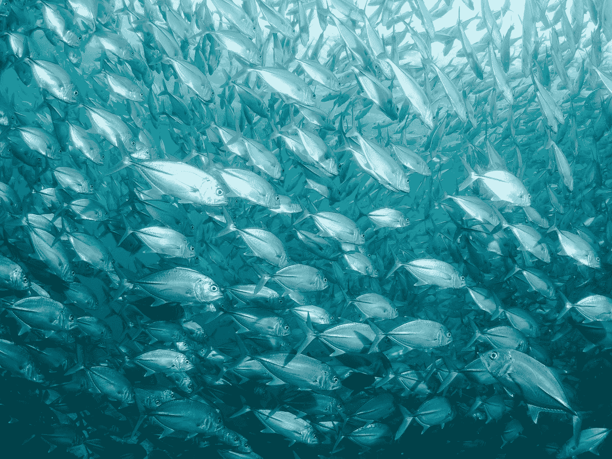

# 观看项目可见性和拖放的最佳 Vue 库

> 原文：<https://javascript.plainenglish.io/best-vue-libraries-for-watching-visibility-of-items-and-drag-and-drop-7aff924d99ff?source=collection_archive---------4----------------------->



Photo by [jean wimmerlin](https://unsplash.com/@jwimmerli?utm_source=medium&utm_medium=referral) on [Unsplash](https://unsplash.com?utm_source=medium&utm_medium=referral)

Vue.js 是一个易于使用的 web 应用框架，我们可以用它来开发交互式前端应用。

在本文中，我们将了解如何观察项目的可见性，并使用第三方包进行拖放。

# vue-观察-可见度

`vue-observe-visibility`包让我们观察组件模板中任何给定 HTML 元素的可见性状态。

它使用交叉点观察器 API 来观察元素的可见性。

我们可以按如下方式安装它:

```
npm install --save vue-observe-visibility
```

此外，我们可以将它作为脚本添加到 HTML 代码中，如下所示:

```
<script src="https://unpkg.com/vue-observe-visibility/dist/vue-observe-visibility.min.js"></script>
```

那么我们可以如下使用它:

`main.js`

```
import Vue from "vue";
import App from "./App.vue";
import VueObserveVisibility from "vue-observe-visibility";Vue.use(VueObserveVisibility);
Vue.config.productionTip = false;new Vue({
  render: h => h(App)
}).$mount("#app");
```

`App.vue`

```
<template>
  <div id="app">
    <div v-for="n in 100" :key="n" v-observe-visibility="visibilityChanged">{{n}}</div>
  </div>
</template><script>
export default {
  name: "App",
  methods: {
    visibilityChanged(isVisible, entry) {
      console.log(
        `${entry.target.innerText} is ${isVisible ? "visible" : "invisible"}`
      );
    }
  }
};
</script>
```

在上面的代码中，我们在`main.js`中注册了`VueObserveVisibility`包，这样我们就可以在整个应用程序中使用它。

然后我们有`App.vue`，它有一个 div 列表，每个 div 显示一个数字。

在每个 div 中，我们在`methods`属性中使用带有`visibilityChanged`方法的`v-observe-visibility`指令来记录每个项目的可见性。

`entry`对象是事件对象，它具有被监视元素的`target`属性。

`invisible`属性是一个布尔值，表示给定的项目是否可见。

现在，当我们上下滚动页面时，我们会看到类似这样的内容:

```
...
31 is invisible
59 is visible
30 is invisible
...
```

在我们滚动时从控制台日志输出。

我们还可以将`once`选项添加到我们作为`v-observe-visibility`指令的值传入的对象中，如下所示:

```
<div v-observe-visibility="{
  callback: visibilityChanged,
  once: true,
}">
  ...
</div>
```

这样，当元素第一次加载时，我们只能看到内部元素的可见性。

此外，我们可以添加一个`throttle`选项，这样回调就不会被太频繁地调用。例如，我们可以写:

```
<div v-observe-visibility="{
  callback: visibilityChanged,
  throttle: 300,
}">
  ...
</div>
```

上面的代码将延迟调用`visibilityChanged`回调买入 300ms。

我们可以通过添加一个`throttleOptions`属性来调节选项，该属性采用一个`leading`选项在可见性改变时第一时间触发回调，而无需等待调节延迟。

可以是`visible`、`hidden`或`both`。

此外，我们可以通过如下方式传入一个 falsy 值来禁用某个项目上的观察者:

```
<div
  v-for="n in 100"
  :key="n"
  v-observe-visibility="n === 100 ? visibilityChanged : false"
>
  //...
</div>
```

上面的代码将只观察最后一项的可见性变化。


Photo by [Matthew Sleeper](https://unsplash.com/@mjsleeper?utm_source=medium&utm_medium=referral) on [Unsplash](https://unsplash.com?utm_source=medium&utm_medium=referral)

# v 形拖曳

指令让我们可以轻松地处理项目的拖动。

要安装它，我们运行:

```
npm install --save v-dragged
```

那么我们可以如下使用它:

`main.js`

```
import Vue from "vue";
import App from "./App.vue";
import VDragged from "v-dragged";Vue.use(VDragged);
Vue.config.productionTip = false;new Vue({
  render: h => h(App)
}).$mount("#app");
```

`App.vue`

```
<template>
  <div id="app">
    <div v-dragged="onDragged" id="drag">drag me</div>
  </div>
</template>
<script>
export default {
  name: "App",
  methods: {
    onDragged({
      el,
      deltaX,
      deltaY,
      offsetX,
      offsetY,
      clientX,
      clientY,
      first,
      last
    }) {
      if (first) {
        return;
      }
      if (last) {
        return;
      }
      const l = +window.getComputedStyle(el)["left"].slice(0, -2) || 0;
      const t = +window.getComputedStyle(el)["top"].slice(0, -2) || 0;
      el.style.left = `${l + deltaX}px`;
      el.style.top = `${t + deltaY}px`;
    }
  }
};
</script><style>
#drag {
  position: absolute;
}
</style>
```

在上面的代码中，我们有一个内部带有文本“拖动我”的 div。我们将其绑定到值被设置为`onDragged`方法的`v-dragged`指令。

在`onDragged`方法中，我们可以通过对元素对象`el`使用`window.getComputedStyle`方法来获得新的左坐标和上坐标，该元素对象包含被拖动的元素。

然后，我们可以使用这些新值来设置新的左侧和顶部样式，如下所示:

```
el.style.left = `${l + deltaX}px`;
el.style.top = `${t + deltaY}px`;
```

我们将增量添加到原始的左值和上值来更新位置。

此外，我们将可拖动元素的样式设置为`position: absolute;`，这样我们可以在页面上自由移动它。

# 结论

`vue-observe-visibility`包让我们观察屏幕上项目的可见性。可见性更新时调用的回调可以被限制。

`v-dragged`包对于处理拖动事件很有用。我们可以用它来用指令提供的数据更新被拖动的项目的位置。

# **简明英语团队的说明**

你知道我们有四种出版物吗？给他们一个 follow 来表达爱意吧:[**JavaScript in Plain English**](https://medium.com/javascript-in-plain-english)，[**AI in Plain English**](https://medium.com/ai-in-plain-english)，[**UX in Plain English**](https://medium.com/ux-in-plain-english)，[**Python in Plain English**](https://medium.com/python-in-plain-english)**—谢谢，继续学习！**

**我们还推出了一个 YouTube，希望你能通过 [**订阅我们的简明英语频道**](https://www.youtube.com/channel/UCtipWUghju290NWcn8jhyAw) 来支持我们**

**一如既往,“简明英语”希望帮助推广好的内容。如果您有一篇文章想要提交给我们的任何出版物，请发送电子邮件至[**submissions @ plain English . io**](mailto:submissions@plainenglish.io)**并附上您的媒体用户名和您感兴趣的内容，我们将会回复您！****