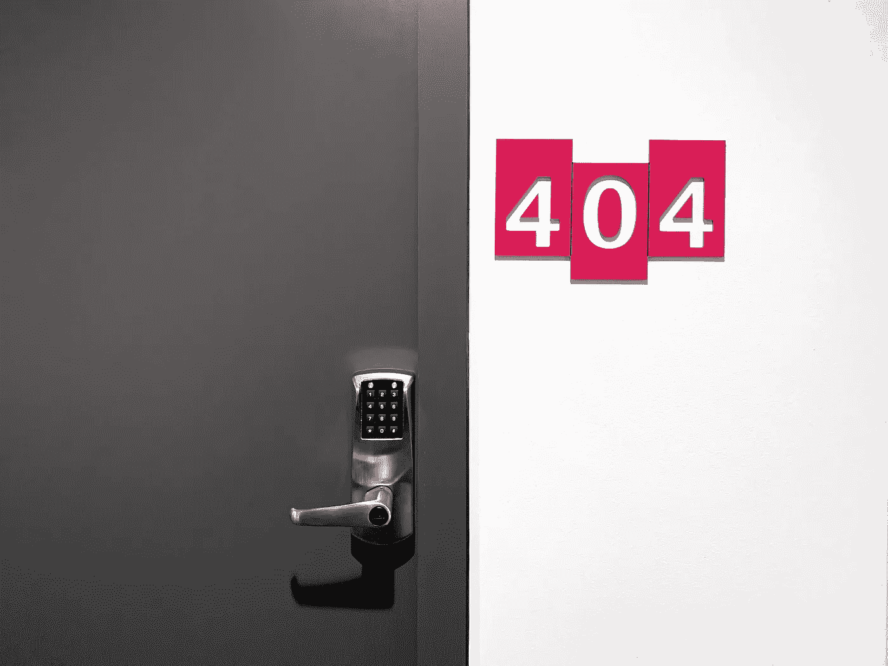

# 跟踪角度误差的最佳方法

> 原文：<https://javascript.plainenglish.io/best-way-to-trace-errors-in-angular-632bdc40421a?source=collection_archive---------11----------------------->

当构建健壮且无错误的 web 应用程序时，处理错误是必不可少的。开发团队必须跟踪在生产或开发阶段发生的所有错误。为了做到这一点，应用程序必须有一些日志记录功能，比如向 API 发送错误。

大多数日志记录都是手动完成的。我们将我们的功能打包到 try-catch 块或一些异步错误回调中，捕获异常并将其发送到服务器。

也许这个解决方案管用。这确实是浪费时间，而且还有很高的风险，有人会忘记跟踪错误。

在本文中，我将向您展示全局错误跟踪程序，它在内部使用自身来向我们显示错误消息。 [Angular Docs](https://angular.io/) 中没有记载，我在挖掘 Angular 源代码的时候偶然发现了它。

# **错误处理程序类**

在角度源代码里面有一个叫做`[error_handler](https://github.com/angular/angular/blob/master/packages/core/src/error_handler.ts)`的类。它有一个单一的责任，记录每一个发生在角度应用程序内部的错误。

每当应用程序内部发生错误时(错误的 HTTP 请求，字段未定义等)。)，由 Angular Core 本身捕获一个错误，并使用`error_handler`类将其记录到控制台中。

`error_handler`类由 Angular DI(依赖注入)创建。因此，Angular 注入，这个类本身，就像我们在 Component 中注入一些服务一样。这就是为什么我们可以提供自己的`MyErrorHandler`类，并将其附加到`ErrorHandler`提供商。

# 我的错误处理器

让我们创建一个名为`MyErrorHandler`的类(名称可以是任何东西)，并在那里定义`handleError(error:any)`方法。

然后将其添加到`HandleError`提供程序，而不是本地的`error_handler`类。

[https://gist . github . com/luka onik/aa 3 ECD 528459 FCC 83 e 52 D5 b 6280 a 11 a 8](https://gist.github.com/lukaonik/aa3ecd528459fcc83e52d5b6280a11a8)

现在，当 Angular 将注入`ErrorHandler`类时，它将得到我们的`MyErrorHandler`实例，并且所有人都将调用我们的定制函数，而不是本地函数。

## 增强功能

如果我们处于生产环境中，我们还可以向服务器发送错误，如果我们处于开发阶段，则在控制台中输出错误。我们所要做的就是，继承原生的`error_handler`类，如果我们处于开发模式，就调用它的`handleError`方法

## 来自简明英语团队的说明

你知道我们有四份出版物和一个 YouTube 频道吗？你可以在我们的主页 [**plainenglish.io**](https://plainenglish.io) 上找到所有这些——关注我们的出版物并 [**订阅我们的 YouTube 频道**](https://www.youtube.com/channel/UCtipWUghju290NWcn8jhyAw) **来表达你的爱吧！**