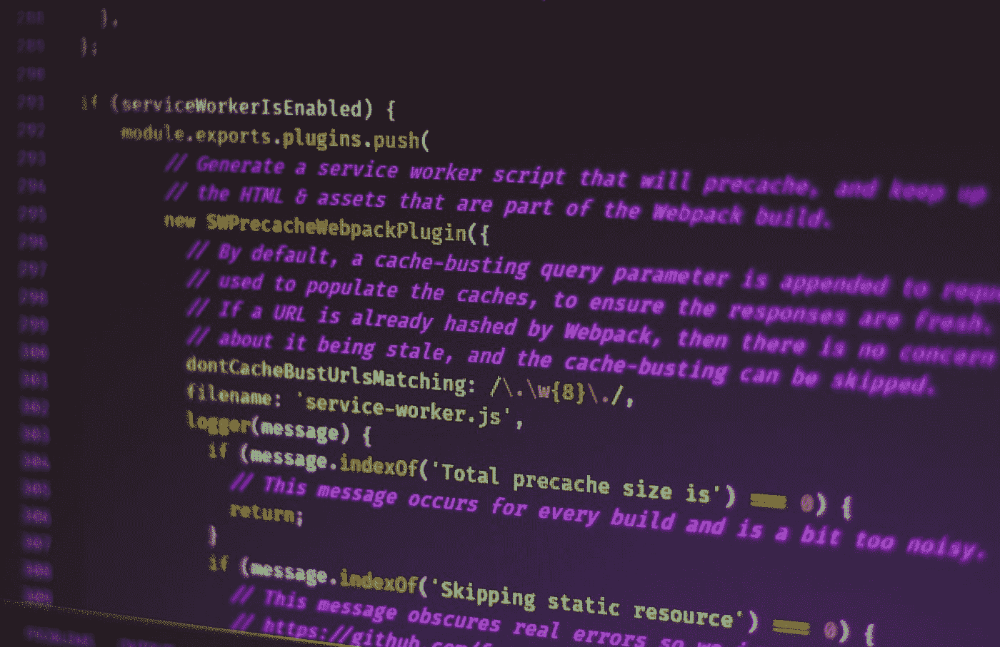

# 更好的 JavaScript——三元运算符

> 原文：<https://javascript.plainenglish.io/better-javascript-the-ternary-operator-d181338c4c20?source=collection_archive---------9----------------------->

## 理解 JavaScript 中的三元运算符以及如何使用它

Photo by [Nathan da Silva](https://unsplash.com/@silvawebdesigns?utm_source=medium&utm_medium=referral) on [Unsplash](https://unsplash.com?utm_source=medium&utm_medium=referral)

# 介绍

当您在 JavaScript 代码中处理条件时，大多数情况下，您使用的是传统条件(`**if**`、`**else**`和`**else if**`)。这些传统条件的替代方案是**三元运算符**。该操作器的工作方式与传统操作器一样，但它是为小条件设计的。使用它，可以让你有一个更简洁高效的代码。

在这篇短文中，我们将看看三元运算符以及如何在 JavaScript 中使用它。

Photo by [Ferenc Almasi](https://unsplash.com/@flowforfrank?utm_source=medium&utm_medium=referral) on [Unsplash](https://unsplash.com?utm_source=medium&utm_medium=referral)

# 三元运算符语法

JavaScript 中的三元运算符以字符`**?**`和`**:**`出现在您的代码中。理解三元运算符如何工作的最好方法是将其与一个`**if**`条件进行比较:

The Ternary Operator.

# 使用案例

下面的例子是最推荐的使用案例。如果您有一个简短的条件，并且您想让您的代码更简洁，您可以使用三元运算符。

The Ternary Example.

请注意，三元运算符的主要思想是构建一行条件。

# 复杂条件

三元运算符允许您创建复杂的条件。但是我不建议在这种情况下使用它。

Complex Conditions.

如您所见，在这种情况下使用三元运算符并不是一个好主意。代码看起来有点难懂。您也可以在使用三元条件时执行多个操作，但不建议这样做，因为它可能难以阅读和理解，尤其是对于其他必须阅读您的代码的开发人员。

# 结论

对于小条件，使用三元运算符是个好主意。它让你有一个更简洁高效的代码。但在我看来，它不是为复杂条件设计的。

感谢您的阅读，希望您觉得有用。

喜欢这篇文章吗？如果有，通过 [**订阅获取更多类似内容解码，我们的 YouTube 频道**](https://www.youtube.com/channel/UCtipWUghju290NWcn8jhyAw) **！**